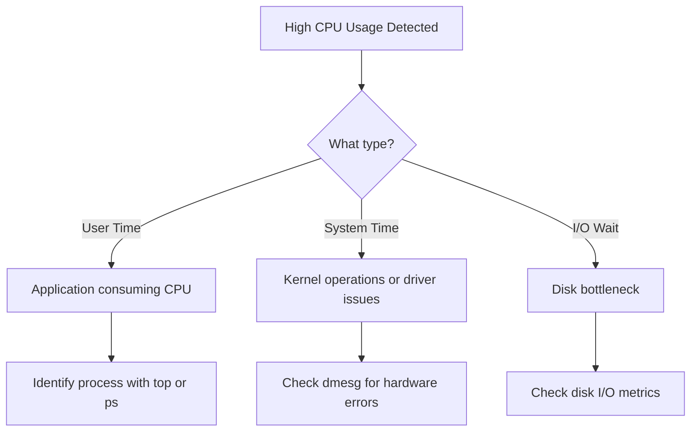
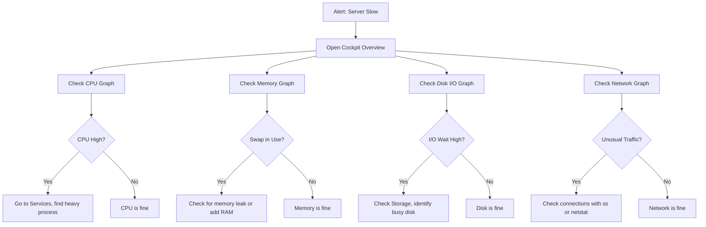

# How to Monitor System Resource Usage from the Cockpit Web Console on RHEL 9

Author: [nawazdhandala](https://www.github.com/nawazdhandala)

Tags: RHEL, Cockpit, Monitoring, System Resources, Linux

Description: Learn how to use the RHEL 9 Cockpit Web Console to monitor CPU, memory, disk I/O, and network usage with real-time graphs and historical performance data.

---

## Why Monitor Resources Through Cockpit

Command-line tools like `top`, `vmstat`, and `sar` are powerful, but sometimes you just want to glance at a graph and know whether the server is healthy. Cockpit gives you exactly that: real-time resource monitoring through a browser, with no extra agents or exporters to configure.

For quick health checks, capacity planning reviews, or troubleshooting performance issues, Cockpit's monitoring view gets you answers fast. It is especially useful when you need to show a non-technical stakeholder what is happening on a server without explaining `htop` output.

## Prerequisites

Make sure Cockpit is installed and running.

```bash
# Install Cockpit if not already present
sudo dnf install cockpit

# Enable and start the socket
sudo systemctl enable --now cockpit.socket

# Verify it is running
sudo systemctl status cockpit.socket
```

For historical performance data, you also want the Performance Co-Pilot (PCP) integration.

```bash
# Install PCP and the Cockpit PCP bridge
sudo dnf install cockpit-pcp

# Enable and start the PCP collector
sudo systemctl enable --now pmcd
sudo systemctl enable --now pmlogger
```

PCP collects performance data continuously, so Cockpit can show you graphs going back hours or days, not just the current moment.

## Accessing the Monitoring Dashboard

Open your browser and navigate to `https://your-server-ip:9090`. Log in with your credentials.

The **Overview** page shows a high-level summary with live graphs for CPU usage and memory usage. For deeper metrics, click on **Metrics and history** (if PCP is installed) or look at the individual sections.

## CPU Monitoring

The CPU graph on the overview page shows the combined CPU utilization as a percentage. For more detail, the metrics page breaks this down into:

- User time (time spent running user processes)
- System time (time spent in kernel operations)
- I/O wait (time spent waiting for disk I/O)

High I/O wait is a common culprit for sluggish systems. If you see it spiking, the bottleneck is usually the disk, not the CPU.

The command-line equivalents for reference:

```bash
# Quick CPU overview
top -bn1 | head -5

# Detailed CPU statistics updated every 2 seconds
mpstat -P ALL 2

# Check load averages
uptime
```

### What to Look For



## Memory Monitoring

Cockpit shows memory usage broken down into:

- Used memory
- Cached memory
- Swap usage

A common mistake is panicking when you see "high memory usage." Linux aggressively uses free memory for disk cache, which is a good thing. The cache is released immediately when applications need the memory. What you should worry about is swap usage. If swap is being used heavily and consistently, you either need more RAM or you have a memory leak.

```bash
# Quick memory overview
free -h

# Detailed memory information
cat /proc/meminfo

# Check which processes use the most memory
ps aux --sort=-%mem | head -10
```

### Swap Monitoring

In Cockpit, swap usage appears alongside memory. If swap starts climbing, pay attention. The command-line check:

```bash
# Check swap usage
swapon --show

# See which processes are using swap
for pid in /proc/[0-9]*; do
    awk '/VmSwap/{print FILENAME, $0}' "$pid/status" 2>/dev/null
done | sort -k3 -rn | head -10
```

## Disk I/O Monitoring

The metrics page shows disk read and write throughput over time. This is invaluable for spotting:

- Backup jobs that saturate disk I/O
- Database queries causing excessive reads
- Log floods generating massive writes

```bash
# Real-time disk I/O monitoring
iostat -xz 2

# Check which processes are doing the most I/O
sudo iotop -o
```

### Disk Space

Cockpit's **Storage** section shows disk space usage for each mounted file system. You can see at a glance which partitions are filling up.

```bash
# Check disk space usage
df -h

# Find the largest files in a directory
du -sh /var/log/* | sort -rh | head -10
```

## Network Monitoring

Network graphs in Cockpit show:

- Incoming traffic (receive) in bytes per second
- Outgoing traffic (transmit) in bytes per second

This is shown per-interface, so you can distinguish between management traffic and application traffic if your server has multiple network interfaces.

```bash
# Quick network interface stats
ip -s link show

# Real-time network monitoring
nload

# Detailed network statistics
ss -s
```

### Identifying Network Anomalies

Sudden spikes in network traffic can indicate:

- A DDoS attack or port scan
- A backup or replication job kicking in
- A misconfigured application flooding the network

Cockpit's graph makes these spikes immediately visible, whereas spotting them from the command line requires watching numbers scroll by.

## Historical Performance Data with PCP

With PCP installed, Cockpit stores performance data and lets you look back at historical trends. This is where it gets really useful for capacity planning.

On the metrics page, you can:

- Zoom into specific time ranges
- Compare CPU, memory, disk, and network side by side
- Spot patterns that correlate (for example, high disk I/O at the same time as high CPU)

PCP stores data in archives under `/var/log/pcp/pmlogger/`. You can also query this data from the command line.

```bash
# List available PCP metrics
pminfo | head -20

# Get current CPU utilization via PCP
pmval kernel.all.cpu.user -s 5 -t 1

# Query historical data from an archive
pmval -a /var/log/pcp/pmlogger/$(hostname)/20260304.0.xz kernel.all.cpu.user -S "@08:00" -T "@12:00"
```

### Configuring PCP Retention

By default, PCP keeps about 14 days of data. You can adjust this in the pmlogger configuration.

```bash
# Edit the pmlogger configuration
sudo vi /etc/pcp/pmlogger/control.d/local
```

The retention period is controlled by the pmlogger daily maintenance script. Check its configuration:

```bash
# View the pmlogger daily configuration
cat /etc/sysconfig/pmlogger
```

To change the retention period:

```bash
# Set PCP log retention to 30 days
sudo tee /etc/sysconfig/pmlogger << 'EOF'
PMLOGGER_DAILY_PARAMS="-E -x 30"
EOF
```

## Putting It All Together: A Monitoring Workflow



## Practical Tips

- **Set browser bookmarks** for your servers' Cockpit dashboards. Checking them takes seconds.
- **Install PCP early.** You cannot look at historical data from before PCP was installed. Get it running as part of your base server build.
- **Combine Cockpit with CLI tools.** Use Cockpit for the visual overview, then switch to `top`, `iostat`, or `ss` when you need to dig into specific processes or connections.
- **Do not rely on Cockpit alone for production monitoring.** It is great for individual server visibility, but for fleet-wide monitoring, use a dedicated solution like Prometheus, Grafana, or OneUptime that can aggregate data from many servers and send alerts.
- **Check the metrics page after incidents.** Being able to scroll back in time and see exactly when a spike happened, and what other metrics moved at the same time, is incredibly valuable for root cause analysis.

## Summary

Cockpit's resource monitoring on RHEL 9 gives you real-time and historical visibility into CPU, memory, disk, and network usage through a clean browser interface. Combined with PCP for data retention, it becomes a useful tool for daily health checks, troubleshooting, and capacity planning. Install it as part of your standard server build and you will always have a quick way to see what your system is doing.
