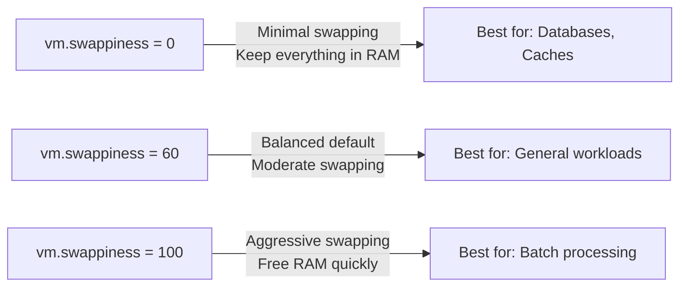

# How to Monitor and Tune Kernel Memory Management on RHEL

Author: [nawazdhandala](https://www.github.com/nawazdhandala)

Tags: RHEL, Kernel, Memory, Tuning, Linux

Description: A comprehensive guide to monitoring and tuning the Linux kernel's memory management subsystem on RHEL, covering swappiness, dirty pages, OOM killer behavior, page cache, and memory pressure indicators.

---

## Understanding Linux Memory Management

The Linux kernel does not just hand out RAM and forget about it. It actively manages memory through page caching, swap, reclamation, and the OOM killer. Understanding these mechanisms is key to tuning memory behavior for your workload.

On RHEL, the kernel's memory management defaults work well for general-purpose servers. But if you are running database servers, in-memory caches, container hosts, or other memory-intensive workloads, tuning can make a significant difference.

## Monitoring Memory Usage

### Reading /proc/meminfo

```bash
# View detailed memory information
cat /proc/meminfo
```

The most important fields:

| Field | Meaning |
|-------|---------|
| MemTotal | Total physical RAM |
| MemFree | Completely unused RAM |
| MemAvailable | Estimated memory available for new applications |
| Buffers | Memory used for block device I/O buffers |
| Cached | Memory used for page cache |
| SwapTotal | Total swap space |
| SwapFree | Unused swap space |
| Dirty | Memory waiting to be written to disk |
| Slab | Kernel data structure caches |

### Using vmstat for Real-Time Monitoring

```bash
# Print memory stats every 2 seconds
vmstat 2

# Include slab info
vmstat -m | head -20
```

### Using free for a Quick Overview

```bash
# Human-readable memory summary
free -h

# Watch memory changes over time
watch -n 5 free -h
```

## Tuning Swappiness

Swappiness controls how aggressively the kernel moves inactive pages from RAM to swap. The value ranges from 0 to 200 (on recent kernels), with 60 being the default.

```bash
# Check current swappiness
sysctl vm.swappiness

# Reduce swappiness for database servers (prefer keeping data in RAM)
sudo sysctl -w vm.swappiness=10

# Set to 0 to avoid swapping as much as possible
sudo sysctl -w vm.swappiness=0
```



Make it persistent:

```bash
sudo tee /etc/sysctl.d/90-memory.conf <<EOF
# Reduce swappiness for memory-intensive workloads
vm.swappiness = 10
EOF
sudo sysctl -p /etc/sysctl.d/90-memory.conf
```

## Dirty Page Tuning

When applications write data, it first goes to the page cache as "dirty" pages. The kernel's pdflush/writeback threads eventually flush dirty pages to disk. Tuning these parameters controls how much dirty data can accumulate and when writeback starts.

```bash
# Percentage of total memory that can be dirty before background writeback starts
sudo sysctl -w vm.dirty_background_ratio=5

# Percentage of total memory that can be dirty before processes are forced to wait
sudo sysctl -w vm.dirty_ratio=15

# Maximum time dirty data can stay in cache before forced writeback (centiseconds)
sudo sysctl -w vm.dirty_expire_centisecs=3000

# How often the writeback thread wakes up to check for dirty data (centiseconds)
sudo sysctl -w vm.dirty_writeback_centisecs=500
```

For database servers with battery-backed write caches, you can be more aggressive:

```bash
# Allow more dirty data for higher write throughput
sudo sysctl -w vm.dirty_background_ratio=10
sudo sysctl -w vm.dirty_ratio=30
```

For systems where data integrity matters more than throughput:

```bash
# Flush dirty data more aggressively
sudo sysctl -w vm.dirty_background_ratio=2
sudo sysctl -w vm.dirty_ratio=5
```

## Page Cache Management

The page cache uses free memory to cache file data from disk. This is usually beneficial, but sometimes you need to control it.

```bash
# Check current page cache usage
free -h | grep -i cache

# Drop caches (use with caution, mainly for benchmarking)
# 1 = page cache, 2 = dentries/inodes, 3 = both
echo 3 | sudo tee /proc/sys/vm/drop_caches
```

The `vfs_cache_pressure` parameter controls how aggressively the kernel reclaims memory from directory and inode caches.

```bash
# Default is 100 (balanced reclaim)
sysctl vm.vfs_cache_pressure

# Reduce to 50 to keep directory/inode caches longer (good for file servers)
sudo sysctl -w vm.vfs_cache_pressure=50

# Increase to 200 to reclaim cache more aggressively (good for memory-starved systems)
sudo sysctl -w vm.vfs_cache_pressure=200
```

## OOM Killer Tuning

When the system runs out of memory, the Out-of-Memory (OOM) killer selects a process to terminate. You can influence its choices.

```bash
# Check the OOM score of a specific process
cat /proc/$(pidof postgres)/oom_score

# Adjust OOM score to make a process less likely to be killed (-1000 to 1000)
echo -500 | sudo tee /proc/$(pidof postgres)/oom_score_adj

# Completely protect a process from OOM killer
echo -1000 | sudo tee /proc/$(pidof postgres)/oom_score_adj
```

For systemd services, use the `OOMScoreAdjust` directive:

```bash
# Create a drop-in to protect PostgreSQL from OOM killer
sudo systemctl edit postgresql.service
```

```ini
[Service]
OOMScoreAdjust=-900
```

```bash
sudo systemctl daemon-reload
sudo systemctl restart postgresql
```

### Controlling OOM Behavior

```bash
# Enable memory overcommit (default: heuristic)
# 0 = heuristic overcommit, 1 = always overcommit, 2 = strict (no overcommit)
sudo sysctl -w vm.overcommit_memory=0

# When using strict mode (2), set the overcommit ratio
# Total commit limit = swap + (RAM * overcommit_ratio / 100)
sudo sysctl -w vm.overcommit_ratio=80

# Trigger OOM killer vs kernel panic
# 0 = kill a process, 1 = kernel panic
sudo sysctl -w vm.panic_on_oom=0
```

## Memory Pressure Monitoring with PSI

Pressure Stall Information (PSI) gives you a clear picture of whether your system is actually suffering from memory pressure.

```bash
# Check memory pressure
cat /proc/pressure/memory

# Example output:
# some avg10=0.00 avg60=0.00 avg300=0.00 total=0
# full avg10=0.00 avg60=0.00 avg300=0.00 total=0
```

| Metric | Meaning |
|--------|---------|
| some | Percentage of time at least one task is stalled on memory |
| full | Percentage of time all tasks are stalled on memory |

If `full` is consistently above zero, your system needs more memory or better tuning.

## Monitoring with /proc/vmstat

```bash
# View virtual memory statistics
cat /proc/vmstat | grep -E "pgfault|pgmajfault|pswpin|pswpout|oom_kill"
```

| Counter | Meaning |
|---------|---------|
| pgfault | Total page faults (minor + major) |
| pgmajfault | Major page faults (required disk I/O) |
| pswpin | Pages swapped in from disk |
| pswpout | Pages swapped out to disk |
| oom_kill | Number of OOM kills |

## Comprehensive Persistent Configuration

```bash
sudo tee /etc/sysctl.d/90-memory-tuning.conf <<EOF
# Swappiness - reduce for database workloads
vm.swappiness = 10

# Dirty page thresholds
vm.dirty_background_ratio = 5
vm.dirty_ratio = 15
vm.dirty_expire_centisecs = 3000
vm.dirty_writeback_centisecs = 500

# Cache pressure - balanced
vm.vfs_cache_pressure = 100

# Overcommit - heuristic mode
vm.overcommit_memory = 0

# Do not panic on OOM, just kill a process
vm.panic_on_oom = 0

# Minimum free memory in KB (reserve for the kernel)
vm.min_free_kbytes = 65536
EOF

sudo sysctl --system
```

## Wrapping Up

Memory tuning on RHEL is about matching kernel behavior to your workload pattern. Monitor first with `free`, `vmstat`, and PSI metrics. Identify whether you are swap-bound, cache-bound, or facing OOM pressure. Then adjust the relevant parameters. The biggest wins usually come from getting swappiness and dirty page ratios right. Test under realistic load, not just idle conditions, and always keep your sysctl configuration files documented and version-controlled.
