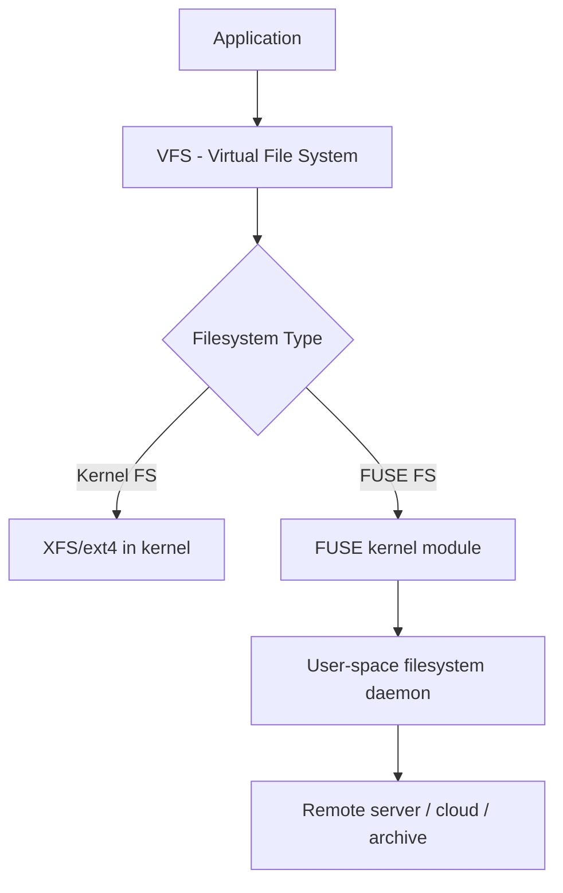

# How to Mount and Configure FUSE-Based File Systems on RHEL 9

Author: [nawazdhandala](https://www.github.com/nawazdhandala)

Tags: RHEL, FUSE, Filesystems, Linux

Description: Learn how to install, mount, and configure FUSE-based file systems on RHEL 9 for user-space filesystem access.

---

FUSE (Filesystem in Userspace) lets you mount filesystems without kernel modules. This means regular users can mount filesystems, developers can create custom filesystems, and you can access remote storage, archives, and cloud services as if they were local directories. RHEL 9 has solid FUSE support built in.

## What Is FUSE

Traditional filesystems (XFS, ext4) run in kernel space. FUSE provides a bridge that lets filesystem code run in user space while still appearing as a normal mount point to applications.



## Installing FUSE

FUSE is available by default on RHEL 9, but verify:

```bash
# Install FUSE packages
dnf install -y fuse fuse-libs fuse3 fuse3-libs
```

Check that the FUSE kernel module is loaded:

```bash
# Verify FUSE module
lsmod | grep fuse
```

If not loaded:

```bash
# Load the FUSE module
modprobe fuse
```

## Allowing Non-Root Users to Mount FUSE

By default, only root can mount FUSE filesystems. To allow regular users, edit the FUSE configuration:

```bash
# Edit FUSE config
vi /etc/fuse.conf
```

Uncomment or add:

```
user_allow_other
```

This allows users to use the `allow_other` mount option, making their FUSE mounts accessible to other users.

## Common FUSE Filesystems on RHEL 9

Several popular FUSE filesystems are available:

| Filesystem | Purpose | Package |
|-----------|---------|---------|
| SSHFS | Mount remote dirs over SSH | fuse-sshfs |
| s3fs | Mount S3 buckets | s3fs-fuse (EPEL) |
| ntfs-3g | Read/write NTFS drives | ntfs-3g |
| encfs | Encrypted directories | fuse-encfs (EPEL) |
| rclone mount | Cloud storage (S3, GCS, etc.) | rclone |

## Mounting NTFS Drives

NTFS support through FUSE is common for accessing Windows drives:

```bash
# Install ntfs-3g
dnf install -y ntfs-3g

# Mount an NTFS partition
mount -t ntfs-3g /dev/sdb1 /mnt/windows
```

For fstab:

```
/dev/sdb1  /mnt/windows  ntfs-3g  defaults,uid=1000,gid=1000  0 0
```

## General FUSE Mount Options

Common options that work with most FUSE filesystems:

```bash
# Mount with common options
mount -t fuse.<type> <device> /mountpoint -o allow_other,default_permissions,uid=1000,gid=1000
```

Key options:
- `allow_other` - let other users access the mount
- `default_permissions` - use kernel permission checking
- `uid=` / `gid=` - set ownership of files
- `ro` - mount read-only
- `noatime` - do not update access times

## Unmounting FUSE Filesystems

```bash
# Standard unmount
fusermount -u /mountpoint

# Or use umount
umount /mountpoint

# Force unmount if busy
fusermount -uz /mountpoint
```

The `fusermount` command is preferred for FUSE mounts as it handles cleanup properly.

## FUSE Performance Considerations

FUSE adds overhead compared to kernel filesystems because every I/O request crosses the kernel-user boundary:

- Small file operations are slower (more context switches)
- Large sequential I/O is less affected
- Network-based FUSE filesystems are limited by network latency anyway

To improve FUSE performance:

```bash
# Mount with larger buffer sizes where supported
mount -t fuse.sshfs user@host:/path /mnt -o max_read=131072,max_write=131072
```

## Debugging FUSE Issues

Enable debug output:

```bash
# Mount with debug output
mount -t fuse.<type> <device> /mountpoint -o debug
```

Check for FUSE-related kernel messages:

```bash
# Check kernel log
dmesg | grep -i fuse
```

Check if the FUSE device exists:

```bash
# Verify /dev/fuse
ls -la /dev/fuse
```

## SELinux and FUSE

SELinux on RHEL 9 may block some FUSE operations. Check for denials:

```bash
# Check for FUSE-related SELinux denials
ausearch -m avc -ts recent | grep fuse
```

If needed, create a policy module:

```bash
# Generate and install a policy for FUSE access
ausearch -m avc -ts recent | audit2allow -M myfuse
semodule -i myfuse.pp
```

## Automounting FUSE via fstab

FUSE filesystems can be added to fstab, but they need the `_netdev` option if they depend on networking:

```
sshfs#user@host:/remote/path  /mnt/remote  fuse  _netdev,user,idmap=user  0 0
```

## Automounting with systemd

For more control, use a systemd automount unit:

```bash
# /etc/systemd/system/mnt-remote.mount
cat > /etc/systemd/system/mnt-remote.mount << 'EOF'
[Unit]
Description=FUSE mount for remote storage
After=network-online.target

[Mount]
What=sshfs#user@host:/remote/path
Where=/mnt/remote
Type=fuse
Options=_netdev,user,idmap=user,IdentityFile=/root/.ssh/id_rsa

[Install]
WantedBy=multi-user.target
EOF

systemctl enable --now mnt-remote.mount
```

## Summary

FUSE on RHEL 9 gives you flexible, user-space filesystem access for remote storage, cloud services, and non-native filesystem formats. Install the FUSE packages, configure `/etc/fuse.conf` for user access, and use the appropriate FUSE filesystem for your needs. Keep in mind the performance overhead compared to kernel filesystems, and use `fusermount -u` for clean unmounts.
