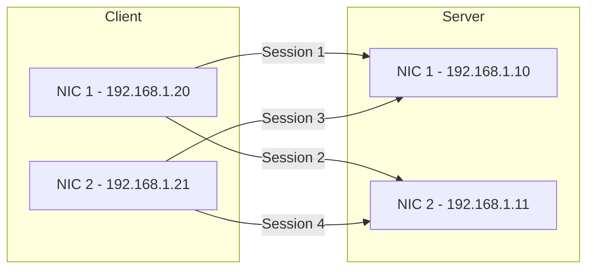

# How to Configure Multi-Channel Samba for Higher Throughput on RHEL

Author: [nawazdhandala](https://www.github.com/nawazdhandala)

Tags: RHEL, Samba, Multi-Channel, Performance, Linux

Description: Enable SMB multi-channel on RHEL to aggregate bandwidth across multiple network interfaces for higher Samba throughput.

---

## What Is SMB Multi-Channel?

SMB multi-channel allows a client and server to establish multiple simultaneous connections across different network interfaces or using multiple connections on the same interface. This provides both higher throughput (bandwidth aggregation) and fault tolerance (if one NIC fails, the connection continues over the others).

SMB 3.0 introduced multi-channel, and Samba on RHEL supports it.

## Prerequisites

- RHEL with Samba installed
- Multiple network interfaces on the server (and ideally the client)
- SMB 3.0 or later (default on RHEL)
- Both interfaces on the same network or directly connected

## Step 1 - Verify Network Interfaces

```bash
# List all network interfaces
ip addr show

# Verify both interfaces are up and have IPs
ip -4 addr show | grep "inet "
```

You need at least two NICs, for example:
- ens192: 192.168.1.10
- ens224: 192.168.1.11

## Step 2 - Enable Multi-Channel in Samba

Edit /etc/samba/smb.conf:

```ini
[global]
    workgroup = WORKGROUP
    server string = RHEL Multi-Channel Samba
    security = user

    # Enable SMB multi-channel
    server multi channel support = yes

    # Bind to specific interfaces (optional but recommended)
    interfaces = ens192 ens224
    bind interfaces only = yes
```

## Step 3 - Restart Samba

```bash
# Restart Samba to apply changes
sudo systemctl restart smb

# Verify Samba is listening on both interfaces
ss -tlnp | grep smbd
```

## Step 4 - Client Configuration

### Windows Client

Windows 10/11 and Windows Server 2012+ support SMB multi-channel by default. Verify:

```powershell
# Check if multi-channel is enabled
Get-SmbClientConfiguration | Select EnableMultichannel

# If disabled, enable it
Set-SmbClientConfiguration -EnableMultichannel $true
```

### Linux Client (Samba smbclient)

```bash
# Mount with multi-channel enabled
sudo mount -t cifs //192.168.1.10/shared /mnt/smb-share \
    -o credentials=/root/.smbcredentials,multichannel
```

## How Multi-Channel Works



The SMB protocol negotiates multiple connections automatically. Data flows across all available paths simultaneously.

## Verifying Multi-Channel Is Active

### On the Server

```bash
# Check active connections and their channels
sudo smbstatus -b
```

### On a Windows Client

```powershell
# View multi-channel connections
Get-SmbMultichannelConnection

# Detailed view
Get-SmbMultichannelConnection | Format-List
```

## Performance Testing

```bash
# Test throughput with a single NIC baseline
dd if=/dev/zero of=/mnt/smb-share/test1 bs=1M count=1024

# Compare with multi-channel active (both NICs)
dd if=/dev/zero of=/mnt/smb-share/test2 bs=1M count=1024
```

You should see roughly 2x throughput with two NICs compared to one.

## Network Bonding vs. Multi-Channel

Multi-channel and NIC bonding both aggregate bandwidth, but they work differently:

| Feature | Multi-Channel | NIC Bonding |
|---------|--------------|-------------|
| Layer | Application (SMB) | Network (L2) |
| Switch config | None | May need LACP |
| Protocol support | SMB only | All protocols |
| Client requirement | SMB 3.0+ | None |
| Setup complexity | Simple | Moderate |

For SMB traffic only, multi-channel is simpler. For general network aggregation, use bonding.

## Tuning Multi-Channel Performance

```ini
[global]
    # Additional performance settings
    server multi channel support = yes
    aio read size = 1
    aio write size = 1
    use sendfile = yes
    min receivefile size = 16384
```

## Troubleshooting

```bash
# Check if multi-channel is negotiated
sudo smbstatus -b | grep -i channel

# Verify Samba is bound to all interfaces
sudo ss -tlnp | grep smbd

# Check Samba log for multi-channel messages
sudo grep -i "multi" /var/log/samba/log.smbd
```

If multi-channel is not working:
- Verify both NICs are on the same subnet (or have routing configured)
- Check that no firewall rules block SMB on the second interface
- Ensure the client supports SMB 3.0+
- Verify `server multi channel support = yes` in smb.conf

## Wrap-Up

SMB multi-channel on RHEL is a straightforward way to increase Samba throughput by utilizing multiple network interfaces. Enable it in smb.conf, ensure both NICs are accessible, and the SMB protocol handles the rest. For environments already running multiple NICs, this is essentially free bandwidth aggregation that requires no switch configuration or network bonding setup.
