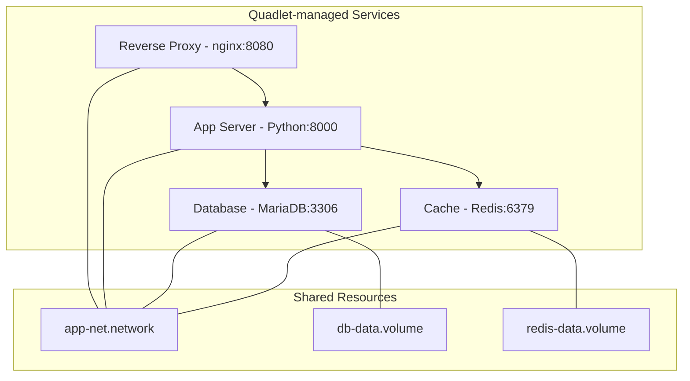

# How to Deploy Multi-Container Applications with Podman and Quadlet on RHEL

Author: [nawazdhandala](https://www.github.com/nawazdhandala)

Tags: RHEL, Podman, Quadlet, Multi-Container, Linux

Description: Learn how to deploy multi-container applications on RHEL using Podman Quadlet, including service dependencies, shared networks, and coordinated lifecycle management.

---

Most real-world applications are not a single container. You have a web frontend, an API backend, a database, maybe a cache layer and a reverse proxy. On RHEL, Podman's Quadlet system lets you define each piece as a separate `.container` file with shared networks and proper startup ordering. No Docker Compose needed.

## Architecture Overview

We will deploy a typical web application stack:



## Setting Up the Quadlet Directory

This section covers setting up the quadlet directory.

## Create the Quadlet directory for rootless containers
```bash
mkdir -p ~/.config/containers/systemd/
```

## Define the Shared Network

All containers need to be on the same network for DNS-based discovery:

```bash
cat > ~/.config/containers/systemd/app-net.network << 'EOF'
[Network]
Subnet=10.89.2.0/24
Gateway=10.89.2.1
Label=app=webapp
EOF
```

## Define the Volumes

```bash
cat > ~/.config/containers/systemd/db-data.volume << 'EOF'
[Volume]
Label=app=webapp
Label=component=database
EOF
```

```bash
cat > ~/.config/containers/systemd/redis-data.volume << 'EOF'
[Volume]
Label=app=webapp
Label=component=cache
EOF
```

## Define the Database Service

```bash
cat > ~/.config/containers/systemd/database.container << 'EOF'
[Unit]
Description=MariaDB Database for WebApp

[Container]
Image=docker.io/library/mariadb:latest
ContainerName=database
Network=app-net.network
Volume=db-data.volume:/var/lib/mysql:Z
Environment=MYSQL_ROOT_PASSWORD=rootsecret
Environment=MYSQL_DATABASE=webapp
Environment=MYSQL_USER=appuser
Environment=MYSQL_PASSWORD=appsecret
HealthCmd=healthcheck.sh --connect --innodb_initialized
HealthInterval=30s
HealthTimeout=10s
HealthRetries=5

[Service]
Restart=always
TimeoutStartSec=900

[Install]
WantedBy=default.target
EOF
```

## Define the Cache Service

```bash
cat > ~/.config/containers/systemd/cache.container << 'EOF'
[Unit]
Description=Redis Cache for WebApp

[Container]
Image=docker.io/library/redis:latest
ContainerName=cache
Network=app-net.network
Volume=redis-data.volume:/data:Z
HealthCmd=redis-cli ping
HealthInterval=15s
HealthTimeout=5s
HealthRetries=3

[Service]
Restart=always

[Install]
WantedBy=default.target
EOF
```

## Define the Application Service

```bash
cat > ~/.config/containers/systemd/appserver.container << 'EOF'
[Unit]
Description=Application Server
Requires=database.service cache.service
After=database.service cache.service

[Container]
Image=registry.access.redhat.com/ubi9/ubi-minimal
ContainerName=appserver
Network=app-net.network
Environment=DATABASE_HOST=database
Environment=DATABASE_PORT=3306
Environment=REDIS_HOST=cache
Environment=REDIS_PORT=6379
Exec=sleep infinity

[Service]
Restart=always

[Install]
WantedBy=default.target
EOF
```

The `Requires=` and `After=` directives ensure the database and cache start before the application server.

## Define the Reverse Proxy

```bash
cat > ~/.config/containers/systemd/proxy.container << 'EOF'
[Unit]
Description=Nginx Reverse Proxy
Requires=appserver.service
After=appserver.service

[Container]
Image=docker.io/library/nginx:latest
ContainerName=proxy
Network=app-net.network
PublishPort=8080:80

[Service]
Restart=always

[Install]
WantedBy=default.target
EOF
```

Only the proxy publishes a port to the host. Everything else communicates over the internal network.

## Starting the Stack

This section covers starting the stack.

## Reload systemd to pick up all new unit files
```bash
systemctl --user daemon-reload
```

## Start the proxy (which pulls in all dependencies)
```bash
systemctl --user start proxy
```

Because of the dependency chain, systemd starts them in order: database and cache first, then appserver, then proxy.

## Check the status of all services
```bash
systemctl --user status database cache appserver proxy
```

## Verify all containers are running
```bash
podman ps
```

## Enable All Services for Boot

```bash
systemctl --user enable database cache appserver proxy
```

Make sure lingering is enabled so services survive logout:

```bash
sudo loginctl enable-linger $USER
```

## Viewing Logs

This section covers viewing logs.

## View logs for a specific service
```bash
journalctl --user -u database -f
```

## View logs for all app-related services
```bash
journalctl --user -u database -u cache -u appserver -u proxy --no-pager -n 100
```

## Updating Individual Services

One advantage of Quadlet over Docker Compose is that you can update individual services independently:

## Pull a new database image
```bash
podman pull docker.io/library/mariadb:latest
```

## Restart just the database service
```bash
systemctl --user restart database
```

The other services continue running. If you need to restart dependent services:

```bash
systemctl --user restart database appserver
```

## Scaling Considerations

Quadlet does not have a built-in "scale" feature like Docker Compose. But you can create multiple container files:

```bash
cat > ~/.config/containers/systemd/appserver-2.container << 'EOF'
[Unit]
Description=Application Server Instance 2
Requires=database.service cache.service
After=database.service cache.service

[Container]
Image=registry.access.redhat.com/ubi9/ubi-minimal
ContainerName=appserver-2
Network=app-net.network
Environment=DATABASE_HOST=database
Environment=REDIS_HOST=cache
Exec=sleep infinity

[Service]
Restart=always

[Install]
WantedBy=default.target
EOF
```

## Stopping the Entire Stack

This section covers stopping the entire stack.

## Stop everything in reverse order
```bash
systemctl --user stop proxy appserver cache database
```

Or just stop the top-level service and let dependencies be handled:

```bash
systemctl --user stop proxy
```

## Debugging Quadlet Files

This section covers debugging quadlet files.

## Dry-run the Quadlet generator to check for errors
```bash
/usr/libexec/podman/quadlet --dryrun --user 2>&1
```

## View the generated systemd unit
```bash
systemctl --user cat database.service
```

## Summary

Deploying multi-container applications with Quadlet on RHEL gives you the reliability of systemd with the simplicity of declarative container definitions. Define your network, volumes, and containers in separate files, set up dependencies with standard systemd directives, and let systemd handle the startup ordering and lifecycle management. It is simpler than Docker Compose for many use cases and integrates naturally with the rest of the system.
