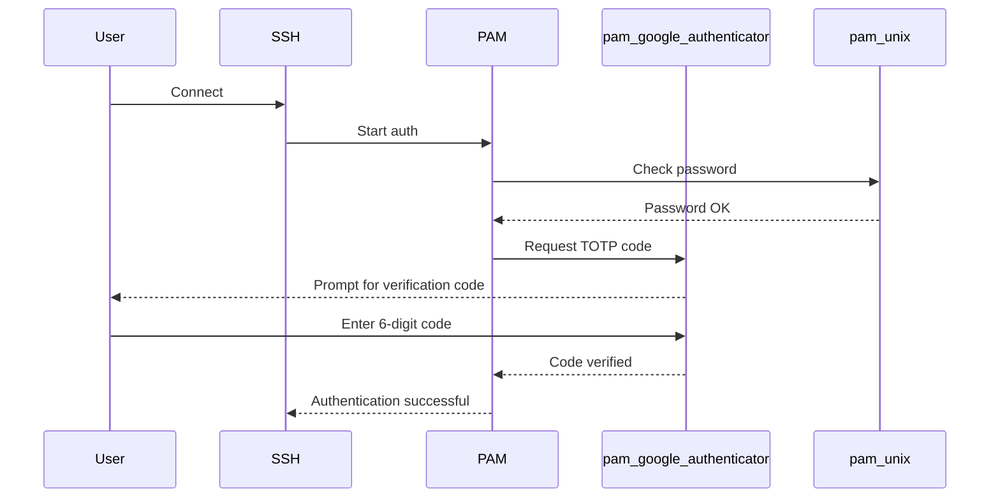

# How to Set Up Multi-Factor Authentication with PAM on RHEL 9

Author: [nawazdhandala](https://www.github.com/nawazdhandala)

Tags: RHEL, MFA, PAM, Security, Linux

Description: Configure multi-factor authentication on RHEL 9 using PAM with Google Authenticator TOTP, requiring both a password and a one-time code for login.

---

Passwords alone are not enough these days. Even strong passwords get phished, leaked in breaches, or brute-forced. Adding a second factor to your RHEL 9 login, typically a time-based one-time password (TOTP) from an authenticator app, makes compromised credentials far less useful to an attacker.

This guide walks through setting up TOTP-based MFA using the Google Authenticator PAM module on RHEL 9.

## How It Works

After setup, logging in requires two things: the user's regular password plus a 6-digit code from their authenticator app (Google Authenticator, Authy, FreeOTP, etc.).



## Installing Google Authenticator

The package is available from the EPEL repository.

```bash
# Enable the EPEL repository
sudo dnf install epel-release -y

# Install the Google Authenticator PAM module
sudo dnf install google-authenticator -y
```

Verify the module was installed:

```bash
# Check that the PAM module file exists
ls -la /usr/lib64/security/pam_google_authenticator.so
```

## Setting Up TOTP for a User

Each user needs to run the setup command to generate their secret key.

### Run the setup as the user (not as root)

```bash
# Run this as the user who will use MFA
google-authenticator
```

Answer the prompts:

```
Do you want authentication tokens to be time-based (y/n) y
```

The command outputs a QR code that you scan with your authenticator app. It also shows:
- A secret key (for manual entry)
- Emergency scratch codes (save these somewhere safe)

Continue answering:

```
Do you want me to update your "/home/jsmith/.google_authenticator" file? (y/n) y
Do you want to disallow multiple uses of the same authentication token? (y/n) y
By default, a new token is generated every 30 seconds... Do you want to do so? (y/n) n
Do you want to enable rate-limiting? (y/n) y
```

### Verify the configuration file was created

```bash
# The secret is stored in the user's home directory
ls -la ~/.google_authenticator
```

This file must be readable only by the user:

```bash
chmod 600 ~/.google_authenticator
```

## Configuring PAM for MFA

### Configure the SSH PAM service

```bash
sudo vi /etc/pam.d/sshd
```

Add the Google Authenticator module to the auth section. Place it after `pam_unix` (or the `password-auth` substack):

```
auth       substack     password-auth
auth       required     pam_google_authenticator.so nullok
```

The `nullok` option allows users who have not set up MFA yet to still log in with just a password. Remove `nullok` once all users have enrolled.

### Configure SSH to support challenge-response

```bash
sudo vi /etc/ssh/sshd_config
```

Make sure these settings are present:

```
ChallengeResponseAuthentication yes
AuthenticationMethods keyboard-interactive
```

Or if you want to require both a public key and TOTP:

```
AuthenticationMethods publickey,keyboard-interactive
```

### Restart the SSH service

```bash
sudo systemctl restart sshd
```

## Testing MFA

### Test from another terminal (keep your current session open)

```bash
ssh testuser@localhost
```

You should be prompted for your password first, then for a verification code.

### If something goes wrong

Keep your existing root session open. If MFA breaks SSH access, you can fix it from the existing session:

```bash
# Disable MFA temporarily by removing the PAM line
sudo vi /etc/pam.d/sshd
# Comment out the pam_google_authenticator.so line
```

## Advanced Configuration Options

### Allow MFA bypass for specific users

If service accounts need to log in without MFA, use the `nullok` option or combine with `pam_succeed_if`:

```
# Skip MFA for users in the 'svc-accounts' group
auth    [success=1 default=ignore]    pam_succeed_if.so user ingroup svc-accounts
auth    required                       pam_google_authenticator.so
```

### Require MFA only for SSH (not console)

Only add the `pam_google_authenticator.so` line to `/etc/pam.d/sshd`, not to `/etc/pam.d/system-auth`. This way, console logins remain password-only.

### Use a centralized secret storage

By default, secrets are stored in each user's home directory. For centralized management:

```
auth    required    pam_google_authenticator.so secret=/etc/google-auth/${USER}/.google_authenticator user=root
```

Create the directory structure:

```bash
sudo mkdir -p /etc/google-auth
# For each user
sudo mkdir -p /etc/google-auth/jsmith
sudo chown root:root /etc/google-auth/jsmith
sudo chmod 700 /etc/google-auth/jsmith
```

## Requiring SSH Key + TOTP (No Password)

For the strongest setup, require an SSH key as the first factor and TOTP as the second:

```bash
sudo vi /etc/ssh/sshd_config
```

```
PubkeyAuthentication yes
AuthenticationMethods publickey,keyboard-interactive:pam
```

Then in `/etc/pam.d/sshd`, make sure `pam_google_authenticator.so` is the only auth module that prompts (comment out the password-auth substack):

```
# auth    substack     password-auth
auth    required     pam_google_authenticator.so
```

This way, the user authenticates with their SSH key first, then gets prompted only for the TOTP code.

## Emergency Access with Scratch Codes

During setup, Google Authenticator generates 5 emergency scratch codes. These are one-time-use codes for when the user loses access to their authenticator app.

```bash
# View remaining scratch codes (as the user)
cat ~/.google_authenticator | tail -5
```

To regenerate scratch codes, run `google-authenticator` again.

## Monitoring MFA Events

```bash
# Check for MFA-related authentication events
sudo grep google_authenticator /var/log/secure

# Look for failed TOTP attempts
sudo grep "Failed to verify" /var/log/secure
```

## Wrapping Up

MFA with TOTP on RHEL 9 is one of the highest-impact security improvements you can make with relatively little effort. Start by deploying it to your admin team with `nullok` so users who have not enrolled yet are not locked out, then enforce it for everyone once enrollment is complete. Keep those emergency scratch codes somewhere safe, and always test MFA changes from a separate terminal while keeping an existing root session open.
