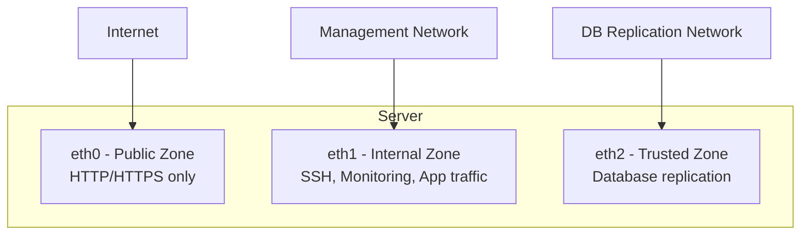

# How to Set Up a Multi-Zone Firewall Configuration on RHEL 9

Author: [nawazdhandala](https://www.github.com/nawazdhandala)

Tags: RHEL, Firewalld, Multi-Zone, Security, Linux

Description: How to design and implement a multi-zone firewall configuration on RHEL 9, with separate zones for public, management, and internal traffic on different interfaces.

---

Most production servers have more than one network interface. A web server might have a public-facing NIC and a private management NIC. A database server might have an application network and a replication network. Each of these interfaces carries different traffic with different trust levels, and that is exactly what multi-zone configurations are for.

## Design: Separating Traffic by Zone



Each interface gets its own zone with its own set of allowed services and ports.

## Step 1: Plan Your Zones

Before configuring, map out what each interface should allow:

| Interface | Zone | Purpose | Allowed Services |
|---|---|---|---|
| eth0 | public | Internet-facing | HTTP, HTTPS |
| eth1 | internal | Management | SSH, Cockpit (9090), Node Exporter (9100) |
| eth2 | trusted | Replication | All traffic (trusted network) |

## Step 2: Assign Interfaces to Zones

```bash
# Assign public-facing interface
firewall-cmd --zone=public --change-interface=eth0 --permanent

# Assign management interface
firewall-cmd --zone=internal --change-interface=eth1 --permanent

# Assign replication interface (trusted allows all traffic)
firewall-cmd --zone=trusted --change-interface=eth2 --permanent

# Apply changes
firewall-cmd --reload
```

## Step 3: Configure the Public Zone

Strip it down to only what is needed:

```bash
# Remove default SSH from public (we will only allow it on internal)
firewall-cmd --zone=public --remove-service=ssh --permanent
firewall-cmd --zone=public --remove-service=dhcpv6-client --permanent

# Add only web services
firewall-cmd --zone=public --add-service=http --permanent
firewall-cmd --zone=public --add-service=https --permanent

firewall-cmd --reload
```

## Step 4: Configure the Internal Zone

```bash
# SSH for management access
firewall-cmd --zone=internal --add-service=ssh --permanent

# Cockpit web console
firewall-cmd --zone=internal --add-service=cockpit --permanent

# Prometheus Node Exporter
firewall-cmd --zone=internal --add-port=9100/tcp --permanent

# SNMP monitoring
firewall-cmd --zone=internal --add-service=snmp --permanent

firewall-cmd --reload
```

## Step 5: Verify the Configuration

```bash
# Show active zones and their interfaces
firewall-cmd --get-active-zones

# Check each zone's rules
firewall-cmd --zone=public --list-all
firewall-cmd --zone=internal --list-all
firewall-cmd --zone=trusted --list-all
```

Expected output for active zones:

```
public
  interfaces: eth0
internal
  interfaces: eth1
trusted
  interfaces: eth2
```

## Testing the Configuration

From an external machine, verify that only allowed services are accessible:

```bash
# Should work (HTTP on public interface)
curl http://public-ip

# Should fail (SSH on public interface)
ssh user@public-ip

# Should work (SSH on management interface)
ssh user@management-ip
```

## Real-World Example: Application Server

```bash
# Public zone (eth0) - only the application port
firewall-cmd --zone=public --change-interface=eth0 --permanent
firewall-cmd --zone=public --remove-service=ssh --permanent
firewall-cmd --zone=public --add-port=8443/tcp --permanent

# Internal zone (eth1) - management and monitoring
firewall-cmd --zone=internal --change-interface=eth1 --permanent
firewall-cmd --zone=internal --add-service=ssh --permanent
firewall-cmd --zone=internal --add-port=9090/tcp --permanent
firewall-cmd --zone=internal --add-port=9100/tcp --permanent

# DMZ zone (eth2) - communication with other app servers
firewall-cmd --zone=dmz --change-interface=eth2 --permanent
firewall-cmd --zone=dmz --add-port=5701/tcp --permanent
firewall-cmd --zone=dmz --add-port=8080/tcp --permanent

firewall-cmd --reload
```

## Using Rich Rules with Multi-Zone

You can add rich rules to specific zones for even more control:

```bash
# Only allow monitoring from the Prometheus server
firewall-cmd --zone=internal --add-rich-rule='rule family="ipv4" source address="10.0.2.10" port port="9100" protocol="tcp" accept' --permanent

# Remove the generic port rule
firewall-cmd --zone=internal --remove-port=9100/tcp --permanent

firewall-cmd --reload
```

## Default Zone Behavior

Any interface not explicitly assigned to a zone uses the default zone:

```bash
# Check the default zone
firewall-cmd --get-default-zone

# Set a restrictive default
firewall-cmd --set-default-zone=drop
```

Setting the default to `drop` means any new or unassigned interface will silently drop all incoming traffic. This is a good security practice.

## Source-Based Zone Assignment

In addition to interface-based zones, you can assign traffic to zones based on source IP:

```bash
# Route traffic from 10.0.5.0/24 to the trusted zone regardless of interface
firewall-cmd --zone=trusted --add-source=10.0.5.0/24 --permanent
firewall-cmd --reload
```

Source-based assignments take precedence over interface-based ones.

## Troubleshooting Multi-Zone Issues

**Traffic hitting the wrong zone**: Check which zone an interface is in:

```bash
firewall-cmd --get-zone-of-interface=eth0
```

**Service accessible when it should not be**: Make sure the service is not in the default zone:

```bash
firewall-cmd --zone=public --list-all
```

**Zone changes not taking effect**: Remember to use `--permanent` and `--reload`:

```bash
firewall-cmd --reload
firewall-cmd --get-active-zones
```

## Summary

Multi-zone configurations let you apply different trust levels to different network interfaces. The pattern is simple: assign each interface to a zone, add only the services needed in each zone, remove defaults you do not need, and set the default zone to something restrictive. This approach naturally segments your firewall rules and makes it easy to audit what is allowed on each network. Always verify from external machines that the rules work as expected, testing both allowed and blocked traffic.
