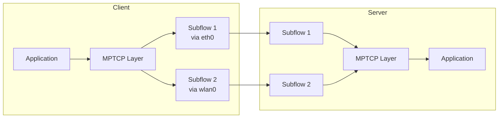

# How to Set Up Multipath TCP (MPTCP) on RHEL 9

Author: [nawazdhandala](https://www.github.com/nawazdhandala)

Tags: RHEL, MPTCP, TCP, Networking, Multi-Path, Linux

Description: Learn how to enable and configure Multipath TCP (MPTCP) on RHEL 9 to use multiple network paths simultaneously for improved throughput and redundancy.

---

Multipath TCP (MPTCP) extends standard TCP to use multiple network paths simultaneously. This means a connection can span both Wi-Fi and Ethernet, or multiple NICs, providing both higher throughput and seamless failover.

## How MPTCP Works



## Prerequisites

- RHEL 9.1 or later (MPTCP support is included in the kernel)
- At least two network interfaces
- Root or sudo access

## Step 1: Verify MPTCP Support

```bash
# Check if MPTCP is available in the kernel
sysctl net.mptcp.enabled
# Output: net.mptcp.enabled = 1

# If disabled, enable it
sudo sysctl -w net.mptcp.enabled=1

# Make it persistent
echo "net.mptcp.enabled=1" | sudo tee /etc/sysctl.d/mptcp.conf
```

## Step 2: Configure MPTCP Endpoints

```bash
# List current MPTCP endpoints
ip mptcp endpoint show

# Add the first interface as a subflow endpoint
sudo ip mptcp endpoint add 10.0.1.5 dev ens3 subflow

# Add the second interface as a subflow endpoint
sudo ip mptcp endpoint add 10.0.2.5 dev ens4 subflow

# Set the path manager limits
# This controls how many additional subflows can be created
sudo ip mptcp limits set subflow 2 add_addr_accepted 2

# Verify the configuration
ip mptcp endpoint show
ip mptcp limits show
```

## Step 3: Configure MPTCP with NetworkManager

```bash
# Enable MPTCP flags on a connection
sudo nmcli connection modify ens3 connection.mptcp-flags "subflow,signal"
sudo nmcli connection modify ens4 connection.mptcp-flags "subflow,signal"

# Reapply the connections
sudo nmcli connection up ens3
sudo nmcli connection up ens4
```

## Step 4: Test MPTCP Connections

```bash
# Install mptcpize utility to wrap existing applications with MPTCP
sudo dnf install -y mptcpd

# Run curl with MPTCP support
mptcpize run curl https://check.mptcp.dev

# Monitor MPTCP subflows in real time
ss -M
# or
ip mptcp monitor

# Check active MPTCP connections
ss -tM
```

## Step 5: Configure the Path Manager

```bash
# Set the path manager to in-kernel mode
sudo ip mptcp pm nl flush

# Add endpoints with specific flags
# "signal" means the address is announced to the peer
# "subflow" means the host will create a subflow to the peer
sudo ip mptcp pm nl add 10.0.1.5 flags signal,subflow dev ens3 id 1
sudo ip mptcp pm nl add 10.0.2.5 flags signal,subflow dev ens4 id 2

# Set limits
sudo ip mptcp pm nl limits set subflow 2 add_addr_accepted 2

# Show the configuration
ip mptcp pm nl dump
```

## Step 6: Server-Side MPTCP Configuration

```bash
# On the server, enable MPTCP and configure endpoints similarly
sudo sysctl -w net.mptcp.enabled=1

# Add server endpoints
sudo ip mptcp endpoint add 203.0.113.10 dev ens3 signal
sudo ip mptcp endpoint add 203.0.113.20 dev ens4 signal

# Set server limits
sudo ip mptcp limits set subflow 4 add_addr_accepted 4
```

## Monitoring and Debugging

```bash
# Watch MPTCP events in real time
ip mptcp monitor &

# Check MPTCP statistics
nstat -az | grep -i mptcp

# View detailed subflow information
ss -tiM

# Check MPTCP path manager counters
cat /proc/net/mptcp_net/snmp
```

## Summary

You have enabled and configured Multipath TCP on RHEL 9. MPTCP allows your applications to use multiple network paths simultaneously, improving both throughput and resilience. This is particularly valuable for mobile devices transitioning between networks, multi-homed servers, and any workload that benefits from link aggregation at the transport layer.
