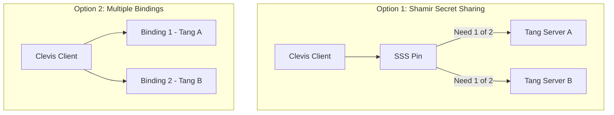
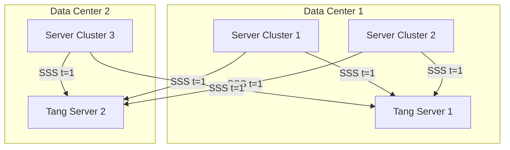

# How to Configure NBDE with Multiple Tang Servers for High Availability on RHEL 9

Author: [nawazdhandala](https://www.github.com/nawazdhandala)

Tags: RHEL, NBDE, Tang, High Availability, Linux

Description: Set up NBDE with multiple Tang servers on RHEL 9 using Shamir's Secret Sharing or redundant bindings to ensure encrypted volumes always unlock even if a Tang server is down.

---

A single Tang server is a single point of failure. If it goes down, your encrypted servers cannot unlock their volumes on reboot. For production environments, you need redundancy. Clevis supports two approaches: Shamir's Secret Sharing (SSS) for threshold-based unlocking, and multiple independent bindings for simple redundancy.

## Two Approaches to Tang HA



**Shamir's Secret Sharing (SSS)** splits the encryption secret into shares distributed across multiple Tang servers. You configure a threshold, for example "any 1 of 2" or "any 2 of 3." This is the recommended approach.

**Multiple independent bindings** add separate Clevis bindings to different LUKS key slots. Any single binding can unlock the volume. This is simpler but uses more LUKS key slots.

## Prerequisites

You need at least two Tang servers running on separate hosts:

- Tang Server A: 10.0.1.10
- Tang Server B: 10.0.1.11

Verify both are operational:

```bash
# Test Tang Server A
curl -sf http://10.0.1.10/adv | python3 -m json.tool

# Test Tang Server B
curl -sf http://10.0.1.11/adv | python3 -m json.tool
```

## Method 1: Shamir's Secret Sharing (Recommended)

SSS is built into Clevis through the `sss` pin. It wraps multiple pins and requires a configurable threshold to succeed.

### Binding with SSS - Any 1 of 2

This configuration succeeds if any one of the two Tang servers is reachable:

```bash
# Bind with SSS - threshold of 1 out of 2 Tang servers
sudo clevis luks bind -d /dev/sda3 sss '{"t":1,"pins":{"tang":[{"url":"http://10.0.1.10"},{"url":"http://10.0.1.11"}]}}'
```

When prompted, enter your existing LUKS passphrase. Clevis will contact both Tang servers and set up the SSS shares.

### Binding with SSS - Any 2 of 3

For higher security, require multiple Tang servers to agree:

```bash
# Bind with SSS - threshold of 2 out of 3 Tang servers
sudo clevis luks bind -d /dev/sda3 sss '{"t":2,"pins":{"tang":[{"url":"http://10.0.1.10"},{"url":"http://10.0.1.11"},{"url":"http://10.0.1.12"}]}}'
```

This means at least 2 of the 3 Tang servers must be reachable for the volume to unlock.

### Verifying the SSS Binding

```bash
# Check the binding details
sudo clevis luks list -d /dev/sda3
```

The output will show the SSS pin with the nested Tang pins and the threshold configuration.

## Method 2: Multiple Independent Bindings

This approach adds separate bindings, each in its own LUKS key slot:

```bash
# Add first Tang binding
sudo clevis luks bind -d /dev/sda3 tang '{"url":"http://10.0.1.10"}'

# Add second Tang binding
sudo clevis luks bind -d /dev/sda3 tang '{"url":"http://10.0.1.11"}'
```

Each binding gets its own LUKS key slot. During boot, Clevis tries each one. If any succeeds, the volume unlocks.

```bash
# Verify both bindings
sudo clevis luks list -d /dev/sda3
```

## Rebuilding the initramfs

After adding bindings, rebuild the initramfs:

```bash
# Ensure network early boot is configured
sudo tee /etc/dracut.conf.d/nbde-network.conf << 'EOF'
kernel_cmdline="rd.neednet=1"
EOF

# Rebuild initramfs
sudo dracut -fv
```

## Choosing Between SSS and Multiple Bindings

| Feature | SSS | Multiple Bindings |
|---------|-----|-------------------|
| LUKS key slots used | 1 | 1 per Tang server |
| Threshold support | Yes (t of n) | No (any single works) |
| Configuration complexity | Higher | Lower |
| Recommended by Red Hat | Yes | Acceptable |

SSS is preferred because it uses a single LUKS key slot regardless of how many Tang servers you have, and it supports flexible threshold policies.

## Testing Failover

Test that the encrypted volume unlocks when one Tang server is down:

```bash
# Stop Tang on Server A (on that server)
sudo systemctl stop tangd.socket

# On the client, test the binding
sudo clevis luks unlock -d /dev/sda3
# Should succeed using Server B

# Restart Tang on Server A
sudo systemctl start tangd.socket
```

For a full test, reboot the client while one Tang server is stopped.

## Monitoring Tang Server Availability

Set up monitoring to alert you when a Tang server goes down, even if NBDE still works with the remaining servers:

```bash
# Simple check script for monitoring
#!/bin/bash
for tang_server in 10.0.1.10 10.0.1.11; do
    if ! curl -sf "http://${tang_server}/adv" > /dev/null 2>&1; then
        echo "CRITICAL: Tang server ${tang_server} is unreachable"
        # Send alert to your monitoring system
    fi
done
```

## Key Rotation with Multiple Tang Servers

When rotating keys on one Tang server, clients bound via SSS will automatically use the other server(s) during the rotation period:

```bash
# On Tang Server A - generate new keys
sudo /usr/libexec/tangd-keygen /var/db/tang

# Clients can still unlock using Server B
# Re-bind clients to pick up the new Server A keys
sudo clevis luks regen -d /dev/sda3 -s 1
```

## Deployment Architecture for Large Environments



Place Tang servers in different failure domains - different racks, different power circuits, different network switches. For multi-site deployments, have at least one Tang server per site with SSS threshold of 1.

## Recovering from Total Tang Failure

If all Tang servers are down simultaneously, clients fall back to passphrase prompts. This is why you must always maintain a working LUKS passphrase:

```bash
# Verify passphrase still works
sudo cryptsetup luksOpen --test-passphrase /dev/sda3
```

Keep passphrases in a secure, accessible location like a locked safe or an enterprise secrets manager. When all Tang servers fail, these passphrases are your only way in.
