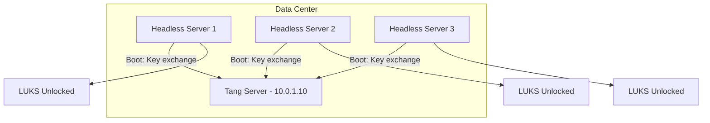

# How to Implement NBDE with Tang and Clevis for Headless RHEL Servers

Author: [nawazdhandala](https://www.github.com/nawazdhandala)

Tags: RHEL, NBDE, Tang, Clevis, Headless, Linux

Description: Deploy Network-Bound Disk Encryption with Tang and Clevis for headless RHEL servers that need automatic LUKS unlocking without console access.

---

Headless servers in data centers and remote locations present a unique challenge for disk encryption. There is no keyboard to type a passphrase, and console access through IPMI or iLO is slow and unreliable. NBDE with Tang and Clevis is the answer, letting these servers boot unattended while keeping their data encrypted at rest. This guide covers the full end-to-end setup for headless environments.

## The Headless Encryption Problem

Without NBDE, encrypted headless servers have two bad options:

1. Store the passphrase in a file on the boot partition (defeats the purpose of encryption)
2. Require someone to connect via IPMI/iLO console on every reboot (does not scale)

NBDE gives you a third option: the server unlocks automatically when it can reach the Tang server on your trusted network, but stays locked if it is physically removed.

## Architecture for Headless Deployment



## Prerequisites

Before starting, make sure:

- Tang server is deployed and accessible (see the Tang setup guide)
- RHEL is installed with LUKS encryption on the target servers
- Network is configured and working between clients and the Tang server
- You have console access for the initial setup (IPMI, iLO, or physical)

## Step 1: Prepare the Tang Server

On your Tang server, verify it is operational:

```bash
# Confirm Tang is running
sudo systemctl status tangd.socket

# Get the advertised keys
curl -sf http://10.0.1.10/adv | python3 -m json.tool

# Note the signing key thumbprint for verification
sudo tang-show-keys
```

Write down the thumbprint. You will need it when binding clients to verify you are connecting to the right Tang server.

## Step 2: Configure Each Headless Server

Connect to the headless server via console or SSH and install the required packages:

```bash
# Install Clevis with all required components
sudo dnf install clevis clevis-luks clevis-dracut -y
```

## Step 3: Bind LUKS to Tang

Identify the encrypted device and bind it:

```bash
# Find the LUKS device
lsblk -f | grep crypto

# Bind to Tang using IP address (more reliable than DNS for early boot)
sudo clevis luks bind -d /dev/sda3 tang '{"url":"http://10.0.1.10"}'
```

When prompted, verify the thumbprint matches what you noted from the Tang server, then enter the existing LUKS passphrase.

## Step 4: Configure Early Boot Networking

This is the most critical step for headless servers. The initramfs must bring up the network before trying to unlock the disk.

For DHCP:

```bash
# Create dracut config for network boot
sudo tee /etc/dracut.conf.d/nbde-network.conf << 'EOF'
kernel_cmdline="rd.neednet=1"
EOF
```

For static IP (more reliable in data center environments):

```bash
# Configure static IP for early boot
# Format: ip=client-ip::gateway:netmask:hostname:interface:none
sudo tee /etc/dracut.conf.d/nbde-network.conf << 'EOF'
kernel_cmdline="rd.neednet=1 ip=10.0.1.50::10.0.1.1:255.255.255.0:server01:ens192:none"
EOF
```

## Step 5: Rebuild initramfs

```bash
# Rebuild with Clevis and network support
sudo dracut -fv
```

Verify the Clevis modules are included:

```bash
# Check that Clevis modules are in the initramfs
lsinitrd | grep clevis
```

You should see Clevis binaries and scripts listed.

## Step 6: Test the Reboot

This is the moment of truth. Reboot the server:

```bash
# Reboot and verify automatic unlock
sudo reboot
```

Monitor via the console (IPMI/iLO) if possible. You should see the boot process bring up the network, contact Tang, and unlock the LUKS volume without any passphrase prompt.

If it works, you can close the console and rely on SSH access after boot.

## Step 7: Verify After Reboot

Once the server is back up:

```bash
# Confirm the LUKS volume is unlocked and mounted
lsblk -f
df -h

# Check boot logs for Clevis activity
journalctl -b | grep -i clevis
```

## Handling Boot Failures

If the server fails to unlock automatically, it will typically fall back to a passphrase prompt on the console. Connect via IPMI/iLO and enter the passphrase manually, then troubleshoot.

Common issues for headless servers:

```bash
# Check if network came up during boot
journalctl -b | grep -E "network|dhcp|ens|eth"

# Check if Tang was reachable
journalctl -b | grep tang

# Verify the binding
sudo clevis luks list -d /dev/sda3

# Test Tang connectivity manually
curl -sf http://10.0.1.10/adv
```

## Configuring a Fallback IPMI/iLO Alert

For extra safety, configure the BMC to send an alert if the server does not complete boot within a reasonable time:

```bash
# Configure IPMI boot watchdog (if supported by your hardware)
sudo ipmitool mc watchdog set timer use=bios_frb2 countdown=300 action=power_cycle
```

## Multiple Network Interface Handling

Headless servers often have multiple NICs. Make sure the correct one is specified for early boot:

```bash
# Identify the interface connected to the Tang network
ip addr show

# Use the specific interface in the dracut config
sudo tee /etc/dracut.conf.d/nbde-network.conf << 'EOF'
kernel_cmdline="rd.neednet=1 ip=10.0.1.50::10.0.1.1:255.255.255.0:server01:ens192:none"
EOF

sudo dracut -fv
```

## Automating Headless NBDE Deployment with Kickstart

For deploying new headless servers at scale, include NBDE configuration in your Kickstart file:

```bash
# Kickstart snippet for NBDE
%packages
clevis
clevis-luks
clevis-dracut
%end

%post
# Bind LUKS to Tang
clevis luks bind -d /dev/sda3 -f tang '{"url":"http://10.0.1.10","thp":"key-thumbprint-here"}'

# Configure networking in dracut
cat > /etc/dracut.conf.d/nbde-network.conf << 'NBDE'
kernel_cmdline="rd.neednet=1"
NBDE

# Rebuild initramfs
dracut -fv
%end
```

The `-f` flag skips the interactive thumbprint verification by providing it directly, and the `thp` parameter pins the expected thumbprint.

## Security Considerations for Headless NBDE

- Use IP addresses instead of hostnames in Tang URLs to avoid DNS dependency during early boot
- Place Tang servers on the same network segment as the headless servers to minimize failure points
- Always keep a working LUKS passphrase as a fallback, stored securely off-site
- Monitor Tang server availability with your monitoring system
- Test the full reboot cycle after any network changes

NBDE with Tang and Clevis turns disk encryption from a headless server liability into a practical security control. Servers boot unattended on the trusted network, and data stays protected if hardware leaves the data center.
