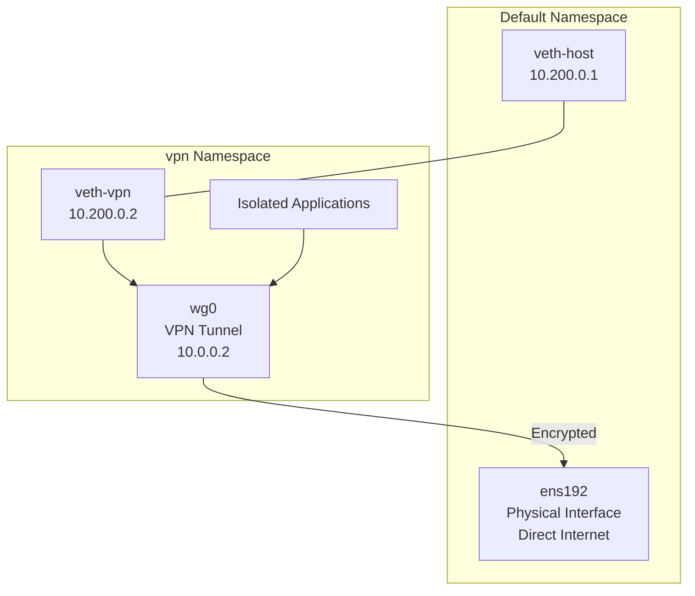

# How to Use Network Namespaces to Isolate VPN Traffic on RHEL 9

Author: [nawazdhandala](https://www.github.com/nawazdhandala)

Tags: RHEL, Network Namespaces, VPN, Isolation, Linux

Description: Learn how to use network namespaces on RHEL 9 to run a VPN in an isolated network environment, ensuring only specific applications use the VPN while the rest of the system uses the normal network path.

---

Sometimes you need only certain applications to go through a VPN, while the rest of the system uses the normal network. Or you want to prevent VPN leaks entirely by making it physically impossible for a process to bypass the tunnel. Network namespaces solve both problems elegantly on RHEL 9.

## The Problem with Traditional Split Tunneling

Traditional split tunneling relies on routing rules. But applications can ignore routes, DNS can leak outside the tunnel, and a misconfiguration can expose traffic you wanted protected. Network namespaces provide hard isolation - a process inside a namespace literally cannot see the physical interface.

## Architecture: VPN in a Namespace



## Setting Up the VPN Namespace

### Step 1: Create the Namespace

```bash
# Create the VPN namespace
sudo ip netns add vpn

# Bring up loopback inside the namespace
sudo ip netns exec vpn ip link set lo up
```

### Step 2: Connect the Namespace to the Host

```bash
# Create a veth pair
sudo ip link add veth-host type veth peer name veth-vpn

# Move one end into the vpn namespace
sudo ip link set veth-vpn netns vpn

# Configure the host side
sudo ip addr add 10.200.0.1/24 dev veth-host
sudo ip link set veth-host up

# Configure the namespace side
sudo ip netns exec vpn ip addr add 10.200.0.2/24 dev veth-vpn
sudo ip netns exec vpn ip link set veth-vpn up
```

### Step 3: Set Up Routing and NAT

The VPN namespace needs to reach the VPN server through the host's physical interface.

```bash
# Default route inside the namespace goes through the veth pair
sudo ip netns exec vpn ip route add default via 10.200.0.1

# Enable forwarding on the host
sudo sysctl -w net.ipv4.ip_forward=1

# NAT traffic from the namespace
sudo iptables -t nat -A POSTROUTING -s 10.200.0.0/24 -o ens192 -j MASQUERADE

# Allow forwarding
sudo iptables -A FORWARD -i veth-host -o ens192 -j ACCEPT
sudo iptables -A FORWARD -i ens192 -o veth-host -m state --state RELATED,ESTABLISHED -j ACCEPT
```

### Step 4: Set Up DNS in the Namespace

```bash
# Create DNS config for the namespace
sudo mkdir -p /etc/netns/vpn
echo "nameserver 8.8.8.8" | sudo tee /etc/netns/vpn/resolv.conf
```

### Step 5: Start WireGuard Inside the Namespace

```bash
# Copy the WireGuard config into the namespace
# The config should use the namespace's routing
sudo ip netns exec vpn wg-quick up /etc/wireguard/wg0.conf
```

Or set it up manually:

```bash
# Create the WireGuard interface inside the namespace
sudo ip netns exec vpn ip link add wg0 type wireguard

# Configure it
sudo ip netns exec vpn wg setconf wg0 /etc/wireguard/wg0.conf
sudo ip netns exec vpn ip addr add 10.0.0.2/24 dev wg0
sudo ip netns exec vpn ip link set wg0 up

# Replace the default route to go through the VPN
sudo ip netns exec vpn ip route del default
sudo ip netns exec vpn ip route add default dev wg0

# Keep a route to the VPN server through the veth pair
sudo ip netns exec vpn ip route add VPN_SERVER_IP via 10.200.0.1
```

### Step 6: Update DNS to Use VPN DNS

```bash
# Update DNS to use VPN's DNS server
echo "nameserver 10.0.0.1" | sudo tee /etc/netns/vpn/resolv.conf
```

## Running Applications in the VPN Namespace

```bash
# Run a browser in the VPN namespace
sudo ip netns exec vpn sudo -u $USER firefox &

# Run curl to verify you're going through the VPN
sudo ip netns exec vpn curl ifconfig.me

# Run any command
sudo ip netns exec vpn ping -c 4 10.0.0.1
```

## Verifying Isolation

```bash
# From the default namespace - shows your real IP
curl ifconfig.me

# From the VPN namespace - shows the VPN server's IP
sudo ip netns exec vpn curl ifconfig.me

# Check that the namespace can't see the physical interface
sudo ip netns exec vpn ip link show
# Should only show lo, veth-vpn, and wg0 - NOT ens192
```

## Creating a Convenience Script

```bash
sudo tee /usr/local/bin/vpn-exec > /dev/null << 'EOF'
#!/bin/bash
# Run a command inside the VPN namespace
# Usage: vpn-exec <command> [args...]

if [ $# -eq 0 ]; then
    echo "Usage: vpn-exec <command> [args...]"
    exit 1
fi

exec sudo ip netns exec vpn sudo -u "$SUDO_USER" "$@"
EOF

sudo chmod +x /usr/local/bin/vpn-exec

# Usage:
# sudo vpn-exec curl ifconfig.me
# sudo vpn-exec firefox
```

## Advantages Over Traditional Split Tunneling

1. **No DNS leaks** - DNS inside the namespace uses the VPN's DNS exclusively
2. **No route leaks** - Applications can't bypass the VPN because they can't see the physical interface
3. **Process-level control** - Only processes you explicitly start in the namespace use the VPN
4. **Easy verification** - `ip link show` inside the namespace confirms isolation

## Cleaning Up

```bash
# Bring down WireGuard inside the namespace
sudo ip netns exec vpn wg-quick down wg0

# Delete the namespace (removes veth endpoints too)
sudo ip netns del vpn

# Remove NAT rules
sudo iptables -t nat -D POSTROUTING -s 10.200.0.0/24 -o ens192 -j MASQUERADE

# Remove DNS config
sudo rm -rf /etc/netns/vpn
```

## Troubleshooting

**Can't reach VPN server from namespace:**

```bash
# Check routing inside the namespace
sudo ip netns exec vpn ip route show

# Verify the host-side veth is up
ip link show veth-host

# Check NAT is working
sudo iptables -t nat -L POSTROUTING -v -n
```

**VPN works but DNS fails:**

```bash
# Check the namespace's resolv.conf
sudo ip netns exec vpn cat /etc/resolv.conf

# Test DNS directly
sudo ip netns exec vpn dig @10.0.0.1 example.com
```

## Wrapping Up

Network namespaces give you bulletproof VPN isolation on RHEL 9. Applications in the namespace physically cannot communicate except through the VPN tunnel. This approach eliminates DNS leaks, route leaks, and accidental cleartext exposure. It takes more setup than traditional split tunneling, but the security guarantees are significantly stronger.
