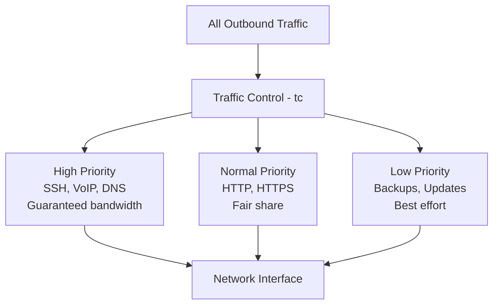

# How to Set Up Network Traffic Shaping and QoS on RHEL 9

Author: [nawazdhandala](https://www.github.com/nawazdhandala)

Tags: RHEL, QoS, Traffic Shaping, Networking, Linux

Description: Learn how to implement network traffic shaping and Quality of Service (QoS) on RHEL 9 using tc (traffic control) to prioritize critical traffic, limit bandwidth, and manage network congestion.

---

Not all network traffic is created equal. Database replication is more important than someone's Spotify stream. SSH sessions need low latency even if they use minimal bandwidth. Traffic shaping with QoS lets you enforce these priorities at the OS level on RHEL 9.

## What Traffic Shaping Can Do



Important limitation: traffic shaping only works on **outbound** traffic. You can't directly control what comes in. For inbound shaping, you'd use an Intermediate Functional Block (IFB) device, or shape at the upstream router.

## The tc Command

`tc` (traffic control) is the tool for QoS on Linux. It's part of the iproute2 package, which is installed by default.

```bash
# Check current queueing discipline
tc qdisc show dev ens192

# On RHEL 9, you'll likely see fq_codel as the default
```

## Simple Bandwidth Limiting

The quickest way to limit bandwidth on an interface:

```bash
# Limit outbound bandwidth to 100 Mbits/sec using tbf (Token Bucket Filter)
sudo tc qdisc add dev ens192 root tbf rate 100mbit burst 32kbit latency 400ms

# Verify
tc qdisc show dev ens192

# Remove the limit
sudo tc qdisc del dev ens192 root
```

## Setting Up HTB (Hierarchical Token Bucket)

HTB is the standard choice for complex QoS policies. It lets you create a hierarchy of classes with guaranteed and maximum bandwidths.

```bash
# Step 1: Add the root HTB qdisc
# Total link capacity: 1 Gbit
sudo tc qdisc add dev ens192 root handle 1: htb default 30

# Step 2: Create the root class (total available bandwidth)
sudo tc class add dev ens192 parent 1: classid 1:1 htb rate 1gbit

# Step 3: Create sub-classes
# High priority: guaranteed 500 Mbits, can burst to 1 Gbit
sudo tc class add dev ens192 parent 1:1 classid 1:10 htb rate 500mbit ceil 1gbit prio 1

# Normal priority: guaranteed 300 Mbits, can burst to 800 Mbit
sudo tc class add dev ens192 parent 1:1 classid 1:20 htb rate 300mbit ceil 800mbit prio 2

# Low priority: guaranteed 200 Mbits, can burst to 500 Mbit
sudo tc class add dev ens192 parent 1:1 classid 1:30 htb rate 200mbit ceil 500mbit prio 3
```

## Classifying Traffic with Filters

Once you have classes, you need filters to sort traffic into them.

```bash
# SSH traffic goes to high priority (class 1:10)
sudo tc filter add dev ens192 parent 1: protocol ip prio 1 u32 match ip dport 22 0xffff flowid 1:10

# DNS traffic goes to high priority
sudo tc filter add dev ens192 parent 1: protocol ip prio 1 u32 match ip dport 53 0xffff flowid 1:10

# HTTP/HTTPS traffic goes to normal priority (class 1:20)
sudo tc filter add dev ens192 parent 1: protocol ip prio 2 u32 match ip dport 80 0xffff flowid 1:20
sudo tc filter add dev ens192 parent 1: protocol ip prio 2 u32 match ip dport 443 0xffff flowid 1:20

# Everything else falls to default (class 1:30) via the "default 30" setting
```

## Adding fq_codel to Each Class

Each class should have a fair queueing discipline to prevent starvation within the class.

```bash
# Add fq_codel to each leaf class
sudo tc qdisc add dev ens192 parent 1:10 handle 10: fq_codel
sudo tc qdisc add dev ens192 parent 1:20 handle 20: fq_codel
sudo tc qdisc add dev ens192 parent 1:30 handle 30: fq_codel
```

## Verifying the Configuration

```bash
# Show all qdiscs
tc qdisc show dev ens192

# Show all classes with statistics
tc -s class show dev ens192

# Show all filters
tc filter show dev ens192
```

## Making QoS Persistent

tc rules don't survive reboots. Use a NetworkManager dispatcher script.

```bash
# Create a dispatcher script
sudo tee /etc/NetworkManager/dispatcher.d/90-qos > /dev/null << 'SCRIPT'
#!/bin/bash
IFACE=$1
ACTION=$2

if [ "$IFACE" = "ens192" ] && [ "$ACTION" = "up" ]; then
    # Clear existing rules
    tc qdisc del dev ens192 root 2>/dev/null

    # Set up HTB
    tc qdisc add dev ens192 root handle 1: htb default 30
    tc class add dev ens192 parent 1: classid 1:1 htb rate 1gbit
    tc class add dev ens192 parent 1:1 classid 1:10 htb rate 500mbit ceil 1gbit prio 1
    tc class add dev ens192 parent 1:1 classid 1:20 htb rate 300mbit ceil 800mbit prio 2
    tc class add dev ens192 parent 1:1 classid 1:30 htb rate 200mbit ceil 500mbit prio 3

    # Filters
    tc filter add dev ens192 parent 1: protocol ip prio 1 u32 match ip dport 22 0xffff flowid 1:10
    tc filter add dev ens192 parent 1: protocol ip prio 1 u32 match ip dport 53 0xffff flowid 1:10
    tc filter add dev ens192 parent 1: protocol ip prio 2 u32 match ip dport 80 0xffff flowid 1:20
    tc filter add dev ens192 parent 1: protocol ip prio 2 u32 match ip dport 443 0xffff flowid 1:20

    # Fair queueing on leaves
    tc qdisc add dev ens192 parent 1:10 handle 10: fq_codel
    tc qdisc add dev ens192 parent 1:20 handle 20: fq_codel
    tc qdisc add dev ens192 parent 1:30 handle 30: fq_codel
fi
SCRIPT

sudo chmod +x /etc/NetworkManager/dispatcher.d/90-qos
```

## Monitoring QoS in Action

```bash
# Watch class statistics update in real time
watch -n 1 'tc -s class show dev ens192'

# Check bytes sent and packets per class
tc -s class show dev ens192 | grep -A 3 "class htb"
```

## Removing QoS Rules

```bash
# Remove everything and restore default
sudo tc qdisc del dev ens192 root

# Verify it's back to default
tc qdisc show dev ens192
```

## Wrapping Up

Traffic shaping on RHEL 9 with tc gives you control over how your outbound bandwidth is used. HTB with fq_codel on the leaf classes is the standard recipe. The setup involves three layers: qdiscs define the algorithm, classes define the bandwidth allocation, and filters classify packets into classes. Make it persistent with a dispatcher script, and monitor it with `tc -s` to make sure traffic is flowing where you expect.
