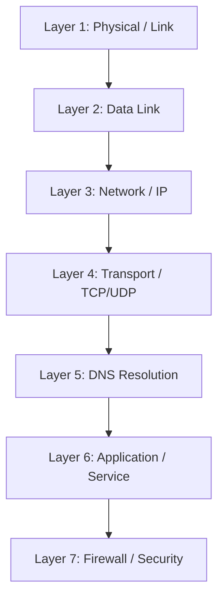

# How to Build a Network Troubleshooting Checklist for RHEL 9

Author: [nawazdhandala](https://www.github.com/nawazdhandala)

Tags: RHEL, Troubleshooting, Networking, Checklist, Linux

Description: A structured network troubleshooting checklist for RHEL 9 systems, walking through each layer from physical connectivity to application issues, with specific commands and verification steps.

---

When a network issue hits, having a systematic checklist keeps you from chasing your tail. I've seen seasoned engineers waste hours on DNS when the problem was a cable, and vice versa. Working through the layers methodically is faster than guessing. Here's the checklist I use on RHEL 9 systems.

## The Troubleshooting Stack



Always start at the bottom. A Layer 1 problem makes everything above it fail.

## Layer 1: Physical and Link State

Is the interface physically connected and up?

```bash
# Check interface link state
ip link show dev ens192

# Look for "state UP" or "state DOWN"
# Also check for "NO-CARRIER" which means no cable or link

# Check all interfaces at a glance
ip -br link show

# Check link speed and duplex
ethtool ens192 | grep -E "Speed|Duplex|Link detected"
```

**What to look for:**
- Interface is UP
- Link detected: yes
- Speed and duplex match expectations
- No excessive errors in `ip -s link show`

```bash
# Check for errors and drops
ip -s link show dev ens192
# Look at RX/TX errors, drops, and overruns
```

## Layer 2: Data Link and ARP/NDP

Can you reach your local gateway at the data link layer?

```bash
# Check the ARP/neighbor table
ip neigh show dev ens192

# Look for your gateway - it should be REACHABLE or STALE
# If it's INCOMPLETE or FAILED, Layer 2 connectivity is broken

# Try to trigger an ARP resolution
ping -c 1 GATEWAY_IP

# Check again
ip neigh show dev ens192
```

## Layer 3: IP Configuration and Routing

Does the interface have the right IP? Are routes correct?

```bash
# Check IP addresses
ip -br addr show

# Verify the expected address is there
ip addr show dev ens192

# Check the routing table
ip route show

# Verify default route exists
ip route show default

# Check the route to a specific destination
ip route get 8.8.8.8

# Test gateway reachability
ping -c 4 GATEWAY_IP
```

**Common issues:**
- No IP address (DHCP failure or misconfiguration)
- Wrong subnet mask
- Missing or incorrect default route
- Duplicate IP address

```bash
# Check for DHCP issues
journalctl -u NetworkManager --since "10 minutes ago" | grep -i dhcp
```

## Layer 4: Transport Connectivity

Can you establish TCP connections? Is UDP working?

```bash
# Test TCP connectivity to a known service
curl -o /dev/null -s -w "%{http_code}" http://example.com
# Any response (even 404) means TCP works

# Test a specific port
ss -tn state established dst example.com

# Check if a local service is listening
ss -tlnp | grep :80

# Test UDP (DNS is a good test)
dig +short example.com @8.8.8.8
```

## Layer 5: DNS Resolution

Can you resolve hostnames?

```bash
# Test DNS resolution
dig example.com

# Check which nameserver is being used
cat /etc/resolv.conf

# Or with systemd-resolved
resolvectl status

# Test with a specific DNS server
dig @8.8.8.8 example.com

# Test reverse DNS
dig -x 8.8.8.8
```

**Common DNS issues:**
- No nameservers in /etc/resolv.conf
- Nameserver unreachable
- Incorrect search domain
- DNS cache returning stale results

```bash
# Flush DNS cache (if using systemd-resolved)
sudo resolvectl flush-caches
```

## Layer 6: Application and Service

Is the service itself running and responding?

```bash
# Check if the service is running
sudo systemctl status httpd  # or nginx, etc.

# Check service logs
journalctl -u httpd --since "10 minutes ago"

# Test the application locally
curl -v http://localhost:80

# Check if the service is bound to the right address
ss -tlnp | grep :80
# Is it listening on 0.0.0.0 (all interfaces) or 127.0.0.1 (localhost only)?
```

## Layer 7: Firewall and Security

Is the firewall blocking traffic?

```bash
# Check firewall rules
sudo firewall-cmd --list-all

# Check if the service/port is allowed
sudo firewall-cmd --list-services
sudo firewall-cmd --list-ports

# Temporarily disable firewall to test (re-enable immediately after)
sudo systemctl stop firewalld
# Test connectivity
sudo systemctl start firewalld

# Check SELinux
getenforce

# Check for SELinux denials
sudo ausearch -m avc --start recent
```

## The Quick Diagnostic Script

Here's a script that runs through the entire checklist:

```bash
#!/bin/bash
# Network troubleshooting checklist for RHEL 9
# Usage: sudo bash netcheck.sh [target_host]

TARGET=${1:-"8.8.8.8"}
IFACE=$(ip route get $TARGET 2>/dev/null | grep -oP 'dev \K\S+')

echo "=== Target: $TARGET ==="
echo "=== Interface: $IFACE ==="
echo ""

echo "--- Layer 1: Link State ---"
ip -br link show dev $IFACE 2>/dev/null
echo ""

echo "--- Layer 2: Neighbors ---"
ip neigh show dev $IFACE 2>/dev/null | head -5
echo ""

echo "--- Layer 3: IP and Routes ---"
ip -br addr show dev $IFACE 2>/dev/null
echo "Default route:"
ip route show default
echo "Route to target:"
ip route get $TARGET 2>/dev/null
echo "Ping gateway:"
GW=$(ip route show default | awk '{print $3}' | head -1)
ping -c 2 -W 2 $GW 2>/dev/null | tail -2
echo ""

echo "--- Layer 4: Connectivity ---"
echo "Ping target:"
ping -c 2 -W 2 $TARGET 2>/dev/null | tail -2
echo ""

echo "--- Layer 5: DNS ---"
echo "Nameservers:"
grep nameserver /etc/resolv.conf
echo "Resolution test:"
dig +short example.com 2>/dev/null || echo "DNS FAILED"
echo ""

echo "--- Layer 6: Services ---"
echo "Listening TCP:"
ss -tlnp 2>/dev/null | head -10
echo ""

echo "--- Layer 7: Firewall ---"
echo "Active zone:"
firewall-cmd --get-active-zones 2>/dev/null
echo "Allowed services:"
firewall-cmd --list-services 2>/dev/null
echo "SELinux:"
getenforce 2>/dev/null
```

## Common Gotchas on RHEL 9

**NetworkManager overrides manual changes:**
Any `ip addr` or `ip route` changes will be undone when NetworkManager refreshes. Use `nmcli` for persistent changes.

**firewalld zone confusion:**
If an interface isn't explicitly assigned to a zone, it falls into the default zone. Check with `firewall-cmd --get-active-zones`.

**SELinux port bindings:**
If a service tries to listen on a non-standard port, SELinux may block it. Check with `semanage port -l | grep http` and add the port if needed.

**IPv6 can confuse IPv4 troubleshooting:**
Some tools prefer IPv6 by default. Use `-4` flags to force IPv4 testing.

## When to Escalate

After working through the checklist, if the issue is:
- **Layer 1** - Contact the data center or network team
- **Layer 2/3 on the other side** - Contact the remote network team
- **ISP or upstream routing** - Open a ticket with your provider, include traceroute output
- **Application-specific** - Escalate to the application team with the network evidence showing the network is healthy

## Wrapping Up

A systematic checklist prevents wasted time on network troubleshooting. Start at Layer 1, work up, and verify each layer before moving to the next. Most problems on RHEL 9 fall into a few categories: interface down, missing route, firewall blocking, DNS broken, or service not listening. The diagnostic script above covers all of these in one pass, giving you a snapshot of the entire network stack.
