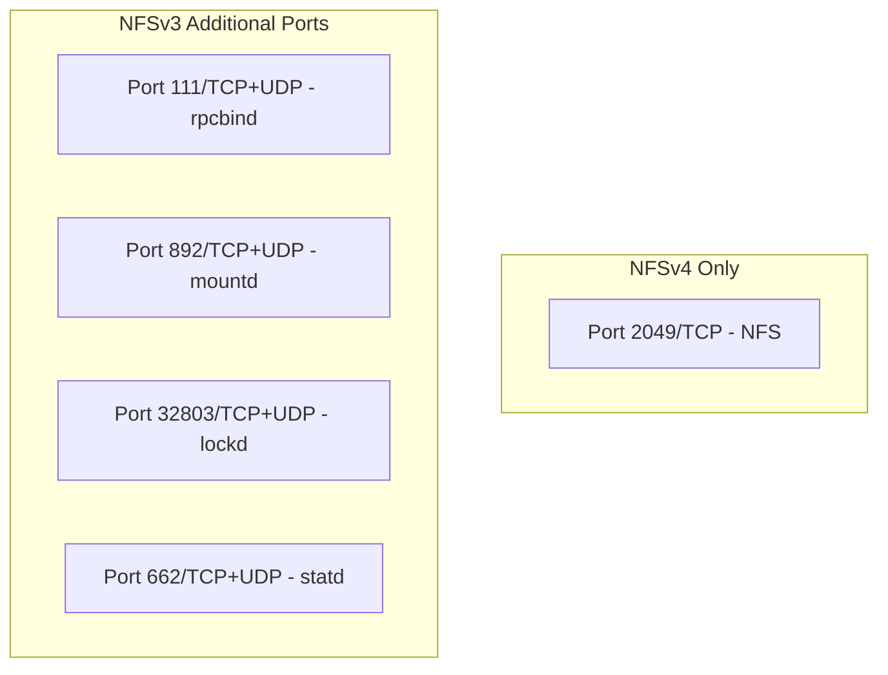

# How to Set Up NFS Firewall Rules on RHEL 9

Author: [nawazdhandala](https://www.github.com/nawazdhandala)

Tags: RHEL, NFS, Firewall, Security, Linux

Description: Configure firewalld rules for NFS on RHEL 9, covering the required ports for NFSv3 and NFSv4, zone configuration, and restricting access by source IP.

---

## NFS and Firewalls

NFS needs specific ports open in the firewall to function. NFSv4 simplified things greatly by requiring only port 2049/TCP, but if you also need NFSv3 compatibility, additional ports must be configured.

RHEL 9 uses firewalld as its default firewall manager, and it includes predefined NFS service definitions that make configuration straightforward.

## NFSv4 Firewall Setup (Recommended)

NFSv4 uses a single port, which makes firewall configuration clean:

```bash
# Open the NFS service (port 2049/TCP)
sudo firewall-cmd --permanent --add-service=nfs
sudo firewall-cmd --reload

# Verify
sudo firewall-cmd --list-services
```

That is all you need for NFSv4. One port, one service, done.

## NFSv3 Firewall Setup

NFSv3 uses multiple services and historically assigned random ports to mountd and related daemons. To make it firewall-friendly, you need to fix those ports.

### Step 1 - Open Required Services

```bash
# Open NFS, mountd, and rpc-bind services
sudo firewall-cmd --permanent --add-service=nfs
sudo firewall-cmd --permanent --add-service=mountd
sudo firewall-cmd --permanent --add-service=rpc-bind
sudo firewall-cmd --reload
```

### Step 2 - Fix NFSv3 Daemon Ports

Edit /etc/nfs.conf to set fixed ports for NFS daemons:

```ini
# /etc/nfs.conf - relevant sections

[lockd]
port=32803
udp-port=32803

[mountd]
port=892

[statd]
port=662
outgoing-port=2020
```

Restart NFS after changing ports:

```bash
sudo systemctl restart nfs-server
```

### Step 3 - Open the Fixed Ports

```bash
# Open the fixed daemon ports
sudo firewall-cmd --permanent --add-port=32803/tcp
sudo firewall-cmd --permanent --add-port=32803/udp
sudo firewall-cmd --permanent --add-port=662/tcp
sudo firewall-cmd --permanent --add-port=662/udp
sudo firewall-cmd --reload
```

## Port Summary



| Service | Port | Protocol | Required For |
|---------|------|----------|-------------|
| nfs | 2049 | TCP | NFSv4 and NFSv3 |
| rpcbind | 111 | TCP/UDP | NFSv3 only |
| mountd | 892 | TCP/UDP | NFSv3 only |
| lockd | 32803 | TCP/UDP | NFSv3 file locking |
| statd | 662 | TCP/UDP | NFSv3 crash recovery |

## Restricting Access by Source

Instead of allowing NFS from anywhere, restrict it to specific networks or hosts:

```bash
# Create a rich rule to allow NFS only from a specific subnet
sudo firewall-cmd --permanent --add-rich-rule='rule family="ipv4" source address="192.168.1.0/24" service name="nfs" accept'
sudo firewall-cmd --reload
```

For multiple subnets:

```bash
# Allow from two different subnets
sudo firewall-cmd --permanent --add-rich-rule='rule family="ipv4" source address="192.168.1.0/24" service name="nfs" accept'
sudo firewall-cmd --permanent --add-rich-rule='rule family="ipv4" source address="10.0.0.0/8" service name="nfs" accept'
sudo firewall-cmd --reload
```

## Using Firewall Zones

For more organized rules, use firewall zones:

```bash
# Create a zone for NFS clients
sudo firewall-cmd --permanent --new-zone=nfs-clients
sudo firewall-cmd --permanent --zone=nfs-clients --add-source=192.168.1.0/24
sudo firewall-cmd --permanent --zone=nfs-clients --add-service=nfs
sudo firewall-cmd --permanent --zone=nfs-clients --add-service=mountd
sudo firewall-cmd --permanent --zone=nfs-clients --add-service=rpc-bind
sudo firewall-cmd --reload

# Verify the zone configuration
sudo firewall-cmd --zone=nfs-clients --list-all
```

## Verifying Firewall Rules

```bash
# List all active rules
sudo firewall-cmd --list-all

# Check if a specific service is allowed
sudo firewall-cmd --query-service=nfs

# List all zones and their rules
sudo firewall-cmd --list-all-zones

# Test connectivity from a client
nc -zv nfs-server.example.com 2049
```

## Testing from the Client Side

```bash
# Check if NFS port is reachable
nc -zv 192.168.1.10 2049

# Check rpcbind (NFSv3)
rpcinfo -p 192.168.1.10

# Try to show exports
showmount -e 192.168.1.10
```

## Troubleshooting Firewall Issues

If NFS mounts fail after firewall configuration:

```bash
# Temporarily disable the firewall to test (diagnostic only)
sudo systemctl stop firewalld

# Try the mount again
sudo mount -t nfs 192.168.1.10:/srv/nfs/shared /mnt/test

# If it works, the firewall is blocking something
# Re-enable the firewall
sudo systemctl start firewalld

# Check firewall logs
journalctl -u firewalld
sudo dmesg | grep -i "REJECT\|DROP"
```

## Dropping NFSv3 Entirely

If all your clients support NFSv4, disable NFSv3 and simplify your firewall:

```bash
# In /etc/nfs.conf, disable NFSv3
# [nfsd]
# vers3=n

sudo systemctl restart nfs-server

# Remove NFSv3-specific firewall rules
sudo firewall-cmd --permanent --remove-service=mountd
sudo firewall-cmd --permanent --remove-service=rpc-bind
sudo firewall-cmd --reload
```

## Wrap-Up

Firewall configuration for NFS on RHEL 9 is simple when using NFSv4, requiring only port 2049. NFSv3 adds complexity with multiple daemon ports that need to be fixed and opened. Use rich rules or dedicated zones to restrict NFS access to trusted networks. And if you can, drop NFSv3 entirely to keep your firewall rules clean and your attack surface small.
