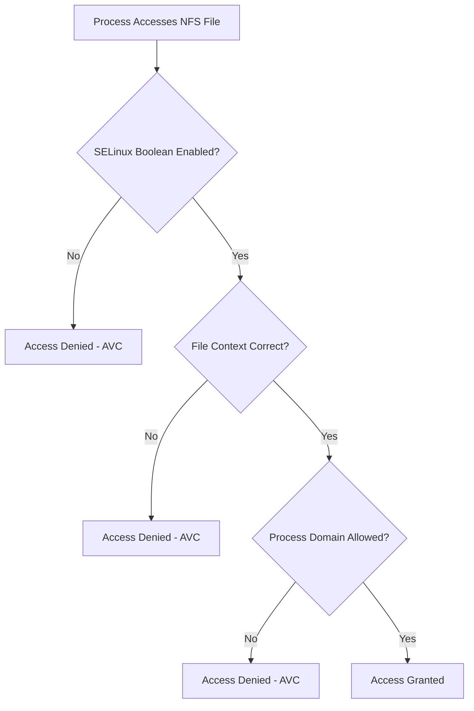

# How to Configure NFSv4 with SELinux Contexts on RHEL 9

Author: [nawazdhandala](https://www.github.com/nawazdhandala)

Tags: RHEL, NFS, SELinux, Security, Linux

Description: Configure SELinux correctly for NFSv4 on RHEL 9, covering file contexts, booleans, and troubleshooting common SELinux denials with NFS.

---

## SELinux and NFS

SELinux enforces mandatory access controls that go beyond traditional Unix permissions. When NFS is involved, SELinux can block access even when file permissions look correct. Understanding how SELinux interacts with NFS saves hours of frustrating troubleshooting.

On RHEL 9, SELinux is enforcing by default, and NFS works with it, but you need to set the right booleans and contexts.

## How SELinux Handles NFS Files

By default, files served over NFS get the `nfs_t` SELinux type on the client side. This is fine for general file access, but applications like Apache, Samba, or custom services may need specific SELinux types to access the files.

```bash
# Check the SELinux context of NFS-mounted files
ls -Z /mnt/nfs-shared/
```

You will typically see:

```
system_u:object_r:nfs_t:s0 somefile.txt
```

## Step 1 - Set SELinux Booleans

RHEL 9 provides several SELinux booleans that control NFS behavior:

```bash
# Allow NFS to export read-write shares
sudo setsebool -P nfs_export_all_rw on

# Allow NFS to export read-only shares
sudo setsebool -P nfs_export_all_ro on

# Allow clients to use NFS home directories
sudo setsebool -P use_nfs_home_dirs on
```

The `-P` flag makes the change persistent across reboots.

### View All NFS-Related Booleans

```bash
# List all SELinux booleans related to NFS
sudo getsebool -a | grep nfs
```

Common NFS booleans:

| Boolean | Description |
|---------|-------------|
| `nfs_export_all_rw` | Allow exporting all files read-write |
| `nfs_export_all_ro` | Allow exporting all files read-only |
| `use_nfs_home_dirs` | Allow using NFS for home directories |
| `httpd_use_nfs` | Allow Apache to serve NFS content |
| `samba_share_nfs` | Allow Samba to share NFS-mounted content |
| `virt_use_nfs` | Allow VMs to use NFS storage |

## Step 2 - Set File Contexts on the Server

On the NFS server, set the correct SELinux context for exported directories:

```bash
# For general NFS exports (read-write)
sudo semanage fcontext -a -t public_content_rw_t "/srv/nfs/shared(/.*)?"
sudo restorecon -Rv /srv/nfs/shared

# For read-only exports
sudo semanage fcontext -a -t public_content_t "/srv/nfs/readonly(/.*)?"
sudo restorecon -Rv /srv/nfs/readonly
```

### Verify the Contexts

```bash
# Check contexts on the server
ls -Zd /srv/nfs/shared
ls -Z /srv/nfs/shared/
```

## Step 3 - Configure Client-Side SELinux

### For Apache Serving NFS Content

If Apache needs to serve files from an NFS mount:

```bash
# Enable the httpd NFS boolean
sudo setsebool -P httpd_use_nfs on
```

### For Samba Sharing NFS Content

```bash
# Enable Samba to access NFS-mounted files
sudo setsebool -P samba_share_nfs on
```

### For Virtualization Using NFS Storage

```bash
# Allow libvirt to use NFS
sudo setsebool -P virt_use_nfs on
```

## Troubleshooting SELinux Denials

### Step 1 - Check for Denials

```bash
# Search for recent AVC denials
sudo ausearch -m avc --start recent

# Or use the audit log directly
sudo grep "denied" /var/log/audit/audit.log | tail -20
```

### Step 2 - Analyze with sealert

```bash
# Install setroubleshoot if not present
sudo dnf install -y setroubleshoot-server

# Analyze recent denials
sudo sealert -a /var/log/audit/audit.log | tail -50
```

sealert provides human-readable explanations and suggested fixes for each denial.

### Step 3 - Use audit2allow for Custom Policies

If standard booleans do not cover your use case:

```bash
# Generate a custom policy module from recent denials
sudo ausearch -m avc --start recent | audit2allow -M my_nfs_policy

# Review the generated policy before applying
cat my_nfs_policy.te

# Apply the policy
sudo semodule -i my_nfs_policy.pp
```

## SELinux Decision Flow for NFS



## NFSv4 Security Labels

NFSv4.2 supports labeled NFS, which passes SELinux contexts from server to client:

```bash
# Mount with security labels (requires NFSv4.2)
sudo mount -t nfs -o vers=4.2,sec=sys 192.168.1.10:/srv/nfs/shared /mnt/nfs-shared
```

For labeled NFS to work, both server and client must support it, and the export must be configured appropriately.

## Temporarily Disabling SELinux for Testing

If you suspect SELinux is causing issues, you can temporarily set it to permissive mode for testing:

```bash
# Set to permissive (logs denials but does not enforce)
sudo setenforce 0

# Test your NFS access

# Set back to enforcing
sudo setenforce 1
```

Never leave production systems in permissive mode. Use this only for troubleshooting.

## Wrap-Up

SELinux and NFS work well together on RHEL 9 once you configure the right booleans and contexts. The key steps are: enable the appropriate booleans with `setsebool -P`, set correct file contexts on exported directories, and use `ausearch` and `sealert` to diagnose any denials. Getting SELinux right from the start is much easier than troubleshooting mysterious access failures later.
