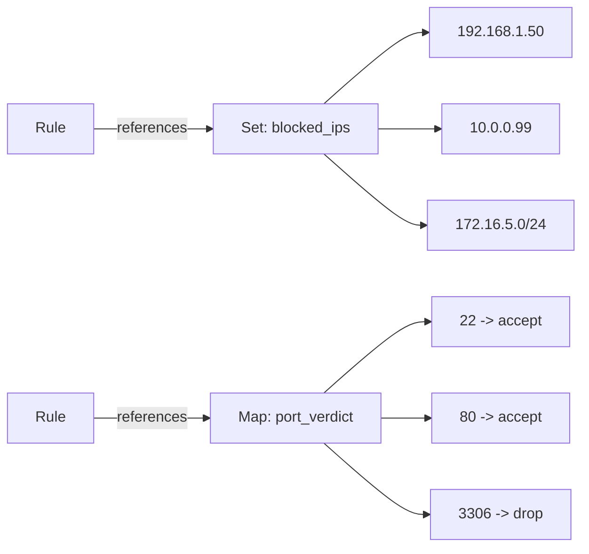

# How to Configure nftables Sets and Maps for Efficient Packet Filtering on RHEL

Author: [nawazdhandala](https://www.github.com/nawazdhandala)

Tags: RHEL, nftables, Sets, Maps, Linux

Description: Learn how to use nftables sets and maps on RHEL to build efficient firewall rules that can match against large groups of addresses, ports, and more.

---

One of the biggest advantages nftables has over iptables is native support for sets and maps. Instead of writing one rule per IP address or port, you can group them into a set and reference it in a single rule. Maps take this further by letting you associate one value with another, like mapping a port to a specific action. This makes your firewall both faster and easier to manage.

## What Are Sets and Maps?

Sets are collections of values of the same type, such as IP addresses, port numbers, or interface names. Maps are like sets, but each element has a key-value pair.



## Creating Named Sets

Named sets are defined in a table and can be referenced by any rule in that table. Start with a basic setup:

Create a table and a set of blocked IP addresses:

```bash
nft add table inet firewall
nft add set inet firewall blocked_ips { type ipv4_addr \; }
```

Add elements to the set:

```bash
nft add element inet firewall blocked_ips { 192.168.1.50, 10.0.0.99, 172.16.5.10 }
```

Use the set in a rule:

```bash
nft add chain inet firewall input { type filter hook input priority 0 \; policy accept \; }
nft add rule inet firewall input ip saddr @blocked_ips drop
```

## Set Types

nftables supports several set types. Here are the most common:

| Type | Description | Example |
|------|-------------|---------|
| `ipv4_addr` | IPv4 addresses | 192.168.1.1 |
| `ipv6_addr` | IPv6 addresses | ::1 |
| `inet_service` | TCP/UDP ports | 22, 80, 443 |
| `ether_addr` | MAC addresses | aa:bb:cc:dd:ee:ff |
| `ifname` | Interface names | eth0, ens192 |

Create a set of allowed ports:

```bash
nft add set inet firewall allowed_ports { type inet_service \; }
nft add element inet firewall allowed_ports { 22, 80, 443, 8080, 8443 }
nft add rule inet firewall input tcp dport @allowed_ports accept
```

## Sets with Flags

Sets can have flags that change their behavior.

Interval sets allow CIDR ranges:

```bash
nft add set inet firewall trusted_nets { type ipv4_addr \; flags interval \; }
nft add element inet firewall trusted_nets { 10.0.0.0/8, 172.16.0.0/12, 192.168.0.0/16 }
nft add rule inet firewall input ip saddr @trusted_nets accept
```

Timeout sets automatically expire elements:

```bash
nft add set inet firewall temp_block { type ipv4_addr \; flags timeout \; timeout 1h \; }
nft add element inet firewall temp_block { 203.0.113.50 timeout 30m }
nft add rule inet firewall input ip saddr @temp_block drop
```

This is incredibly useful for temporary bans. The element will automatically disappear after the timeout.

## Dynamic Sets with Meters

You can use dynamic sets with the `meter` statement for rate limiting per source IP:

```bash
nft add rule inet firewall input tcp dport 22 ct state new \
    meter ssh_meter { ip saddr limit rate 3/minute } accept
```

This creates a dynamic set that tracks connection rates per source IP.

## Concatenated Sets

You can combine multiple types in a single set using concatenation. This lets you match on combinations like IP + port:

```bash
nft add set inet firewall allowed_access { type ipv4_addr . inet_service \; }
nft add element inet firewall allowed_access { 10.0.0.5 . 3306, 10.0.0.6 . 5432 }
nft add rule inet firewall input ip saddr . tcp dport @allowed_access accept
```

This allows 10.0.0.5 to access port 3306 and 10.0.0.6 to access port 5432, all in one rule.

## Maps (Verdict Maps)

Maps associate a key with a verdict (accept, drop, jump, etc.). This is incredibly powerful for complex routing logic.

Create a verdict map that decides what to do based on destination port:

```bash
nft add map inet firewall port_policy { type inet_service : verdict \; }
nft add element inet firewall port_policy { 22 : accept, 80 : accept, 443 : accept, 23 : drop }
nft add rule inet firewall input tcp dport vmap @port_policy
```

## Data Maps

Data maps associate a key with a value that you can use in a rule, like mapping an interface to a mark value:

```bash
nft add map inet firewall iface_mark { type ifname : mark \; }
nft add element inet firewall iface_mark { "eth0" : 0x1, "eth1" : 0x2 }
nft add rule inet firewall input meta mark set iifname map @iface_mark
```

## Managing Set Elements

List all elements in a set:

```bash
nft list set inet firewall blocked_ips
```

Remove an element from a set:

```bash
nft delete element inet firewall blocked_ips { 192.168.1.50 }
```

Flush all elements from a set:

```bash
nft flush set inet firewall blocked_ips
```

## Using Sets in a Ruleset File

For production, define everything in a file:

```bash
cat > /etc/nftables/sets-example.nft << 'EOF'
flush ruleset

table inet firewall {
    set blocked_ips {
        type ipv4_addr
        flags interval
        elements = { 203.0.113.0/24, 198.51.100.0/24 }
    }

    set allowed_services {
        type inet_service
        elements = { 22, 80, 443 }
    }

    set trusted_networks {
        type ipv4_addr
        flags interval
        elements = { 10.0.0.0/8, 192.168.0.0/16 }
    }

    chain input {
        type filter hook input priority 0; policy drop;

        ct state established,related accept
        ct state invalid drop
        iifname "lo" accept

        # Block known bad actors
        ip saddr @blocked_ips drop

        # Allow all traffic from trusted networks
        ip saddr @trusted_networks accept

        # Allow specific services from anywhere
        tcp dport @allowed_services accept

        ip protocol icmp accept
        ip6 nexthdr icmpv6 accept
    }

    chain forward {
        type filter hook forward priority 0; policy drop;
    }

    chain output {
        type filter hook output priority 0; policy accept;
    }
}
EOF
```

Apply and verify:

```bash
nft -f /etc/nftables/sets-example.nft
nft list ruleset
```

## Performance Considerations

Sets in nftables use hash tables internally, so lookups are O(1) regardless of how many elements they contain. This means a set with 10,000 IP addresses performs just as fast as one with 10. With iptables, you'd need ipset as a separate tool to get this behavior. In nftables, it's built in.

For very large blocklists, sets with the interval flag and proper element organization will give you excellent performance without any additional tooling.
