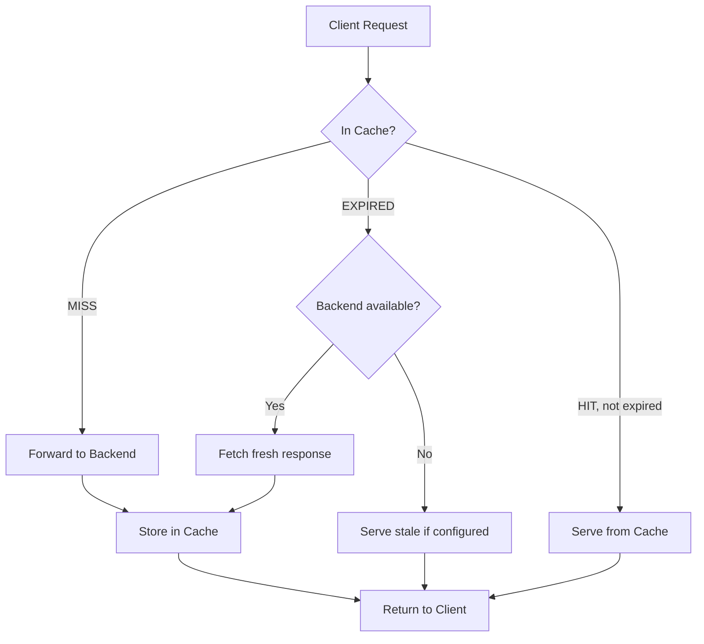

# How to Set Up Nginx as a Caching Proxy on RHEL 9

Author: [nawazdhandala](https://www.github.com/nawazdhandala)

Tags: RHEL, Nginx, Caching, Proxy, Linux

Description: How to configure Nginx as a caching reverse proxy on RHEL 9 to reduce backend load and improve response times.

---

## Why Cache at the Proxy Level?

When Nginx sits in front of your application servers, it can cache responses and serve them directly without hitting the backend again. This reduces latency for users, decreases load on your application servers, and lets you handle traffic spikes more gracefully. A single Nginx cache hit takes microseconds compared to the milliseconds or seconds your backend might need.

## Prerequisites

- RHEL 9 with Nginx installed
- A backend application to proxy
- Root or sudo access
- SELinux boolean `httpd_can_network_connect` enabled

## Step 1 - Create the Cache Directory

```bash
# Create the cache directory
sudo mkdir -p /var/cache/nginx/proxy

# Set ownership to nginx
sudo chown nginx:nginx /var/cache/nginx/proxy
```

Fix SELinux context:

```bash
# Label the cache directory for httpd use
sudo semanage fcontext -a -t httpd_cache_t "/var/cache/nginx/proxy(/.*)?"
sudo restorecon -Rv /var/cache/nginx/proxy/
```

## Step 2 - Define the Cache Zone

Add the cache configuration to the `http` block in `/etc/nginx/nginx.conf` or a separate config file:

```bash
# Create the caching configuration
sudo tee /etc/nginx/conf.d/proxy-cache.conf > /dev/null <<'EOF'
# Define a cache zone
# levels: 2-level directory hierarchy
# keys_zone: name and size of shared memory zone for keys (10 MB holds ~80,000 keys)
# max_size: maximum disk space for cached content
# inactive: remove cached items not accessed within this time
proxy_cache_path /var/cache/nginx/proxy
    levels=1:2
    keys_zone=app_cache:10m
    max_size=1g
    inactive=60m
    use_temp_path=off;

server {
    listen 80;
    server_name cache.example.com;

    location / {
        proxy_pass http://127.0.0.1:3000;
        proxy_set_header Host $host;
        proxy_set_header X-Real-IP $remote_addr;

        # Enable caching
        proxy_cache app_cache;

        # Cache 200 and 302 responses for 10 minutes
        proxy_cache_valid 200 302 10m;

        # Cache 404 responses for 1 minute
        proxy_cache_valid 404 1m;

        # Add a header to show cache status (HIT, MISS, BYPASS)
        add_header X-Cache-Status $upstream_cache_status;
    }
}
EOF
```

## Step 3 - Understand Cache Status Values

The `$upstream_cache_status` variable tells you what happened:

| Status | Meaning |
|--------|---------|
| `MISS` | Response was not in cache, fetched from backend |
| `HIT` | Response served from cache |
| `EXPIRED` | Cached response expired, fetched fresh from backend |
| `STALE` | Served an expired cached response (backend unreachable) |
| `BYPASS` | Cache was bypassed due to rules |
| `UPDATING` | Stale content served while cache is being refreshed |

## Step 4 - Define the Cache Key

The cache key determines what makes a cached response unique:

```nginx
# Default cache key (usually sufficient)
proxy_cache_key $scheme$request_method$host$request_uri;
```

For APIs that depend on query parameters:

```nginx
# Include query string in cache key
proxy_cache_key $scheme$request_method$host$request_uri$is_args$args;
```

## Step 5 - Bypass Cache for Dynamic Content

Skip caching for authenticated users or POST requests:

```nginx
location / {
    proxy_pass http://127.0.0.1:3000;
    proxy_cache app_cache;

    # Do not cache POST requests
    proxy_cache_methods GET HEAD;

    # Bypass cache when a session cookie is present
    proxy_cache_bypass $cookie_session;
    proxy_no_cache $cookie_session;
}
```

## Step 6 - Serve Stale Content on Backend Failure

This is one of the most useful features. If the backend goes down, serve cached content even if it is expired:

```nginx
location / {
    proxy_pass http://127.0.0.1:3000;
    proxy_cache app_cache;
    proxy_cache_valid 200 10m;

    # Serve stale content when the backend is down
    proxy_cache_use_stale error timeout http_500 http_502 http_503 http_504;

    # Update cache in background while serving stale content
    proxy_cache_background_update on;
}
```

## Caching Flow



## Step 7 - Cache Locking

When a cached item expires, multiple clients might request it simultaneously, causing a thundering herd on the backend. Cache locking prevents this:

```nginx
location / {
    proxy_pass http://127.0.0.1:3000;
    proxy_cache app_cache;

    # Only one request updates the cache, others wait or get stale
    proxy_cache_lock on;
    proxy_cache_lock_timeout 5s;
    proxy_cache_lock_age 5s;
}
```

## Step 8 - Purge Cached Content

To purge specific cached items, you can use a custom location:

```nginx
# Simple cache purge by restarting Nginx or clearing files
# For manual purging, remove files from the cache directory
```

```bash
# Clear the entire cache
sudo rm -rf /var/cache/nginx/proxy/*

# Reload Nginx
sudo systemctl reload nginx
```

## Step 9 - Test and Verify

```bash
# Validate config
sudo nginx -t

# Reload Nginx
sudo systemctl reload nginx
```

Test caching behavior:

```bash
# First request should be a MISS
curl -I http://cache.example.com/

# Second request should be a HIT
curl -I http://cache.example.com/
```

Check the `X-Cache-Status` header in the response.

## Step 10 - Monitor Cache Performance

Check cache usage:

```bash
# See how much disk space the cache is using
du -sh /var/cache/nginx/proxy/
```

Check cache hit ratios from the access log:

```bash
# Count cache hits vs misses in the access log
# First, add $upstream_cache_status to your log format
```

In nginx.conf:

```nginx
log_format cache '$remote_addr - $upstream_cache_status [$time_local] '
                 '"$request" $status $body_bytes_sent';

access_log /var/log/nginx/cache-access.log cache;
```

## Wrap-Up

Nginx proxy caching is a powerful way to reduce backend load and improve response times. Start with conservative cache durations and increase them as you understand your content's update patterns. The `proxy_cache_use_stale` directive is particularly valuable for resilience, serving cached content even when the backend fails. Monitor your cache hit ratio to verify the cache is actually helping.
