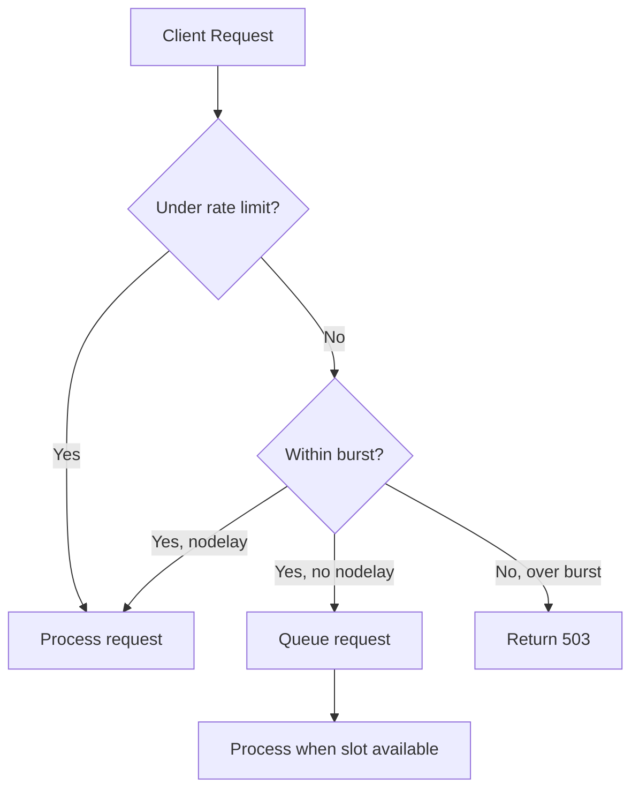

# How to Configure Nginx Rate Limiting and Connection Throttling on RHEL

Author: [nawazdhandala](https://www.github.com/nawazdhandala)

Tags: RHEL, NGINX, Rate Limiting, Security, Linux

Description: How to protect your Nginx server on RHEL with rate limiting and connection throttling to prevent abuse and DDoS attacks.

---

## Why Rate Limiting?

Without rate limiting, a single client can hammer your server with thousands of requests per second. This can exhaust your backend resources, slow down legitimate users, or bring down the whole application. Nginx's built-in rate limiting is simple to configure and effective at mitigating abuse.

## Prerequisites

- RHEL with Nginx installed
- Root or sudo access

## Step 1 - Understand the Two Types of Limiting

Nginx provides two modules for traffic control:

| Module | Purpose |
|--------|---------|
| `ngx_http_limit_req_module` | Limits the request rate per key (usually IP) |
| `ngx_http_limit_conn_module` | Limits the number of simultaneous connections per key |

Both are compiled into Nginx by default on RHEL.

## Step 2 - Configure Request Rate Limiting

Define a rate limiting zone in the `http` block:

```nginx
http {
    # Define a zone named "general" using 10 MB of memory
    # Allow 10 requests per second per IP address
    limit_req_zone $binary_remote_addr zone=general:10m rate=10r/s;
}
```

Apply it to a location:

```nginx
server {
    listen 80;
    server_name www.example.com;

    location / {
        # Apply rate limiting with a burst of 20 and no delay for burst requests
        limit_req zone=general burst=20 nodelay;
        proxy_pass http://127.0.0.1:3000;
    }
}
```

The `burst=20` parameter allows temporary spikes of up to 20 extra requests. The `nodelay` parameter processes burst requests immediately instead of queuing them.

## Step 3 - Rate Limit Specific Endpoints

Protect login pages or APIs with stricter limits:

```nginx
http {
    # General rate limit
    limit_req_zone $binary_remote_addr zone=general:10m rate=10r/s;

    # Strict rate limit for login endpoints
    limit_req_zone $binary_remote_addr zone=login:10m rate=2r/s;
}

server {
    location / {
        limit_req zone=general burst=20 nodelay;
        proxy_pass http://127.0.0.1:3000;
    }

    location /login {
        # Only allow 2 login attempts per second
        limit_req zone=login burst=5 nodelay;
        proxy_pass http://127.0.0.1:3000;
    }
}
```

## Step 4 - Configure Connection Limiting

Limit the number of simultaneous connections from a single IP:

```nginx
http {
    # Define a connection limiting zone
    limit_conn_zone $binary_remote_addr zone=perip:10m;
}

server {
    location / {
        # Max 20 simultaneous connections per IP
        limit_conn perip 20;
        proxy_pass http://127.0.0.1:3000;
    }
}
```

## Step 5 - Bandwidth Throttling

Limit download speed per connection:

```nginx
location /downloads/ {
    # Allow full speed for the first 10 MB, then throttle to 1 MB/s
    limit_rate_after 10m;
    limit_rate 1m;
}
```

## How Rate Limiting Works



## Step 6 - Customize the Error Response

By default, rate-limited requests get a 503 Service Unavailable. Change it to 429 Too Many Requests:

```nginx
# Return 429 instead of 503 for rate-limited requests
limit_req_status 429;
limit_conn_status 429;
```

You can also serve a custom error page:

```nginx
error_page 429 /429.html;
location = /429.html {
    root /var/www/errors;
    internal;
}
```

## Step 7 - Whitelist Trusted IPs

Exempt internal monitoring or trusted clients from rate limiting:

```nginx
http {
    # Use a map to skip rate limiting for trusted IPs
    geo $limit {
        default 1;
        10.0.0.0/8 0;
        192.168.1.0/24 0;
    }

    map $limit $limit_key {
        0 "";
        1 $binary_remote_addr;
    }

    limit_req_zone $limit_key zone=general:10m rate=10r/s;
}
```

When `$limit_key` is empty (for whitelisted IPs), the rate limiting is skipped.

## Step 8 - Logging Rate-Limited Requests

Control how rate-limited events are logged:

```nginx
# Log rate-limited requests at warn level (default is error)
limit_req_log_level warn;
limit_conn_log_level warn;
```

Check the error log for rate limiting events:

```bash
# Look for rate limiting messages
sudo grep "limiting" /var/log/nginx/error.log
```

## Step 9 - Combine Rate and Connection Limiting

For comprehensive protection, use both:

```nginx
http {
    limit_req_zone $binary_remote_addr zone=general:10m rate=10r/s;
    limit_conn_zone $binary_remote_addr zone=perip:10m;
    limit_req_status 429;
    limit_conn_status 429;
}

server {
    listen 80;
    server_name www.example.com;

    location / {
        limit_req zone=general burst=20 nodelay;
        limit_conn perip 20;
        proxy_pass http://127.0.0.1:3000;
    }
}
```

## Step 10 - Test and Apply

```bash
# Validate configuration
sudo nginx -t

# Reload Nginx
sudo systemctl reload nginx
```

Test rate limiting with a burst of requests:

```bash
# Send 50 rapid requests and check how many succeed
for i in $(seq 1 50); do
    curl -s -o /dev/null -w "%{http_code}\n" http://www.example.com/
done | sort | uniq -c
```

You should see a mix of 200 and 429 (or 503) responses.

## Wrap-Up

Rate limiting in Nginx is your first line of defense against abusive traffic. Set a general rate limit for all endpoints and stricter limits for sensitive ones like login pages. Combine request rate limiting with connection limiting for comprehensive protection. Always return 429 instead of the default 503 so clients understand they are being rate-limited, and whitelist your monitoring systems so they do not get blocked.
