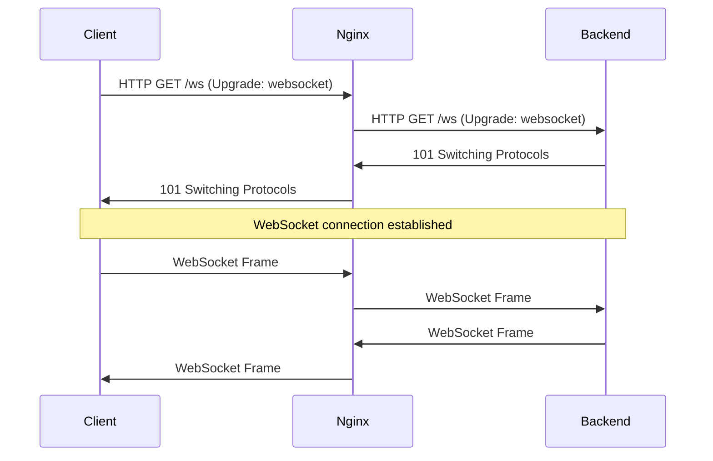

# How to Set Up Nginx with WebSocket Proxying on RHEL 9

Author: [nawazdhandala](https://www.github.com/nawazdhandala)

Tags: RHEL, Nginx, WebSocket, Proxy, Linux

Description: How to configure Nginx to proxy WebSocket connections on RHEL 9 for real-time applications.

---

## What Are WebSockets?

WebSockets provide a full-duplex communication channel over a single TCP connection. Unlike regular HTTP where the client sends a request and waits for a response, WebSockets let both sides send data at any time. They are used in chat applications, live dashboards, collaborative editing tools, and any application that needs real-time updates.

Nginx can proxy WebSocket connections, but it needs specific configuration because the protocol uses an HTTP upgrade mechanism.

## Prerequisites

- RHEL 9 with Nginx installed
- A WebSocket backend application running
- Root or sudo access
- SELinux boolean `httpd_can_network_connect` enabled

## Step 1 - Understand the WebSocket Handshake

A WebSocket connection starts as a regular HTTP request with special headers:

```
GET /ws HTTP/1.1
Host: example.com
Upgrade: websocket
Connection: Upgrade
```

The server responds with a 101 Switching Protocols, and from that point the connection becomes a WebSocket. Nginx needs to pass these upgrade headers to the backend.

## Step 2 - Basic WebSocket Proxy Configuration

```bash
# Create a WebSocket proxy configuration
sudo tee /etc/nginx/conf.d/websocket.conf > /dev/null <<'EOF'
# Map the Upgrade header to the Connection header
map $http_upgrade $connection_upgrade {
    default upgrade;
    ""      close;
}

server {
    listen 80;
    server_name ws.example.com;

    location / {
        proxy_pass http://127.0.0.1:3000;
        proxy_http_version 1.1;
        proxy_set_header Upgrade $http_upgrade;
        proxy_set_header Connection $connection_upgrade;
        proxy_set_header Host $host;
        proxy_set_header X-Real-IP $remote_addr;
        proxy_set_header X-Forwarded-For $proxy_add_x_forwarded_for;
    }
}
EOF
```

The `map` block is the key part. It checks if the request has an `Upgrade` header and sets the `Connection` header accordingly.

## Step 3 - Mixed HTTP and WebSocket on the Same Server

Most applications serve both regular HTTP and WebSocket connections:

```nginx
server {
    listen 80;
    server_name app.example.com;

    # Regular HTTP traffic
    location / {
        proxy_pass http://127.0.0.1:3000;
        proxy_set_header Host $host;
        proxy_set_header X-Real-IP $remote_addr;
    }

    # WebSocket endpoint
    location /ws {
        proxy_pass http://127.0.0.1:3000;
        proxy_http_version 1.1;
        proxy_set_header Upgrade $http_upgrade;
        proxy_set_header Connection $connection_upgrade;
        proxy_set_header Host $host;
        proxy_set_header X-Real-IP $remote_addr;
    }
}
```

## Step 4 - Configure Timeouts

WebSocket connections are long-lived. The default Nginx timeout of 60 seconds will close idle connections:

```nginx
location /ws {
    proxy_pass http://127.0.0.1:3000;
    proxy_http_version 1.1;
    proxy_set_header Upgrade $http_upgrade;
    proxy_set_header Connection $connection_upgrade;

    # Keep the connection open for up to 1 hour
    proxy_read_timeout 3600s;
    proxy_send_timeout 3600s;
}
```

If your application sends periodic ping/pong frames, the connection stays active. Without them, you need to set the timeout long enough for your use case.

## WebSocket Connection Flow



## Step 5 - WebSocket with TLS

For secure WebSocket connections (wss://), add TLS to the server block:

```nginx
server {
    listen 443 ssl;
    server_name ws.example.com;

    ssl_certificate /etc/pki/tls/certs/ws.crt;
    ssl_certificate_key /etc/pki/tls/private/ws.key;

    location /ws {
        proxy_pass http://127.0.0.1:3000;
        proxy_http_version 1.1;
        proxy_set_header Upgrade $http_upgrade;
        proxy_set_header Connection $connection_upgrade;
        proxy_set_header Host $host;
        proxy_set_header X-Real-IP $remote_addr;
        proxy_read_timeout 3600s;
    }
}
```

The client connects with `wss://ws.example.com/ws`, Nginx terminates TLS, and forwards the connection to the backend over plain HTTP.

## Step 6 - Load Balancing WebSocket Connections

When proxying to multiple backends, use `ip_hash` to ensure a client always reaches the same backend:

```nginx
upstream wsbackend {
    ip_hash;
    server 192.168.1.11:3000;
    server 192.168.1.12:3000;
}

server {
    listen 80;
    server_name ws.example.com;

    location /ws {
        proxy_pass http://wsbackend;
        proxy_http_version 1.1;
        proxy_set_header Upgrade $http_upgrade;
        proxy_set_header Connection $connection_upgrade;
        proxy_read_timeout 3600s;
    }
}
```

`ip_hash` is important here because a WebSocket connection is stateful. If a reconnection hits a different backend, the session is lost.

## Step 7 - Test the Configuration

```bash
# Validate config
sudo nginx -t

# Reload
sudo systemctl reload nginx
```

Test the WebSocket connection with a command-line client:

```bash
# Install a WebSocket client for testing
sudo dnf install -y nodejs
npm install -g wscat

# Connect to the WebSocket endpoint
wscat -c ws://ws.example.com/ws
```

Or use curl to check the upgrade response:

```bash
# Check that the upgrade handshake works
curl -i -N -H "Connection: Upgrade" -H "Upgrade: websocket" \
  -H "Sec-WebSocket-Version: 13" \
  -H "Sec-WebSocket-Key: dGhlIHNhbXBsZSBub25jZQ==" \
  http://ws.example.com/ws
```

You should see a 101 Switching Protocols response.

## Troubleshooting

If WebSocket connections fail:

1. Check that `proxy_http_version 1.1` is set (WebSocket requires HTTP/1.1)
2. Verify the `Upgrade` and `Connection` headers are being passed
3. Check SELinux: `getsebool httpd_can_network_connect`
4. Check the `proxy_read_timeout` - idle connections may be closing
5. Look at the Nginx error log: `sudo tail -f /var/log/nginx/error.log`

## Wrap-Up

WebSocket proxying in Nginx requires three things: HTTP/1.1, the Upgrade header, and the Connection header. Get those right and it works. Remember to set long timeouts for idle connections and use `ip_hash` when load balancing. The `map` block for the Connection header is a clean pattern that handles both WebSocket and regular HTTP requests in the same location.
