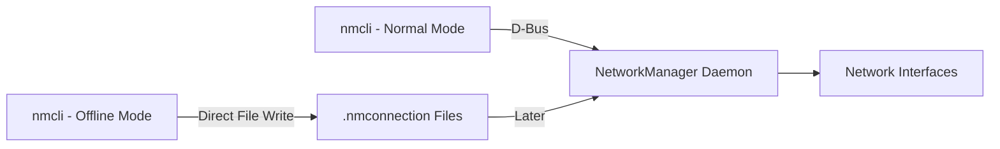

# How to Use nmcli Offline Mode to Generate Network Configuration Files on RHEL

Author: [nawazdhandala](https://www.github.com/nawazdhandala)

Tags: RHEL, nmcli, Offline Mode, Networking, Linux

Description: Learn how to use nmcli's offline mode to generate NetworkManager keyfiles without a running NetworkManager instance, ideal for provisioning and image building.

---

There are situations where you need to create NetworkManager configuration files but NetworkManager is not running. Maybe you are building a disk image, writing a kickstart script, preparing files for an air-gapped system, or creating configurations in a container build pipeline. That is where nmcli's offline mode comes in handy.

## What is Offline Mode?

Starting with NetworkManager 1.40 (included in RHEL), nmcli can generate keyfile-format connection profiles without needing a running NetworkManager daemon. It writes valid `.nmconnection` files to a directory you specify, using the same syntax you would use with regular nmcli commands.

The key difference is that offline mode does not activate anything, does not talk to the NetworkManager daemon, and does not require root privileges (unless you are writing to a protected directory).



## Basic Usage

The offline mode uses the `nmcli connection add` command with the `--offline` flag, and the output goes to stdout or a specified directory:

```bash
# Generate a keyfile and print it to stdout
nmcli --offline connection add \
  con-name "server-eth0" \
  type ethernet \
  ifname eth0 \
  ipv4.method manual \
  ipv4.addresses 10.0.1.50/24 \
  ipv4.gateway 10.0.1.1 \
  ipv4.dns "10.0.1.2"
```

This prints the keyfile content to stdout without writing anything to disk. You can redirect it to a file:

```bash
# Save the generated keyfile to a specific location
nmcli --offline connection add \
  con-name "server-eth0" \
  type ethernet \
  ifname eth0 \
  ipv4.method manual \
  ipv4.addresses 10.0.1.50/24 \
  ipv4.gateway 10.0.1.1 \
  ipv4.dns "10.0.1.2" \
  > /tmp/server-eth0.nmconnection
```

## Use Case: Provisioning Scripts

When building server images or writing provisioning scripts, you often need to pre-configure networking before the system boots for the first time:

```bash
#!/bin/bash
# provision-network.sh - Generate network configs for a new server
# This script runs on the build host, not the target server

TARGET_DIR="/mnt/target/etc/NetworkManager/system-connections"
mkdir -p "$TARGET_DIR"

# Generate the primary network connection
nmcli --offline connection add \
  con-name "primary" \
  type ethernet \
  ifname ens192 \
  ipv4.method manual \
  ipv4.addresses 10.0.1.50/24 \
  ipv4.gateway 10.0.1.1 \
  ipv4.dns "10.0.1.2,10.0.1.3" \
  ipv4.dns-search "example.com" \
  connection.autoconnect yes \
  > "$TARGET_DIR/primary.nmconnection"

# Generate a management network connection
nmcli --offline connection add \
  con-name "mgmt" \
  type ethernet \
  ifname ens224 \
  ipv4.method manual \
  ipv4.addresses 172.16.0.50/24 \
  connection.autoconnect yes \
  > "$TARGET_DIR/mgmt.nmconnection"

# Set proper permissions
chmod 600 "$TARGET_DIR"/*.nmconnection

echo "Network configuration files generated in $TARGET_DIR"
```

## Use Case: Kickstart Post-Install Scripts

In RHEL kickstart files, you can use offline mode in the `%post` section to generate network configurations:

```bash
%post
# Generate the production network configuration
nmcli --offline connection add \
  con-name "production" \
  type ethernet \
  ifname ens192 \
  ipv4.method manual \
  ipv4.addresses 10.0.1.50/24 \
  ipv4.gateway 10.0.1.1 \
  ipv4.dns "10.0.1.2" \
  > /etc/NetworkManager/system-connections/production.nmconnection

chmod 600 /etc/NetworkManager/system-connections/production.nmconnection
%end
```

## Use Case: Container Image Building

When building container images that need NetworkManager configuration (common for system containers or appliance images):

```dockerfile
# In a Containerfile/Dockerfile
RUN nmcli --offline connection add \
  con-name "container-net" \
  type ethernet \
  ifname eth0 \
  ipv4.method auto \
  > /etc/NetworkManager/system-connections/container-net.nmconnection && \
  chmod 600 /etc/NetworkManager/system-connections/container-net.nmconnection
```

## Use Case: Generating Configs for Air-Gapped Systems

For systems in secure environments without network access during setup:

```bash
# On your workstation, generate configs for the target system
mkdir -p /tmp/airgap-configs

# Production interface
nmcli --offline connection add \
  con-name "secure-net" \
  type ethernet \
  ifname ens192 \
  ipv4.method manual \
  ipv4.addresses 10.100.0.50/24 \
  ipv4.gateway 10.100.0.1 \
  ipv4.dns "10.100.0.2" \
  ipv6.method disabled \
  > /tmp/airgap-configs/secure-net.nmconnection

# Copy the configs to removable media
cp /tmp/airgap-configs/*.nmconnection /mnt/usb/network-configs/

# On the target system, copy and set permissions
cp /mnt/usb/network-configs/*.nmconnection /etc/NetworkManager/system-connections/
chmod 600 /etc/NetworkManager/system-connections/*.nmconnection
nmcli connection reload
```

## Generating Multiple Configuration Variants

Offline mode is great for generating multiple variants of a configuration for different environments:

```bash
#!/bin/bash
# generate-env-configs.sh - Create configs for dev, staging, and prod

ENVIRONMENTS=("dev:10.1.0" "staging:10.2.0" "prod:10.3.0")
OUTPUT_DIR="/tmp/network-configs"

for env_info in "${ENVIRONMENTS[@]}"; do
    ENV_NAME="${env_info%%:*}"
    SUBNET="${env_info##*:}"

    mkdir -p "$OUTPUT_DIR/$ENV_NAME"

    nmcli --offline connection add \
      con-name "${ENV_NAME}-primary" \
      type ethernet \
      ifname ens192 \
      ipv4.method manual \
      ipv4.addresses "${SUBNET}.50/24" \
      ipv4.gateway "${SUBNET}.1" \
      ipv4.dns "${SUBNET}.2" \
      connection.autoconnect yes \
      > "$OUTPUT_DIR/$ENV_NAME/primary.nmconnection"

    chmod 600 "$OUTPUT_DIR/$ENV_NAME/primary.nmconnection"
    echo "Generated config for $ENV_NAME environment"
done
```

## Validating Generated Files

After generating keyfiles in offline mode, you should validate them before deploying:

```bash
# Check the generated file is well-formed by trying to read it
cat /tmp/server-eth0.nmconnection

# Verify the file has correct permissions
stat -c '%a' /tmp/server-eth0.nmconnection

# On a system with NetworkManager running, test-load the file
nmcli connection load /tmp/server-eth0.nmconnection
nmcli connection show server-eth0
```

## Offline Mode Limitations

There are a few things to be aware of:

- **No connection activation.** Offline mode only generates files; it cannot activate them.
- **No validation against hardware.** It will not check if the specified interface name actually exists.
- **No UUID conflict detection.** If you generate multiple files, they each get unique UUIDs, but offline mode cannot check against existing connections on a target system.
- **Subset of connection types.** Most common connection types are supported (ethernet, wifi, bond, vlan, bridge), but some exotic types may not be available offline.

## Comparing Normal and Offline Modes

| Feature | Normal Mode | Offline Mode |
|---|---|---|
| Requires running NM | Yes | No |
| Activates connections | Yes | No |
| Validates against hardware | Yes | No |
| Writes to system directories | Yes | Writes to stdout |
| Requires root | Usually | Only if writing to protected dirs |
| Generates valid keyfiles | Yes | Yes |

## Wrapping Up

nmcli's offline mode fills an important gap in the RHEL provisioning story. It lets you generate valid NetworkManager keyfiles anywhere, anytime, without needing a running NetworkManager instance. Whether you are building disk images, writing kickstart scripts, or preparing configurations for air-gapped deployments, offline mode ensures your network configuration files are correctly formatted and ready to go when the system boots for the first time.
