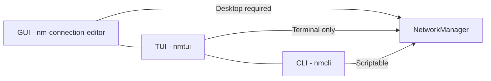

# How to Use nmtui for Text-Based Network Configuration on RHEL 9

Author: [nawazdhandala](https://www.github.com/nawazdhandala)

Tags: RHEL, nmtui, Network Configuration, Linux

Description: Learn how to use nmtui, the text-based user interface for NetworkManager, to configure network connections on RHEL 9 without memorizing nmcli syntax.

---

Not everyone wants to memorize nmcli syntax, and not every server has a graphical desktop. That is exactly where nmtui fits in. It is a curses-based (text UI) front-end to NetworkManager that runs in any terminal. You get a menu-driven interface for creating, editing, and activating network connections, all without needing to remember property names or command-line flags.

## What is nmtui?

nmtui stands for NetworkManager Text User Interface. It is included by default on RHEL 9 as part of the `NetworkManager-tui` package. It provides three main functions:

- Edit a connection
- Activate a connection
- Set the system hostname

Think of it as the middle ground between the full GUI network settings and the raw nmcli command line.



## Installing nmtui

On most RHEL 9 installations, nmtui is already present. If it is missing, install it:

```bash
# Install the NetworkManager TUI package
dnf install NetworkManager-tui -y
```

## Launching nmtui

Simply run:

```bash
# Launch the text-based network configuration tool
nmtui
```

You will see a menu with three options:

- **Edit a connection** - Create, modify, or delete connection profiles
- **Activate a connection** - Bring connections up or down
- **Set system hostname** - Change the system hostname

Navigate using the arrow keys, Tab to move between elements, and Enter to select.

## Editing a Connection

When you select "Edit a connection", you will see a list of all configured connection profiles. From here you can:

### Modify an Existing Connection

1. Select the connection from the list
2. Press Enter or select "Edit"
3. Modify fields as needed (IP address, gateway, DNS, etc.)
4. Tab down to "OK" and press Enter to save

### Create a New Connection

1. Select "Add" at the bottom of the connection list
2. Choose the connection type (Ethernet, Wi-Fi, Bond, VLAN, Bridge, etc.)
3. Fill in the connection details
4. Set the IPv4 and IPv6 configuration:
   - For DHCP, leave the method as "Automatic"
   - For static IP, change the method to "Manual" and add your addresses

### Delete a Connection

1. Select the connection from the list
2. Select "Delete"
3. Confirm the deletion

## Setting a Static IP with nmtui

Here is a step-by-step walkthrough for configuring a static IP:

1. Run `nmtui`
2. Select "Edit a connection"
3. Choose your ethernet connection (e.g., ens192)
4. In the IPv4 Configuration section, change "Automatic" to "Manual" using the dropdown
5. Select "Show" next to IPv4 Configuration to expand the fields
6. Add your IP address (e.g., `192.168.1.100/24`)
7. Set the Gateway (e.g., `192.168.1.1`)
8. Add DNS servers (e.g., `8.8.8.8`)
9. Add search domains if needed
10. Tab to "OK" and press Enter

After saving, you need to reactivate the connection. Go back to the main menu and select "Activate a connection", then deactivate and reactivate your connection.

## Using nmtui Subcommands

You can skip the main menu by launching nmtui with a specific subcommand:

```bash
# Jump directly to the connection editor
nmtui edit

# Jump to editing a specific connection
nmtui edit ens192

# Jump directly to the activation screen
nmtui connect

# Jump directly to the hostname setting
nmtui hostname
```

These shortcuts are helpful when you know exactly what you want to do.

## When to Use nmtui vs. nmcli

Both tools talk to the same NetworkManager daemon and produce the same results. The choice comes down to your workflow:

**Use nmtui when:**
- You are configuring a server interactively and want a visual layout
- You are not sure about the exact property names
- You are training someone who is new to RHEL networking
- You need to make a quick change and do not want to look up syntax

**Use nmcli when:**
- You are writing scripts or automation
- You need to configure networking non-interactively (kickstart, cloud-init)
- You need to query specific connection properties
- You are working over a slow SSH connection where the TUI might lag

## Keyboard Navigation Reference

Since nmtui is a text interface, knowing the keyboard shortcuts makes it much faster to use:

| Key | Action |
|---|---|
| Arrow keys | Move between fields |
| Tab | Move to next element |
| Shift+Tab | Move to previous element |
| Enter | Select/activate |
| Space | Toggle checkboxes |
| Esc | Cancel/go back |

## Configuring Advanced Options

nmtui supports more than just basic IP configuration. In the connection editor, you can configure:

- **MTU** - Set custom MTU sizes for jumbo frames
- **Cloned MAC Address** - Useful for replacing a failed NIC without changing firewall rules
- **IPv6 Configuration** - Full IPv6 support with the same options as IPv4
- **Automatically connect** - Whether the connection should activate on boot
- **Available to all users** - Whether all users can see and activate the connection

For bond, bridge, and VLAN connections, nmtui provides fields for all the relevant options (bond mode, bridge STP, VLAN ID, etc.).

## Limitations of nmtui

nmtui is great for interactive use but has some limitations:

- **No scripting support.** You cannot automate nmtui the way you can with nmcli.
- **Limited property access.** Not all NetworkManager properties are exposed in the TUI. For advanced settings like routing rules or custom dispatcher scripts, you will need nmcli.
- **No monitoring.** Unlike `nmcli monitor`, nmtui does not show real-time network events.
- **Requires a terminal.** It will not work in environments without a proper terminal (some minimal containers, for example).

## Combining nmtui and nmcli

A practical workflow is to use nmtui for the initial setup and then fine-tune with nmcli:

```bash
# Use nmtui to create the basic connection
nmtui edit

# Then add advanced settings with nmcli
nmcli connection modify ens192 ipv4.route-metric 100
nmcli connection modify ens192 802-3-ethernet.mtu 9000

# Reactivate to apply everything
nmcli connection up ens192
```

## Setting the Hostname

The hostname function in nmtui is straightforward:

1. Run `nmtui`
2. Select "Set system hostname"
3. Type the new hostname
4. Select OK

This is equivalent to running:

```bash
# Set the hostname via the command line
hostnamectl set-hostname server01.example.com
```

## Wrapping Up

nmtui is a handy tool that bridges the gap between the command line and a full graphical interface. It is particularly useful for those one-off configuration tasks where you do not want to look up nmcli property names, or when you are working on a server that does not have a desktop environment. Keep in mind that for anything beyond basic configuration or for automation, nmcli is the better choice. But for quick interactive edits, nmtui gets the job done with minimal fuss.
