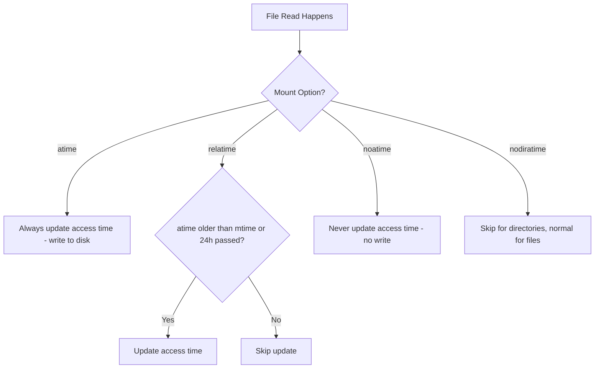

# How to Use noatime and nodiratime Mount Options for Performance on RHEL

Author: [nawazdhandala](https://www.github.com/nawazdhandala)

Tags: RHEL, noatime, Mount Options, Performance, Linux

Description: Learn how to use noatime and nodiratime mount options on RHEL to reduce unnecessary disk writes and improve filesystem performance.

---

Every time you read a file on a Linux system, the kernel updates its "access time" (atime) in the inode metadata. That means every read triggers a write. For workloads that read a lot of files - web servers, build systems, mail servers - this creates a steady stream of unnecessary disk writes that waste I/O bandwidth and reduce SSD lifespan.

## What atime, relatime, noatime, and nodiratime Mean

- **atime** - Access time is updated on every file access (the worst for performance)
- **relatime** - Access time is updated only if it is older than the modify time, or if 24 hours have passed (RHEL default)
- **noatime** - Access time is never updated (best for performance)
- **nodiratime** - Access time is never updated for directories (but still updated for files)



## RHEL Default: relatime

RHEL mounts filesystems with `relatime` by default. This is a reasonable middle ground that reduces most unnecessary writes while keeping atime somewhat current.

Check your current mount options:

```bash
# See mount options for all filesystems
mount | grep -E "ext4|xfs"
```

You should see `relatime` in the options.

## When to Use noatime

Use `noatime` when:

- You want maximum I/O performance
- No application on the system needs accurate file access times
- You are running SSDs and want to minimize write amplification
- The system handles many reads (web servers, file servers, build servers)

## When NOT to Use noatime

Keep `relatime` (or even `atime`) when:

- You run mail servers that use atime to track which messages have been read (like mutt with mstrstrstrstrstrstrstrstrstrstrstrstrstrstrstrstrstrstrstrstrstrstrstrstrstrstrstrstrstrstr mailbox format)
- Backup software relies on atime to determine which files to back up
- Security auditing requires knowing when files were last accessed
- The `tmpwatch` or `systemd-tmpfiles` service uses atime to clean old files

## Applying noatime

### Temporary (Current Session)

```bash
# Remount /data with noatime
mount -o remount,noatime /data
```

Verify:

```bash
# Confirm noatime is active
mount | grep /data
```

### Persistent via fstab

Edit `/etc/fstab` and add `noatime` to the options:

```bash
vi /etc/fstab
```

Before:

```
/dev/vg_data/lv_data  /data  xfs  defaults  0 0
```

After:

```
/dev/vg_data/lv_data  /data  xfs  defaults,noatime  0 0
```

Apply without rebooting:

```bash
# Remount with updated fstab options
mount -o remount /data
```

### For the Root Filesystem

You can also apply noatime to the root filesystem:

```
/dev/mapper/rhel-root  /  xfs  defaults,noatime  0 0
```

This requires a reboot to take effect on the root filesystem.

## Using nodiratime

If you want to keep file atime updates but skip them for directories:

```
/dev/vg_data/lv_data  /data  xfs  defaults,nodiratime  0 0
```

Note: `noatime` implies `nodiratime`, so if you use `noatime`, you do not need `nodiratime` separately.

## Performance Impact

The performance gain depends on your workload:

### High-Read Workloads (Web Servers, Build Systems)

The benefit is significant. Every file read no longer requires a metadata write:

```bash
# Quick before/after test
# Test with relatime (default)
mount -o remount,relatime /data
time find /data -type f -exec cat {} + > /dev/null 2>&1

# Test with noatime
mount -o remount,noatime /data
echo 3 > /proc/sys/vm/drop_caches
time find /data -type f -exec cat {} + > /dev/null 2>&1
```

### SSD Benefits

On SSDs, reducing writes extends drive life and reduces write amplification:

```bash
# Check SMART wear indicator before and after
smartctl -a /dev/sda | grep "Wear_Leveling_Count\|Media_Wearout"
```

### Negligible Impact Workloads

If the workload is mostly writes already (databases, logging), the atime writes are a tiny fraction of total I/O and the benefit is minimal.

## Impact on tmpwatch and systemd-tmpfiles

The `systemd-tmpfiles` service on RHEL can use atime to clean up old files in `/tmp`. If you mount `/tmp` with `noatime`, files that are still being read but not modified might get cleaned up prematurely.

Check your tmpfiles configuration:

```bash
# See tmpfiles rules that reference age
grep -r "^[a-z].*tmp" /etc/tmpfiles.d/ /usr/lib/tmpfiles.d/ 2>/dev/null
```

The `A` (access time) qualifier in tmpfiles rules will not work correctly with `noatime`. However, most rules use modification time, so this is rarely a problem in practice.

## Best Practice Configuration

For a typical RHEL server:

```
# /etc/fstab
/dev/mapper/rhel-root   /       xfs   defaults,noatime  0 0
/dev/mapper/rhel-home   /home   xfs   defaults,noatime  0 0
/dev/vg_data/lv_data    /data   xfs   defaults,noatime  0 0
tmpfs                   /tmp    tmpfs defaults,noatime,size=4G  0 0
```

For a mail server where atime matters for the mail spool:

```
/dev/mapper/rhel-root    /          xfs   defaults,noatime   0 0
/dev/mapper/rhel-home    /home      xfs   defaults,noatime   0 0
/dev/vg_mail/lv_mail     /var/mail  xfs   defaults,relatime  0 0
```

## Verifying atime Behavior

Test that atime is not being updated:

```bash
# Create a test file
touch /data/testfile

# Note the current access time
stat /data/testfile | grep Access

# Read the file
cat /data/testfile > /dev/null

# Check access time again - should be unchanged with noatime
stat /data/testfile | grep Access
```

## Summary

Using `noatime` is one of the simplest and most effective filesystem performance optimizations on RHEL. Add it to your fstab mount options for any filesystem where accurate access times are not needed. The performance gain is most noticeable on read-heavy workloads and SSDs. The only caution is to keep `relatime` on filesystems where mail software or cleanup tools rely on atime.
