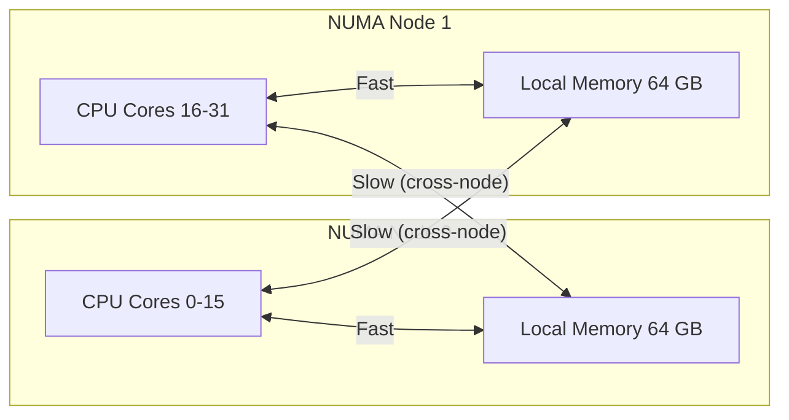

# How to Configure NUMA Balancing and CPU Pinning on RHEL

Author: [nawazdhandala](https://www.github.com/nawazdhandala)

Tags: RHEL, NUMA, CPU Pinning, Performance, Linux

Description: A practical guide to understanding NUMA topology, configuring automatic NUMA balancing, and pinning processes to specific CPUs and memory nodes on RHEL for optimized performance.

---

## What Is NUMA and Why Should You Care?

Non-Uniform Memory Access (NUMA) is the memory architecture used by modern multi-socket servers. In a NUMA system, each CPU socket has its own local memory. Accessing local memory is fast, but accessing memory attached to another socket costs extra latency because the data has to travel over an interconnect.

On a two-socket server, a process running on CPU 0 accessing memory on node 1 might see 30-50% higher memory latency compared to accessing local memory on node 0. For memory-intensive workloads like databases, in-memory caches, and virtual machines, this difference adds up fast.



## Checking Your NUMA Topology

```bash
# Display NUMA node information
numactl --hardware

# Show per-node memory statistics
numastat

# View detailed CPU-to-node mapping
lscpu | grep -i numa

# See which CPUs belong to which NUMA node
cat /sys/devices/system/node/node0/cpulist
cat /sys/devices/system/node/node1/cpulist
```

Install `numactl` if it is not already present.

```bash
# Install NUMA control utilities
sudo dnf install numactl -y
```

## Automatic NUMA Balancing

RHEL enables automatic NUMA balancing by default. The kernel periodically scans process memory, detects pages that are being accessed from a remote node, and migrates them closer to the CPU that uses them.

```bash
# Check if NUMA balancing is enabled (1 = on, 0 = off)
sysctl kernel.numa_balancing

# Enable NUMA balancing
sudo sysctl -w kernel.numa_balancing=1

# Disable NUMA balancing (for manually pinned workloads)
sudo sysctl -w kernel.numa_balancing=0
```

Automatic balancing works well for general workloads where processes move around. But for pinned workloads where you have already assigned specific CPUs and memory nodes, you should disable it to avoid unnecessary page migrations that waste CPU cycles.

## CPU Pinning with taskset

The `taskset` command binds a process to specific CPU cores.

```bash
# Run a process pinned to cores 0-7
taskset -c 0-7 /path/to/application

# Pin an already running process (PID 12345) to cores 0-3
taskset -cp 0-3 12345

# Verify the CPU affinity of a process
taskset -cp 12345
```

## CPU Pinning with numactl

`numactl` gives you control over both CPU and memory placement.

```bash
# Run a process on NUMA node 0 only (both CPU and memory)
numactl --cpunodebind=0 --membind=0 /path/to/application

# Run on specific CPUs with local memory policy
numactl --physcpubind=0-7 --localalloc /path/to/application

# Prefer memory from node 0 but fall back to other nodes if needed
numactl --cpunodebind=0 --preferred=0 /path/to/application
```

| numactl Option | Behavior |
|---------------|----------|
| --membind=N | Strictly allocate memory on node N only |
| --preferred=N | Prefer node N, fall back to others if needed |
| --localalloc | Allocate memory on the local node |
| --interleave=all | Spread memory across all nodes round-robin |

## Pinning with systemd Service Units

For services managed by systemd, use `CPUAffinity` and `NUMAPolicy` directives.

```bash
# Create a drop-in override for a service
sudo systemctl edit myapp.service
```

Add the following content:

```ini
[Service]
# Pin the service to cores 0-7 on NUMA node 0
CPUAffinity=0-7
NUMAPolicy=bind
NUMAMask=0
```

```bash
# Reload and restart the service
sudo systemctl daemon-reload
sudo systemctl restart myapp.service

# Verify the affinity
taskset -cp $(pidof myapp)
```

## Pinning KVM Virtual Machines

For KVM guests, CPU and NUMA pinning reduces latency caused by vCPU migration and remote memory access.

```bash
# Edit the VM definition
sudo virsh edit myvm
```

Add CPU pinning and NUMA tuning to the XML:

```xml
<vcpu placement='static'>4</vcpu>
<cputune>
  <vcpupin vcpu='0' cpuset='0'/>
  <vcpupin vcpu='1' cpuset='1'/>
  <vcpupin vcpu='2' cpuset='2'/>
  <vcpupin vcpu='3' cpuset='3'/>
</cputune>
<numatune>
  <memory mode='strict' nodeset='0'/>
</numatune>
```

## Monitoring NUMA Performance

```bash
# Watch NUMA hit/miss statistics
watch -n 2 numastat

# Check per-process NUMA memory allocation
numastat -p $(pidof postgres)

# Look at NUMA memory balance across nodes
numastat -m
```

Key metrics to watch:

| Metric | Meaning |
|--------|---------|
| numa_hit | Memory allocated on the requested node (good) |
| numa_miss | Memory allocated on a different node (bad) |
| numa_foreign | Memory intended for this node but allocated elsewhere |
| local_node | Memory allocated on the node where the process ran |
| other_node | Memory allocated on a different node |

A high `numa_miss` count indicates your workload is frequently accessing remote memory, which means pinning could help.

## Tuning NUMA-Related Kernel Parameters

```bash
# Persistent NUMA tuning
sudo tee /etc/sysctl.d/90-numa.conf <<EOF
# Disable automatic NUMA balancing for pinned workloads
kernel.numa_balancing = 0

# Control how aggressively the kernel reclaims memory from remote nodes
# 0 = reclaim from local node only, 1 = allow reclaim from remote nodes
vm.zone_reclaim_mode = 0
EOF

sudo sysctl -p /etc/sysctl.d/90-numa.conf
```

The `vm.zone_reclaim_mode` parameter controls whether the kernel will reclaim memory from the local node before allocating from remote nodes. Setting it to 0 (the default on RHEL) is usually best because it avoids premature eviction of cached data.

## Practical Example: PostgreSQL NUMA Optimization

```bash
# Create a systemd override for PostgreSQL
sudo systemctl edit postgresql.service
```

```ini
[Service]
# Pin PostgreSQL to NUMA node 0
CPUAffinity=0-15
NUMAPolicy=bind
NUMAMask=0
```

```bash
# Apply and restart
sudo systemctl daemon-reload
sudo systemctl restart postgresql

# Verify NUMA allocation
numastat -p $(pidof postgres)
```

## Wrapping Up

NUMA-aware configuration can deliver 10-30% performance improvements on multi-socket servers running memory-intensive workloads. The approach depends on your situation: automatic NUMA balancing is fine for mixed workloads, but for dedicated database or VM hosts, manual pinning with numactl or systemd gives you precise control. Always measure before and after with `numastat` and application-level benchmarks to confirm the improvement is real.
