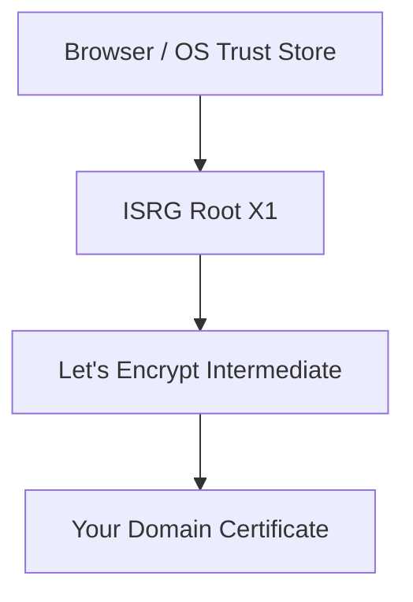

# How to Obtain Free SSL Certificates with Let's Encrypt on RHEL

Author: [nawazdhandala](https://www.github.com/nawazdhandala)

Tags: RHEL, Let's Encrypt, SSL, TLS, Certificates, Linux

Description: A practical guide to obtaining and installing free SSL/TLS certificates from Let's Encrypt on Red Hat Enterprise Linux 9 using Certbot.

---

If you run any public-facing web service on RHEL, you need TLS certificates. Period. Let's Encrypt makes this free and straightforward. I have been using it across dozens of production servers for years now, and it just works.

This post walks through the entire process, from installing Certbot to getting your first certificate issued and configured with Apache or Nginx.

## Prerequisites

Before you start, make sure you have:

- A RHEL system with root or sudo access
- A registered domain name pointing to your server's public IP
- Port 80 open in your firewall (Let's Encrypt uses HTTP-01 challenges by default)
- Either Apache (httpd) or Nginx installed

## Installing Certbot

Certbot is the official Let's Encrypt client. On RHEL, the easiest path is through EPEL.

Enable the EPEL repository first:

```bash
# Install the EPEL release package for RHEL
sudo dnf install https://dl.fedoraproject.org/pub/epel/epel-release-latest-9.noarch.rpm
```

Then install Certbot along with the plugin for your web server:

```bash
# For Apache
sudo dnf install certbot python3-certbot-apache

# For Nginx
sudo dnf install certbot python3-certbot-nginx
```

Verify the installation:

```bash
certbot --version
```

## Opening Firewall Ports

Let's Encrypt needs to reach your server on port 80 (and you will want 443 for HTTPS traffic):

```bash
# Allow HTTP and HTTPS through firewalld
sudo firewall-cmd --permanent --add-service=http
sudo firewall-cmd --permanent --add-service=https
sudo firewall-cmd --reload
```

## Obtaining a Certificate with Apache

If you are running Apache, Certbot can handle both the certificate issuance and the Apache configuration:

```bash
# Obtain and install the certificate, automatically configuring Apache
sudo certbot --apache -d example.com -d www.example.com
```

Certbot will:

1. Verify domain ownership via an HTTP-01 challenge
2. Download the signed certificate
3. Modify your Apache virtual host to use TLS
4. Set up a redirect from HTTP to HTTPS

You will be prompted for an email address (for renewal notifications) and to agree to the Terms of Service.

## Obtaining a Certificate with Nginx

For Nginx, the process is nearly identical:

```bash
# Obtain and install the certificate for Nginx
sudo certbot --nginx -d example.com -d www.example.com
```

Certbot modifies your Nginx server block to include the certificate paths and enables HTTPS.

## Standalone Mode (No Web Server Plugin)

If you are not running Apache or Nginx, or you prefer manual control, use standalone mode. Certbot spins up its own temporary web server on port 80:

```bash
# Stop any service using port 80 first, then run standalone
sudo systemctl stop httpd
sudo certbot certonly --standalone -d example.com -d www.example.com
```

The certificates land in `/etc/letsencrypt/live/example.com/`. You will find:

- `fullchain.pem` - your certificate plus intermediate certificates
- `privkey.pem` - your private key
- `chain.pem` - just the intermediate certificates
- `cert.pem` - just your certificate

## Webroot Mode

If you do not want Certbot touching your web server config at all, webroot mode is a solid choice. It places a challenge file in your document root:

```bash
# Use the webroot plugin, pointing to your site's document root
sudo certbot certonly --webroot -w /var/www/html -d example.com -d www.example.com
```

Your web server must be running and serving files from that directory for this to work.

## Verifying the Certificate

After issuance, confirm everything looks right:

```bash
# List all certificates managed by Certbot
sudo certbot certificates
```

You should see your domain, the expiry date, and the certificate paths. You can also test from the command line:

```bash
# Check the TLS certificate served by your domain
openssl s_client -connect example.com:443 -servername example.com </dev/null 2>/dev/null | openssl x509 -noout -dates -subject
```

## How the Certificate Chain Works

Here is a simplified view of how Let's Encrypt certificates chain up to a trusted root:



Your server sends the domain certificate plus the intermediate. The browser matches the intermediate to a root CA it already trusts.

## Setting Up Auto-Renewal

Let's Encrypt certificates expire after 90 days, so renewal is essential. Certbot installs a systemd timer by default:

```bash
# Check if the renewal timer is active
sudo systemctl status certbot-renew.timer
```

Test renewal without actually renewing:

```bash
# Dry-run to confirm renewal will work
sudo certbot renew --dry-run
```

If the dry run passes, you are all set. Certbot will renew any certificate within 30 days of expiry.

## Troubleshooting Common Issues

**Challenge failures:** Make sure port 80 is reachable from the internet. Check your firewall rules and any cloud security groups. Let's Encrypt must reach `http://example.com/.well-known/acme-challenge/`.

**DNS not pointing to server:** Verify with `dig example.com` or `host example.com` that the A record resolves to your server IP.

**Rate limits:** Let's Encrypt has rate limits (50 certificates per registered domain per week). If you hit them during testing, use the staging environment:

```bash
# Use the staging server for testing (certificates will not be trusted)
sudo certbot --apache --staging -d example.com
```

**SELinux context issues:** If Apache cannot read the certificate files, fix the SELinux context:

```bash
# Restore SELinux contexts on the letsencrypt directory
sudo restorecon -Rv /etc/letsencrypt/
```

## Security Considerations

A few things to keep in mind once your certificates are in place:

- Keep Certbot updated. Run `sudo dnf update certbot` periodically.
- Monitor certificate expiry with your monitoring stack. A certificate that fails to renew silently can cause outages.
- Use strong TLS settings in your web server configuration. Disable TLS 1.0 and 1.1.
- Protect your private key. The files in `/etc/letsencrypt/live/` should only be readable by root.

```bash
# Verify permissions on the private key
sudo ls -la /etc/letsencrypt/live/example.com/privkey.pem
```

The file should show `-rw-------` with root ownership.

## Wrapping Up

Let's Encrypt removed every excuse for not running HTTPS. On RHEL, the combination of EPEL and Certbot makes the whole process take about five minutes. Get your certificates, set up auto-renewal, and move on to more interesting problems.
