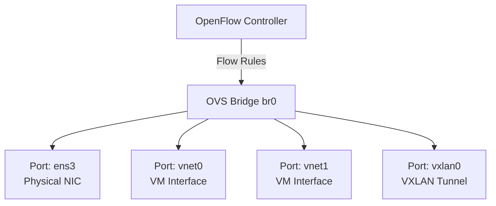

# How to Set Up Open vSwitch (OVS) for Software-Defined Networking on RHEL

Author: [nawazdhandala](https://www.github.com/nawazdhandala)

Tags: RHEL, Open vSwitch, OVS, SDN, Networking, Linux

Description: Learn how to install and configure Open vSwitch on RHEL for software-defined networking with programmable flow rules and VLAN support.

---

Open vSwitch (OVS) is a production-quality, multilayer virtual switch that supports standard management interfaces and is designed to enable network automation through programmatic extension. It is widely used in virtualization and cloud platforms.

## Architecture



## Step 1: Install Open vSwitch

```bash
# Install OVS packages
sudo dnf install -y openvswitch3.1

# Start and enable the OVS service
sudo systemctl enable --now openvswitch

# Verify the installation
ovs-vsctl --version
ovs-vsctl show
```

## Step 2: Create an OVS Bridge

```bash
# Create a new OVS bridge
sudo ovs-vsctl add-br br0

# Add a physical interface to the bridge
sudo ovs-vsctl add-port br0 ens4

# Assign an IP address to the bridge
sudo ip addr add 192.168.1.10/24 dev br0
sudo ip link set br0 up

# Verify the bridge configuration
sudo ovs-vsctl show
```

## Step 3: Configure VLANs

```bash
# Add a port with a specific VLAN tag (access port)
sudo ovs-vsctl add-port br0 vnet0 tag=100

# Add a trunk port that carries multiple VLANs
sudo ovs-vsctl add-port br0 ens5 trunks=100,200,300

# Set a port as a native VLAN trunk
sudo ovs-vsctl set port ens5 vlan_mode=native-untagged tag=100

# View port VLAN settings
sudo ovs-vsctl list port ens5
```

## Step 4: Add OpenFlow Rules

```bash
# View existing flow rules
sudo ovs-ofctl dump-flows br0

# Add a rule to drop all ICMP traffic
sudo ovs-ofctl add-flow br0 "priority=100,icmp,actions=drop"

# Add a rule to forward HTTP traffic to a specific port
sudo ovs-ofctl add-flow br0 "priority=200,tcp,tp_dst=80,actions=output:2"

# Add a rule to mirror all traffic to a monitoring port
sudo ovs-ofctl add-flow br0 "priority=50,actions=output:1,output:3"

# Delete a specific flow
sudo ovs-ofctl del-flows br0 "icmp"
```

## Step 5: Add a VXLAN Tunnel Port

```bash
# Create a VXLAN tunnel to a remote OVS host
sudo ovs-vsctl add-port br0 vxlan0 -- set interface vxlan0 \
    type=vxlan \
    options:remote_ip=10.0.0.2 \
    options:key=1000

# Verify the tunnel
sudo ovs-vsctl show
```

## Step 6: Monitor OVS

```bash
# Show bridge and port statistics
sudo ovs-ofctl dump-ports br0

# Monitor real-time flow matches
sudo ovs-ofctl snoop br0

# Check the OVS database
sudo ovsdb-client dump

# View OVS logs
sudo journalctl -u openvswitch
```

## Step 7: Make OVS Configuration Persistent

OVS stores its configuration in a database that persists across reboots automatically. However, IP addressing needs separate handling:

```bash
# Use NetworkManager to manage the bridge IP
sudo nmcli connection add type ovs-bridge con-name br0 conn.interface br0
sudo nmcli connection add type ovs-port con-name br0-port conn.interface br0 master br0
sudo nmcli connection add type ovs-interface con-name br0-iface conn.interface br0 \
    master br0-port \
    ipv4.method manual \
    ipv4.addresses 192.168.1.10/24

sudo nmcli connection up br0-iface
```

## Summary

You have installed and configured Open vSwitch on RHEL. OVS provides a programmable virtual switch with support for VLANs, VXLAN tunnels, and OpenFlow rules. This makes it a foundation for software-defined networking in virtualization environments, container platforms, and multi-tenant data centers.
