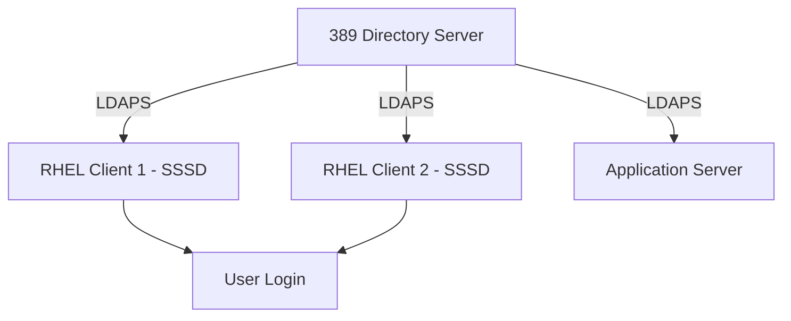

# How to Set Up OpenLDAP Server on RHEL for Centralized Authentication

Author: [nawazdhandala](https://www.github.com/nawazdhandala)

Tags: RHEL, OpenLDAP, Authentication, Linux

Description: A hands-on guide to deploying an OpenLDAP server on RHEL for centralized user authentication, covering installation, schema configuration, TLS setup, and client integration.

---

OpenLDAP is no longer shipped with RHEL as a server package. Red Hat removed the OpenLDAP server (slapd) starting with RHEL 8 and recommends using 389 Directory Server instead. However, the OpenLDAP client libraries and tools are still available. This guide covers setting up 389 Directory Server as a standalone LDAP server on RHEL, since it fills the same role and is the supported replacement.

If you specifically need OpenLDAP slapd, you would need to build it from source or use a container, which is not covered here. For production environments on RHEL, 389 Directory Server is the right choice.

## Why 389 Directory Server

389 DS is the upstream project behind Red Hat Directory Server. It is a full-featured LDAPv3 server with multi-master replication, TLS support, access control, and a modern command-line tool (dsconf/dsctl). It works as a drop-in replacement for OpenLDAP in most authentication scenarios.

## Architecture


```mermaid
flowchart TD
    A[389 Directory Server] -->|LDAPS| B[RHEL Client 1 - SSSD]
    A -->|LDAPS| C[RHEL Client 2 - SSSD]
    A -->|LDAPS| D[Application Server]
    B --> E[User Login]
    C --> E
```

## Step 1 - Install 389 Directory Server

Make sure the RHEL and Directory Server repositories are enabled on the host.

```bash
# Install 389 DS

sudo dnf module enable redhat-ds:12 -y
sudo dnf install 389-ds-base cockpit-389-ds openldap-clients -y
```

## Step 2 - Create the Directory Server Instance

Use `dscreate` to set up a new instance.

```bash
# Generate a default configuration template
sudo dscreate create-template /tmp/ds-setup.inf
```

Edit the template to match your environment:

```bash
sudo vi /tmp/ds-setup.inf
```

Key settings to modify:

```ini
[general]
full_machine_name = ldap.example.com
start = True

[slapd]
instance_name = localhost
port = 389
secure_port = 636
root_dn = cn=Directory Manager
root_password = YourStrongPassword

[backend-userroot]
create_suffix_entry = True
suffix = dc=example,dc=com
sample_entries = no
```

Create the instance:

```bash
# Create the directory server instance
sudo dscreate from-file /tmp/ds-setup.inf

# Open LDAP and LDAPS in the firewall
sudo firewall-cmd --permanent --add-port={389/tcp,636/tcp}
sudo firewall-cmd --reload

# Verify it is running
sudo dsctl localhost status
```

## Step 3 - Configure TLS

LDAP traffic must be encrypted. Set up TLS for the directory server.

```bash
# Generate a certificate signing request
sudo dsctl localhost tls generate-server-cert-csr \
  -s "CN=ldap.example.com,O=Example Corp" ldap.example.com

# After your CA signs the CSR, import the issued server certificate
sudo dsconf -D "cn=Directory Manager" ldap://ldap.example.com \
  security certificate add \
  --file /etc/pki/tls/certs/ldap.crt \
  --name "server-cert" \
  --primary-cert

# Or import an existing certificate and private key
sudo dsctl localhost tls import-server-key-cert \
  /etc/pki/tls/certs/ldap.crt \
  /etc/pki/tls/private/ldap.key

# Import the CA certificate
sudo dsconf -D "cn=Directory Manager" ldap://ldap.example.com \
  security ca-certificate add \
  --file /etc/pki/tls/certs/ca.crt \
  --name "Example CA"

# Trust the CA for TLS
sudo dsconf -D "cn=Directory Manager" ldap://ldap.example.com \
  security ca-certificate set-trust-flags "Example CA" \
  --flags "CT,,"

# Enable TLS
sudo dsconf localhost security enable --cert-name server-cert

# Enable minimum TLS version
sudo dsconf localhost security set --tls-protocol-min TLS1.2

# Restart the instance
sudo dsctl localhost restart
```

Test TLS connectivity:

```bash
# Test LDAPS connection
ldapsearch -x -H ldaps://ldap.example.com:636 \
  -D "cn=Directory Manager" -W \
  -b "dc=example,dc=com" -s base
```

## Step 4 - Create the Directory Structure

Set up the organizational units for users and groups.

```bash
# Add the people OU
ldapadd -x -H ldaps://ldap.example.com:636 -D "cn=Directory Manager" -W << 'EOF'
dn: ou=people,dc=example,dc=com
objectClass: organizationalUnit
ou: people

dn: ou=groups,dc=example,dc=com
objectClass: organizationalUnit
ou: groups
EOF
```

## Step 5 - Add Users

Create user entries with POSIX attributes for Linux authentication.

```bash
# Add a user
ldapadd -x -H ldaps://ldap.example.com:636 -D "cn=Directory Manager" -W << 'EOF'
dn: uid=jsmith,ou=people,dc=example,dc=com
objectClass: inetOrgPerson
objectClass: posixAccount
objectClass: shadowAccount
uid: jsmith
cn: John Smith
sn: Smith
givenName: John
mail: jsmith@example.com
uidNumber: 10001
gidNumber: 10001
homeDirectory: /home/jsmith
loginShell: /bin/bash
userPassword: temporaryPassword
EOF
```

To set a password interactively:

```bash
# Set a user's password
ldappasswd -x -H ldaps://ldap.example.com:636 \
  -D "cn=Directory Manager" -W \
  -S "uid=jsmith,ou=people,dc=example,dc=com"
```

## Step 6 - Add Groups

```bash
# Add a POSIX group
ldapadd -x -H ldaps://ldap.example.com:636 -D "cn=Directory Manager" -W << 'EOF'
dn: cn=developers,ou=groups,dc=example,dc=com
objectClass: posixGroup
cn: developers
gidNumber: 10001
memberUid: jsmith
EOF
```

## Step 7 - Create a Bind Account for SSSD

SSSD needs a service account to search the directory.

```bash
# Create a bind account
ldapadd -x -H ldaps://ldap.example.com:636 -D "cn=Directory Manager" -W << 'EOF'
dn: cn=sssd-bind,ou=people,dc=example,dc=com
objectClass: inetOrgPerson
cn: sssd-bind
sn: SSSD Bind Account
userPassword: BindAccountPassword
EOF
```

Set appropriate ACLs so the bind account can read user entries but not modify them:

```bash
# Add an ACI for the bind account
ldapmodify -x -H ldaps://ldap.example.com:636 -D "cn=Directory Manager" -W << 'EOF'
dn: dc=example,dc=com
changetype: modify
add: aci
aci: (targetattr="uid || cn || sn || givenName || mail || uidNumber || gidNumber || homeDirectory || loginShell || gecos || memberUid || objectClass")(version 3.0; acl "sssd-read-access"; allow (read,search,compare) userdn="ldap:///cn=sssd-bind,ou=people,dc=example,dc=com";)
EOF
```

## Step 8 - Configure RHEL Clients

On each RHEL client, configure SSSD to authenticate against the 389 DS server.

```bash
# Install SSSD
sudo dnf install openldap-clients sssd sssd-ldap oddjob-mkhomedir -y

# Configure SSSD
sudo vi /etc/sssd/sssd.conf
```

```ini
[sssd]
services = nss, pam
domains = example
config_file_version = 2

[domain/example]
id_provider = ldap
auth_provider = ldap
ldap_uri = ldaps://ldap.example.com
ldap_search_base = dc=example,dc=com
ldap_default_bind_dn = cn=sssd-bind,ou=people,dc=example,dc=com
ldap_default_authtok = BindAccountPassword
ldap_tls_reqcert = hard
ldap_tls_cacert = /etc/pki/tls/certs/ca.crt
ldap_user_search_base = ou=people,dc=example,dc=com
ldap_group_search_base = ou=groups,dc=example,dc=com
cache_credentials = True
```

```bash
sudo chmod 600 /etc/sssd/sssd.conf
sudo authselect select sssd with-mkhomedir --force
sudo systemctl enable --now sssd oddjobd
```

## Step 9 - Verify Authentication

```bash
# Test user lookup
id jsmith

# Test login
su - jsmith

# Test from the client
ssh jsmith@client.example.com
```

## Backup and Maintenance

```bash
# Back up the directory
sudo dsconf localhost backup create

# List backups
sudo dsconf localhost backup list

# Monitor server health
sudo dsconf localhost monitor server
sudo dsconf localhost monitor backend
```

389 Directory Server is a capable, production-ready LDAP server that replaces OpenLDAP on RHEL. The tooling is modern and well-documented, and it integrates cleanly with SSSD on the client side.
