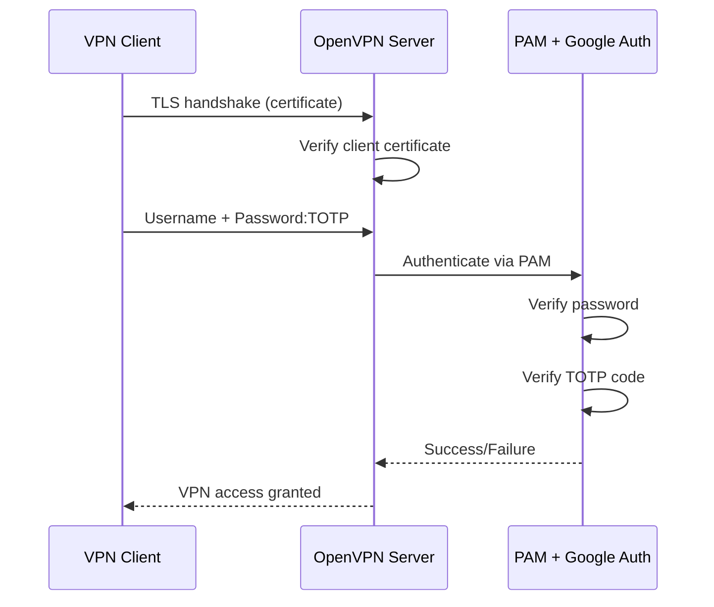

# How to Set Up OpenVPN with Two-Factor Authentication on RHEL

Author: [nawazdhandala](https://www.github.com/nawazdhandala)

Tags: RHEL, OpenVPN, 2FA, Security, Linux

Description: Learn how to add two-factor authentication to OpenVPN on RHEL using Google Authenticator (TOTP), combining certificate-based identity with time-based one-time passwords for stronger VPN security.

---

Certificates alone or passwords alone are not enough for VPN access to sensitive networks. Two-factor authentication adds a second layer: something you have (a TOTP token on your phone) on top of something you know (your password) or something you are issued (a certificate). Here's how to set it up with OpenVPN and Google Authenticator on RHEL.

## How 2FA Works with OpenVPN



The user enters their password followed by their 6-digit TOTP code (from Google Authenticator, Authy, or similar). OpenVPN passes this to PAM, which validates both.

## Prerequisites

- OpenVPN installed and working on RHEL
- Existing PKI with client certificates
- Root or sudo access
- Users with shell accounts on the server (for PAM)

## Installing Google Authenticator PAM Module

```bash
# Install the PAM module
sudo dnf install -y epel-release
sudo dnf install -y google-authenticator qrencode
```

## Setting Up TOTP for Each User

Each VPN user needs to initialize Google Authenticator for their account. This needs to run as each user.

```bash
# As the VPN user (or su to them)
google-authenticator

# Answer the prompts:
# Do you want time-based tokens? y
# (Scan the QR code with your authenticator app)
# Do you want to update your .google_authenticator file? y
# Do you want to disallow multiple uses of the same token? y
# Do you want to increase the time skew window? n
# Do you want rate limiting? y
```

This creates `~/.google_authenticator` in the user's home directory.

For automated provisioning:

```bash
# Non-interactive setup for a user
sudo -u vpnuser google-authenticator \
    -t -d -f -r 3 -R 30 -w 3 \
    -s /home/vpnuser/.google_authenticator

# -t = time based
# -d = disallow reuse
# -f = force overwrite
# -r 3 -R 30 = rate limit: 3 attempts per 30 seconds
# -w 3 = window size (allows 1 code before/after current)
```

## Configuring PAM for OpenVPN

Create a PAM configuration that checks both the system password and the TOTP code.

```bash
# Create the PAM config for OpenVPN
sudo tee /etc/pam.d/openvpn > /dev/null << 'EOF'
# First verify the system password
auth    required    pam_unix.so
# Then verify the TOTP code
auth    required    pam_google_authenticator.so forward_pass
account required    pam_unix.so
EOF
```

The `forward_pass` option means the user enters their password and OTP concatenated. If you prefer separate prompts (not supported by all clients), use `authtok_prompt` instead.

## Configuring OpenVPN for PAM Authentication

Add the PAM plugin to your OpenVPN server configuration.

```bash
# Add these lines to /etc/openvpn/server/server.conf
sudo tee -a /etc/openvpn/server/server.conf > /dev/null << 'EOF'

# PAM authentication plugin
plugin /usr/lib64/openvpn/plugins/openvpn-plugin-auth-pam.so openvpn

# Still require client certificates
# (comment out the next line for password+OTP only)
# verify-client-cert none

# Use the authenticated username
username-as-common-name
EOF
```

## How Users Enter Their Credentials

With the `forward_pass` configuration, users enter their credentials as:
- **Username:** their Linux username
- **Password:** their password followed immediately by the 6-digit TOTP code

For example, if the password is `MyP@ssw0rd` and the current TOTP code is `123456`, the user enters `MyP@ssw0rd123456` as the password.

## Client Configuration

The client config needs to prompt for username and password:

```ini
client
dev tun
proto udp
remote vpn.example.com 1194
resolv-retry infinite
nobind
persist-key
persist-tun

# Prompt for credentials
auth-user-pass

# Certificate files
ca ca.crt
cert client1.crt
key client1.key
tls-auth ta.key 1

cipher AES-256-GCM
auth SHA256
verb 3
```

## Restarting and Testing

```bash
# Restart OpenVPN to load the PAM plugin
sudo systemctl restart openvpn-server@server

# Check for errors
sudo systemctl status openvpn-server@server

# Watch the log during a connection attempt
sudo tail -f /var/log/openvpn/openvpn.log
```

## Testing PAM Authentication Directly

Before testing through OpenVPN, verify PAM works:

```bash
# Install PAM testing tool
sudo dnf install -y pamtester

# Test the authentication
# Enter: password + TOTP code when prompted
pamtester openvpn vpnuser authenticate
```

## Handling SELinux

SELinux might block the PAM plugin from reading user home directories.

```bash
# Check for SELinux denials
sudo ausearch -m avc -ts recent | grep openvpn

# If needed, create a policy module
sudo setsebool -P authlogin_yubikey on

# Or allow OpenVPN to read home directories
sudo setsebool -P openvpn_enable_homedirs on
```

## Using Separate Password and OTP Fields

Some OpenVPN clients support a separate OTP field through the static challenge feature:

```bash
# In server.conf, add:
# static-challenge "Enter OTP: " 1
```

The `1` means the OTP is echoed to the screen. With this approach, users enter their password and OTP in separate prompts. The PAM config changes slightly:

```bash
# Modified PAM config without forward_pass
sudo tee /etc/pam.d/openvpn > /dev/null << 'EOF'
auth    required    pam_unix.so
auth    required    pam_google_authenticator.so
account required    pam_unix.so
EOF
```

## Emergency Access: Scratch Codes

Google Authenticator generates scratch codes during setup. These are one-time-use backup codes for when the user loses access to their authenticator app.

```bash
# View remaining scratch codes
sudo cat /home/vpnuser/.google_authenticator | tail -5
```

Store these securely. Each scratch code can only be used once.

## Troubleshooting

**Authentication always fails:**

```bash
# Test PAM directly
pamtester openvpn vpnuser authenticate

# Check time synchronization (TOTP is time-sensitive)
timedatectl
chronyc tracking

# If time is off by more than 30 seconds, TOTP will fail
sudo chronyc makestep
```

**Plugin fails to load:**

```bash
# Verify plugin path
ls -la /usr/lib64/openvpn/plugins/openvpn-plugin-auth-pam.so

# Check PAM config syntax
cat /etc/pam.d/openvpn
```

**SELinux issues:**

```bash
# Generate a custom SELinux module if needed
sudo ausearch -m avc -ts recent | audit2allow -M openvpn-2fa
sudo semodule -i openvpn-2fa.pp
```

## Security Recommendations

1. Keep system time synchronized with NTP/chrony
2. Use both certificates and 2FA (true three-factor if you count the certificate)
3. Store scratch codes in a secure location
4. Set reasonable rate limiting in Google Authenticator
5. Monitor failed authentication attempts in the logs
6. Consider using a dedicated RADIUS/TOTP server for larger deployments

## Wrapping Up

Two-factor authentication with OpenVPN on RHEL significantly raises the bar for unauthorized access. The combination of TLS certificates plus password plus TOTP means an attacker needs to compromise the client's certificate, know their password, and have access to their authenticator app. The PAM integration makes it work with the standard Linux authentication stack, and Google Authenticator is free and widely supported.
