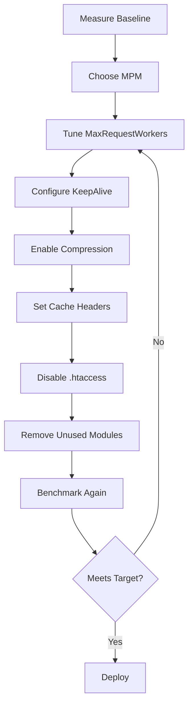

# How to Optimize Apache httpd Performance on RHEL

Author: [nawazdhandala](https://www.github.com/nawazdhandala)

Tags: RHEL, Apache, Performance, Tuning, Linux

Description: Practical performance tuning techniques for Apache httpd on RHEL, including MPM configuration, keepalive settings, and caching.

---

## Why Tune Apache?

The default Apache configuration on RHEL is designed to work out of the box on modest hardware. If you are handling serious traffic or running on a beefy server, you are leaving performance on the table. Tuning Apache is about matching the server's resources to the expected workload.

## Prerequisites

- RHEL with Apache httpd installed
- Root or sudo access
- Some understanding of your traffic patterns

## Step 1 - Choose the Right MPM

Apache on RHEL ships with three Multi-Processing Modules. Check which one is active:

```bash
# Check the current MPM
httpd -V | grep MPM
```

The three options:

| MPM | Description | Best For |
|-----|-------------|----------|
| `event` | Async, handles keep-alive efficiently | Most workloads (default in RHEL) |
| `worker` | Threaded, good concurrency | Thread-safe applications |
| `prefork` | Process-based, no threads | mod_php or non-thread-safe modules |

The `event` MPM is the default and the best choice for most setups. If you are using mod_php, you are stuck with `prefork`.

To switch MPMs, edit `/etc/httpd/conf.modules.d/00-mpm.conf`:

```bash
# View the MPM configuration
cat /etc/httpd/conf.modules.d/00-mpm.conf
```

Comment out the current MPM and uncomment the one you want.

## Step 2 - Tune the Event MPM

Edit or create the MPM configuration:

```apache
# Tune the event MPM for a server with 4 GB RAM
<IfModule mpm_event_module>
    StartServers             3
    MinSpareThreads          75
    MaxSpareThreads          250
    ThreadsPerChild          25
    MaxRequestWorkers        400
    MaxConnectionsPerChild   10000
</IfModule>
```

Key parameters:

- **MaxRequestWorkers** - The maximum number of simultaneous connections. This is the most important setting.
- **ThreadsPerChild** - Threads per child process. MaxRequestWorkers / ThreadsPerChild = number of child processes.
- **MaxConnectionsPerChild** - Recycles processes after this many connections to prevent memory leaks.

### Calculating MaxRequestWorkers

A rough approach: check how much memory each Apache process uses, then divide your available RAM:

```bash
# Check memory usage per Apache process (in KB)
ps aux | grep httpd | awk '{sum += $6; count++} END {print "Avg:", sum/count, "KB per process"}'
```

If each process uses about 50 MB and you have 4 GB for Apache, you can handle around 80 processes. Multiply by ThreadsPerChild for the thread count.

## Step 3 - Configure KeepAlive

KeepAlive lets clients reuse TCP connections for multiple requests. This reduces latency:

```apache
# Enable KeepAlive with reasonable limits
KeepAlive On
MaxKeepAliveRequests 100
KeepAliveTimeout 5
```

A `KeepAliveTimeout` of 5 seconds is a good balance. Too high and idle connections eat up worker slots. Too low and clients have to reconnect constantly.

## Step 4 - Enable Compression

Compress text-based responses to save bandwidth:

```bash
# Create a compression configuration
sudo tee /etc/httpd/conf.d/compression.conf > /dev/null <<'EOF'
<IfModule mod_deflate.c>
    # Compress text-based content types
    AddOutputFilterByType DEFLATE text/html
    AddOutputFilterByType DEFLATE text/css
    AddOutputFilterByType DEFLATE text/javascript
    AddOutputFilterByType DEFLATE application/javascript
    AddOutputFilterByType DEFLATE application/json
    AddOutputFilterByType DEFLATE application/xml
    AddOutputFilterByType DEFLATE text/xml
    AddOutputFilterByType DEFLATE text/plain

    # Do not compress images or already compressed files
    SetEnvIfNoCase Request_URI \.(?:gif|jpe?g|png|webp|zip|gz|bz2)$ no-gzip
</IfModule>
EOF
```

## Step 5 - Enable Browser Caching

Tell browsers to cache static assets:

```bash
# Create a caching headers configuration
sudo tee /etc/httpd/conf.d/caching.conf > /dev/null <<'EOF'
<IfModule mod_expires.c>
    ExpiresActive On

    # Cache images for 30 days
    ExpiresByType image/jpeg "access plus 30 days"
    ExpiresByType image/png "access plus 30 days"
    ExpiresByType image/webp "access plus 30 days"

    # Cache CSS and JS for 7 days
    ExpiresByType text/css "access plus 7 days"
    ExpiresByType application/javascript "access plus 7 days"

    # Cache fonts for 30 days
    ExpiresByType font/woff2 "access plus 30 days"
</IfModule>
EOF
```

## Step 6 - Disable .htaccess Lookups

Every request with `AllowOverride All` triggers a filesystem check for `.htaccess` files. Disable it if you do not need it:

```apache
# Disable .htaccess lookups for better performance
<Directory /var/www/html>
    AllowOverride None
    Require all granted
</Directory>
```

Put your rewrite rules directly in the virtual host configuration instead.

## Step 7 - Disable Unused Modules

Every loaded module consumes memory. Review and remove what you do not need:

```bash
# List loaded modules
httpd -M | wc -l

# Disable unused modules by commenting them out
# Example: disable mod_status if you do not use it
sudo sed -i 's/^LoadModule status_module/#LoadModule status_module/' /etc/httpd/conf.modules.d/00-base.conf
```

## Performance Tuning Flow



## Step 8 - Benchmark Your Changes

Use `ab` (Apache Bench) to measure performance:

```bash
# Install the benchmarking tool
sudo dnf install -y httpd-tools

# Run a benchmark: 1000 requests, 50 concurrent
ab -n 1000 -c 50 http://localhost/
```

Compare the results before and after tuning. Pay attention to requests per second and the time per request.

## Step 9 - Monitor with mod_status

If you want live stats, enable mod_status for localhost only:

```apache
# Enable server status page for localhost
<Location /server-status>
    SetHandler server-status
    Require ip 127.0.0.1
</Location>
```

Access it at `http://localhost/server-status`.

## Apply Changes

```bash
# Validate and reload
sudo apachectl configtest
sudo systemctl reload httpd
```

## Wrap-Up

Apache performance tuning is an iterative process. Start by measuring your baseline, make one change at a time, and measure again. The biggest wins usually come from choosing the right MPM, setting MaxRequestWorkers correctly, and enabling compression. Do not forget to disable .htaccess lookups and unload unused modules for the cleanest setup.
