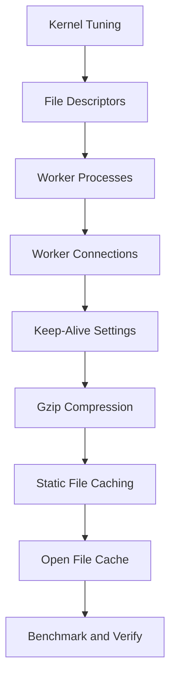

# How to Optimize Nginx for High-Traffic Sites on RHEL

Author: [nawazdhandala](https://www.github.com/nawazdhandala)

Tags: RHEL, NGINX, Performance, Optimization, Linux

Description: Performance tuning techniques for Nginx on RHEL to handle high traffic loads efficiently, covering worker tuning, kernel parameters, and caching.

---

## Why Tune Nginx?

Nginx is fast out of the box, but the default configuration is conservative. When you expect thousands of concurrent connections, you need to tune both Nginx and the underlying Linux kernel. This guide covers the changes that make the biggest difference.

## Prerequisites

- RHEL with Nginx installed
- Root or sudo access
- An understanding of your traffic patterns and server resources

## Step 1 - Tune Worker Processes

Set the number of worker processes to match your CPU cores:

```nginx
# In /etc/nginx/nginx.conf
# Auto detects the number of CPU cores
worker_processes auto;
```

Verify your core count:

```bash
# Check the number of CPU cores
nproc
```

## Step 2 - Increase Worker Connections

Each worker can handle this many simultaneous connections:

```nginx
events {
    # Allow each worker to handle 4096 connections
    worker_connections 4096;

    # Use epoll for efficient event handling on Linux
    use epoll;

    # Accept multiple connections at once
    multi_accept on;
}
```

The theoretical maximum concurrent connections is `worker_processes * worker_connections`. With 4 cores and 4096 connections per worker, that is 16,384 simultaneous connections.

## Step 3 - Optimize File Handling

```nginx
http {
    # Use sendfile for efficient file transfers
    sendfile on;

    # Optimize sendfile by sending headers and file data together
    tcp_nopush on;

    # Disable Nagle's algorithm for better latency
    tcp_nodelay on;
}
```

## Step 4 - Configure Keep-Alive

```nginx
http {
    # Keep connections alive for 30 seconds
    keepalive_timeout 30;

    # Allow up to 100 requests per keep-alive connection
    keepalive_requests 100;
}
```

For upstream connections (reverse proxy), enable keep-alive to backends:

```nginx
upstream backend {
    server 127.0.0.1:3000;

    # Keep 32 connections to the backend alive
    keepalive 32;
}

server {
    location / {
        proxy_pass http://backend;
        proxy_http_version 1.1;
        proxy_set_header Connection "";
    }
}
```

## Step 5 - Enable Gzip Compression

```nginx
http {
    # Enable gzip compression
    gzip on;
    gzip_vary on;
    gzip_proxied any;
    gzip_comp_level 4;
    gzip_min_length 256;
    gzip_types
        text/plain
        text/css
        text/javascript
        application/javascript
        application/json
        application/xml
        image/svg+xml;
}
```

A compression level of 4 gives a good balance between CPU usage and compression ratio. Going higher uses more CPU for diminishing returns.

## Step 6 - Configure Static File Caching

Tell browsers to cache static assets:

```nginx
# Cache static assets
location ~* \.(jpg|jpeg|png|gif|ico|css|js|woff2|svg)$ {
    expires 30d;
    add_header Cache-Control "public, immutable";
    access_log off;
}
```

Turning off access logging for static files reduces I/O.

## Step 7 - Open File Cache

Nginx can cache file descriptors and metadata to avoid repeated disk lookups:

```nginx
http {
    # Cache file descriptors and metadata
    open_file_cache max=10000 inactive=60s;
    open_file_cache_valid 60s;
    open_file_cache_min_uses 2;
    open_file_cache_errors on;
}
```

## Step 8 - Tune Kernel Parameters

The Linux kernel has conservative defaults for networking. Raise them:

```bash
# Create a sysctl config for web server tuning
sudo tee /etc/sysctl.d/99-nginx-tuning.conf > /dev/null <<'EOF'
# Increase the maximum number of connections in the backlog queue
net.core.somaxconn = 65535

# Increase the backlog for incoming connections
net.core.netdev_max_backlog = 65535

# Allow more file descriptors
fs.file-max = 65535

# Reuse TIME_WAIT sockets faster
net.ipv4.tcp_tw_reuse = 1

# Increase the range of local ports
net.ipv4.ip_local_port_range = 1024 65535

# Increase TCP buffer sizes
net.core.rmem_max = 16777216
net.core.wmem_max = 16777216
EOF

# Apply the settings
sudo sysctl -p /etc/sysctl.d/99-nginx-tuning.conf
```

## Step 9 - Increase File Descriptor Limits

Nginx needs one file descriptor per connection. Raise the limits:

```bash
# Create a systemd override for nginx
sudo mkdir -p /etc/systemd/system/nginx.service.d/
sudo tee /etc/systemd/system/nginx.service.d/limits.conf > /dev/null <<'EOF'
[Service]
LimitNOFILE=65535
EOF

# Reload systemd and restart nginx
sudo systemctl daemon-reload
sudo systemctl restart nginx
```

Also set the worker limit in Nginx:

```nginx
# In nginx.conf, outside any block
worker_rlimit_nofile 65535;
```

## Performance Tuning Stack



## Step 10 - Benchmark

Use a load testing tool to verify your changes:

```bash
# Install the benchmarking tool
sudo dnf install -y httpd-tools

# Run a benchmark: 10000 requests, 100 concurrent
ab -n 10000 -c 100 http://your-server/

# Or use wrk for more realistic testing
# wrk -t4 -c200 -d30s http://your-server/
```

Compare results before and after tuning. Look at requests per second and latency percentiles.

## Quick Monitoring

Check how Nginx is doing in real time:

```nginx
# Enable the stub status module
location /nginx_status {
    stub_status;
    allow 127.0.0.1;
    deny all;
}
```

```bash
# Check connection stats
curl http://localhost/nginx_status
```

This shows active connections, accepted connections, and request counts.

## Wrap-Up

High-traffic Nginx tuning involves three layers: the Nginx configuration (workers, connections, caching), the kernel (sysctl settings, file descriptors), and the application layer (upstream keep-alive, buffering). Make one change at a time, benchmark, and measure the impact. The biggest wins usually come from increasing worker_connections, enabling gzip, and tuning the kernel networking parameters.
