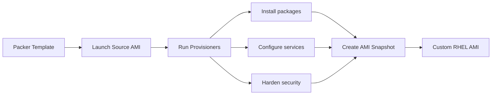

# How to Use Packer to Build Custom RHEL AMI Images

Author: [nawazdhandala](https://www.github.com/nawazdhandala)

Tags: RHEL, Packer, AMI, AWS, Image Building, Linux

Description: Build hardened, pre-configured RHEL AMI images using HashiCorp Packer for faster and more consistent EC2 deployments.

---

Every time you launch an EC2 instance and run a long setup script, you waste time and risk inconsistencies. Packer lets you bake all your configuration into a custom AMI so new instances launch ready to go.

## How Packer Works



## Install Packer

```bash
# Add the HashiCorp repository
sudo dnf config-manager --add-repo https://rpm.releases.hashicorp.com/RHEL/hashicorp.repo

# Install Packer
sudo dnf install -y packer

# Verify the installation
packer version
```

## Create the Packer Template

```hcl
# rhel9-ami.pkr.hcl - Packer template for RHEL AMI

packer {
  required_plugins {
    amazon = {
      version = ">= 1.2.0"
      source  = "github.com/hashicorp/amazon"
    }
  }
}

# Variables for customization
variable "aws_region" {
  type    = string
  default = "us-east-1"
}

variable "instance_type" {
  type    = string
  default = "t3.medium"
}

variable "ami_name_prefix" {
  type    = string
  default = "rhel9-custom"
}

# Find the latest RHEL base AMI
source "amazon-ebs" "rhel9" {
  ami_name      = "${var.ami_name_prefix}-{{timestamp}}"
  instance_type = var.instance_type
  region        = var.aws_region

  # Find the source AMI
  source_ami_filter {
    filters = {
      name                = "RHEL-9.*_HVM-*-x86_64-*-Hourly*"
      root-device-type    = "ebs"
      virtualization-type = "hvm"
    }
    most_recent = true
    owners      = ["309956199498"]  # Red Hat
  }

  # SSH configuration
  ssh_username = "ec2-user"

  # Tag the resulting AMI
  tags = {
    Name        = "${var.ami_name_prefix}"
    OS          = "RHEL"
    BuildDate   = "{{timestamp}}"
    Builder     = "Packer"
  }

  # Customize the root volume
  launch_block_device_mappings {
    device_name           = "/dev/sda1"
    volume_size           = 30
    volume_type           = "gp3"
    delete_on_termination = true
    encrypted             = true
  }
}

# Build steps
build {
  sources = ["source.amazon-ebs.rhel9"]

  # Update the system
  provisioner "shell" {
    inline = [
      "sudo dnf update -y",
      "sudo dnf install -y vim curl wget unzip tar"
    ]
  }

  # Install monitoring and security tools
  provisioner "shell" {
    inline = [
      "# Install common tools",
      "sudo dnf install -y bash-completion bind-utils net-tools",
      "sudo dnf install -y aide chrony",

      "# Enable and configure chrony for time sync",
      "sudo systemctl enable chronyd",

      "# Install and enable the SSM agent for AWS Systems Manager",
      "sudo dnf install -y amazon-ssm-agent",
      "sudo systemctl enable amazon-ssm-agent"
    ]
  }

  # Copy configuration files
  provisioner "file" {
    source      = "files/sshd_config"
    destination = "/tmp/sshd_config"
  }

  # Apply hardening
  provisioner "shell" {
    inline = [
      "# Apply SSH hardening",
      "sudo cp /tmp/sshd_config /etc/ssh/sshd_config",
      "sudo chmod 600 /etc/ssh/sshd_config",

      "# Disable root login",
      "sudo sed -i 's/^PermitRootLogin.*/PermitRootLogin no/' /etc/ssh/sshd_config",

      "# Set proper permissions",
      "sudo chmod 700 /root",

      "# Initialize AIDE database",
      "sudo aide --init",
      "sudo mv /var/lib/aide/aide.db.new.gz /var/lib/aide/aide.db.gz",

      "# Clean up",
      "sudo dnf clean all",
      "sudo rm -rf /tmp/*",
      "sudo rm -f /var/log/wtmp /var/log/btmp",

      "# Remove SSH host keys (will be regenerated on first boot)",
      "sudo rm -f /etc/ssh/ssh_host_*"
    ]
  }
}
```

## Create the SSH Hardening Config

```bash
# Create the files directory
mkdir -p files

# Create a hardened sshd_config
cat > files/sshd_config << 'EOF'
# Hardened SSH configuration for RHEL
Port 22
Protocol 2
PermitRootLogin no
MaxAuthTries 3
PubkeyAuthentication yes
PasswordAuthentication no
PermitEmptyPasswords no
X11Forwarding no
AllowTcpForwarding no
ClientAliveInterval 300
ClientAliveCountMax 2
UsePAM yes
Subsystem sftp /usr/libexec/openssh/sftp-server
EOF
```

## Build the AMI

```bash
# Initialize Packer (downloads plugins)
packer init rhel9-ami.pkr.hcl

# Validate the template
packer validate rhel9-ami.pkr.hcl

# Build the AMI
packer build rhel9-ami.pkr.hcl
```

The build output will show the AMI ID when complete:

```bash
==> amazon-ebs.rhel9: AMIs were created:
us-east-1: ami-0123456789abcdef0
```

## Use the Custom AMI with Terraform

```hcl
# Reference your custom AMI in Terraform
data "aws_ami" "custom_rhel9" {
  most_recent = true
  owners      = ["self"]

  filter {
    name   = "name"
    values = ["rhel9-custom-*"]
  }
}

resource "aws_instance" "app_server" {
  ami           = data.aws_ami.custom_rhel9.id
  instance_type = "t3.medium"

  tags = {
    Name = "app-server"
  }
}
```

## Automate Builds with a Script

```bash
#!/bin/bash
# build-ami.sh - Build and tag the custom RHEL AMI

set -euo pipefail

# Build the AMI and capture the output
OUTPUT=$(packer build -machine-readable rhel9-ami.pkr.hcl)

# Extract the AMI ID
AMI_ID=$(echo "$OUTPUT" | grep 'artifact,0,id' | cut -d: -f2)

echo "Built AMI: $AMI_ID"

# Tag with the git commit for traceability
GIT_COMMIT=$(git rev-parse --short HEAD 2>/dev/null || echo "unknown")
aws ec2 create-tags --resources "$AMI_ID" --tags "Key=GitCommit,Value=$GIT_COMMIT"
```

Packer and Terraform work together naturally. Packer builds the golden image, and Terraform deploys instances from it. Your RHEL servers launch in seconds instead of minutes, with every package and configuration already in place.
