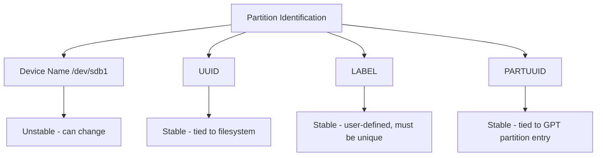

# How to Set Up Partition Labels and UUIDs for Reliable Mounting on RHEL

Author: [nawazdhandala](https://www.github.com/nawazdhandala)

Tags: RHEL, UUID, Labels, Partitioning, Linux

Description: Learn how to use filesystem labels and UUIDs for reliable partition identification on RHEL, avoiding boot failures caused by device name changes.

---

## The Problem with Device Names

Device names like /dev/sdb1 are not stable. They can change when you add or remove disks, replace hardware controllers, or even between reboots. If your /etc/fstab references /dev/sdb1 and the kernel assigns that name to a different disk, you will either mount the wrong filesystem or fail to boot.

UUIDs (Universally Unique Identifiers) and filesystem labels solve this problem by identifying partitions by persistent attributes rather than kernel-assigned names.

## Understanding the Identifier Types

### UUID

Every filesystem gets a unique UUID when formatted. It does not change unless you reformat the partition.

```bash
# View UUIDs for all block devices
sudo blkid

# View UUID for a specific device
sudo blkid /dev/sdb1
```

### PARTUUID

GPT partitions have their own UUID, separate from the filesystem UUID. This identifies the partition itself, not the filesystem on it.

```bash
# Show PARTUUIDs
sudo blkid -s PARTUUID -o value /dev/sdb1
```

### Labels

You assign labels manually. They are human-readable and easier to remember than UUIDs, but you must ensure they are unique across all mounted filesystems.

## Setting Filesystem Labels

### For XFS

```bash
# Set a label during filesystem creation
sudo mkfs.xfs -L "data" /dev/sdb1

# Change the label on an existing XFS filesystem (must be unmounted)
sudo xfs_admin -L "mydata" /dev/sdb1
```

### For ext4

```bash
# Set a label during creation
sudo mkfs.ext4 -L "backups" /dev/sdb2

# Change label on an existing ext4 filesystem
sudo e2label /dev/sdb2 "backups"

# Or use tune2fs
sudo tune2fs -L "backups" /dev/sdb2
```

### For swap

```bash
# Set label during swap creation
sudo mkswap -L "swap1" /dev/sdb3
```

## Viewing Labels and UUIDs

```bash
# Show all filesystem identifiers
sudo blkid

# Filter for just UUIDs
sudo blkid -s UUID

# Filter for just labels
sudo blkid -s LABEL

# Show information in a table format
lsblk -o NAME,UUID,LABEL,FSTYPE,MOUNTPOINT
```

## Using UUIDs in /etc/fstab

The recommended approach on RHEL is to use UUIDs in fstab:

```bash
# Standard UUID mount entry
UUID=a1b2c3d4-e5f6-7890-abcd-ef1234567890  /mnt/data  xfs  defaults  0 0
```

To find the UUID and build the fstab line:

```bash
# Get UUID and construct fstab entry
UUID=$(sudo blkid -s UUID -o value /dev/sdb1)
echo "UUID=${UUID}  /mnt/data  xfs  defaults  0 0"
```

## Using Labels in /etc/fstab

Labels are more readable but require you to keep them unique:

```bash
# Label-based mount entry
LABEL=data  /mnt/data  xfs  defaults  0 0
```

## Using PARTUUIDs in /etc/fstab

PARTUUID is useful when you have not yet formatted the partition or when you want to identify the partition regardless of filesystem:

```bash
# PARTUUID mount entry
PARTUUID=12345678-90ab-cdef-1234-567890abcdef  /mnt/data  xfs  defaults  0 0
```

## Comparison of Identification Methods



| Method | Persistence | Survives Reformat | Human Readable |
|--------|------------|-------------------|----------------|
| Device name | No | N/A | Yes |
| UUID | Yes | No | No |
| LABEL | Yes | No | Yes |
| PARTUUID | Yes | Yes | No |

## GPT Partition Names vs. Filesystem Labels

Do not confuse GPT partition names with filesystem labels. They are different things:

```bash
# GPT partition name (set with parted)
sudo parted /dev/sdb name 1 "data-partition"

# Filesystem label (set with mkfs or admin tools)
sudo xfs_admin -L "data" /dev/sdb1
```

GPT partition names are not usable in fstab. You need filesystem labels or UUIDs for mounting.

## Best Practices

1. **Always use UUID or LABEL in fstab**, never bare device names
2. **Use labels for frequently accessed mounts** where readability helps
3. **Keep labels unique** across the system to avoid ambiguity
4. **Label length limits**: XFS labels can be up to 12 characters, ext4 up to 16
5. **Document your labeling scheme** so other admins know the convention
6. **After reformatting**, the UUID changes, so update fstab immediately

## Checking fstab Before Rebooting

After editing fstab, always test before rebooting:

```bash
# Try mounting everything in fstab
sudo mount -a

# Verify all mounts are active
df -h

# Check for any fstab errors
sudo findmnt --verify
```

## Wrap-Up

Using UUIDs or labels for partition identification on RHEL is essential for system reliability. Device names change, but UUIDs and labels persist. Use UUIDs when you want automatic, unique identification. Use labels when you want human-readable names. Either way, you avoid the nightmare of a system that fails to boot because /dev/sdb became /dev/sdc after a hardware change.
