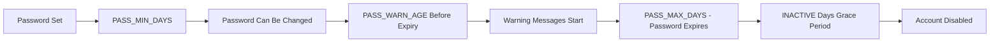

# How to Set Password Expiration and Aging Policies on RHEL

Author: [nawazdhandala](https://www.github.com/nawazdhandala)

Tags: RHEL, Password Aging, Chage, Security, Linux

Description: Configure password expiration, aging policies, and account inactivity on RHEL using chage, login.defs, and PAM for compliance and security.

---

Password aging forces users to change their passwords periodically. Whether you think this is good security practice or just annoying (there is a real debate), many compliance frameworks still require it. RHEL gives you granular control over when passwords expire, how often they can be changed, and what happens when an account goes inactive.

## Password Aging Parameters

Here are the key parameters and what they control:

| Parameter | What It Does |
|---|---|
| PASS_MAX_DAYS | Maximum days before a password must be changed |
| PASS_MIN_DAYS | Minimum days between password changes |
| PASS_WARN_AGE | Days before expiration to warn the user |
| INACTIVE | Days after password expires before account is disabled |



## Setting System-Wide Defaults

### Configure login.defs

These defaults apply to all newly created users:

```bash
sudo vi /etc/login.defs
```

```bash
# Maximum number of days a password is valid
PASS_MAX_DAYS   90

# Minimum number of days between password changes
PASS_MIN_DAYS   1

# Days before expiration to warn the user
PASS_WARN_AGE   14
```

Setting `PASS_MIN_DAYS` to at least 1 prevents users from immediately cycling through passwords to get back to their favorite one (this works together with pam_pwhistory).

### Set default inactivity period

The `INACTIVE` setting is not in login.defs. Use the `useradd` defaults:

```bash
# Set the default inactivity period to 30 days
sudo useradd -D -f 30

# Verify the default
sudo useradd -D
```

## Configuring Per-User Password Aging with chage

The `chage` command lets you set password aging parameters for individual users.

### View current aging settings for a user

```bash
sudo chage -l jsmith
```

Example output:

```bash
Last password change                                    : Mar 04, 2026
Password expires                                        : Jun 02, 2026
Password inactive                                       : Jul 02, 2026
Account expires                                         : never
Minimum number of days between password change          : 1
Maximum number of days between password change          : 90
Number of days of warning before password expires       : 14
```

### Set password expiration to 90 days

```bash
sudo chage -M 90 jsmith
```

### Set minimum days between changes

```bash
sudo chage -m 1 jsmith
```

### Set warning period

```bash
sudo chage -W 14 jsmith
```

### Set inactivity period

```bash
# Disable account 30 days after password expires
sudo chage -I 30 jsmith
```

### Set all parameters at once

```bash
sudo chage -M 90 -m 1 -W 14 -I 30 jsmith
```

### Force password change on next login

```bash
# Expire the password immediately
sudo chage -d 0 jsmith
```

This is useful when provisioning new accounts or after a security incident.

### Set an account expiration date

This is different from password expiration. An account expiration date disables the entire account:

```bash
# Account expires on December 31, 2026
sudo chage -E 2026-12-31 jsmith

# Remove account expiration
sudo chage -E -1 jsmith
```

## Applying Aging Policies to Existing Users

The defaults in login.defs only apply to new users. To update existing users in bulk:

```bash
# Set password aging for all users with UIDs >= 1000 (regular users)
for user in $(awk -F: '$3 >= 1000 && $3 < 65534 {print $1}' /etc/passwd); do
    sudo chage -M 90 -m 1 -W 14 -I 30 "$user"
    echo "Updated aging policy for: $user"
done
```

### Verify the changes

```bash
# List aging info for all regular users
for user in $(awk -F: '$3 >= 1000 && $3 < 65534 {print $1}' /etc/passwd); do
    echo "=== $user ==="
    sudo chage -l "$user"
    echo ""
done
```

## Excluding Service Accounts

Service accounts should typically not have password aging. Lock them to password authentication instead:

```bash
# Lock the service account password (prevents password login)
sudo passwd -l serviceaccount

# Set no expiration for service accounts
sudo chage -M -1 -m 0 -W 0 -I -1 -E -1 serviceaccount
```

### Verify the service account is properly configured

```bash
sudo chage -l serviceaccount
```

Expected output:

```bash
Password expires                                        : never
Password inactive                                       : never
Account expires                                         : never
```

## Monitoring Expiring Passwords

### Find users with expiring passwords

```bash
# Check which passwords expire in the next 14 days
for user in $(awk -F: '$3 >= 1000 && $3 < 65534 {print $1}' /etc/passwd); do
    expiry=$(sudo chage -l "$user" | grep "Password expires" | cut -d: -f2 | xargs)
    if [ "$expiry" != "never" ]; then
        expiry_epoch=$(date -d "$expiry" +%s 2>/dev/null)
        now_epoch=$(date +%s)
        days_left=$(( (expiry_epoch - now_epoch) / 86400 ))
        if [ "$days_left" -le 14 ] && [ "$days_left" -ge 0 ]; then
            echo "WARNING: $user password expires in $days_left days ($expiry)"
        fi
    fi
done
```

### Create a monitoring script

```bash
sudo vi /usr/local/bin/check-password-expiry.sh
```

```bash
#!/bin/bash
# Report users with passwords expiring within the next 14 days
WARN_DAYS=14

for user in $(awk -F: '$3 >= 1000 && $3 < 65534 {print $1}' /etc/passwd); do
    expire_date=$(sudo chage -l "$user" 2>/dev/null | grep "Password expires" | cut -d: -f2 | xargs)

    if [ "$expire_date" = "never" ] || [ -z "$expire_date" ]; then
        continue
    fi

    expire_epoch=$(date -d "$expire_date" +%s 2>/dev/null)
    if [ -z "$expire_epoch" ]; then
        continue
    fi

    now_epoch=$(date +%s)
    days_left=$(( (expire_epoch - now_epoch) / 86400 ))

    if [ "$days_left" -le "$WARN_DAYS" ]; then
        logger -p auth.warning "Password expiring: $user in $days_left days"
    fi
done
```

```bash
sudo chmod 700 /usr/local/bin/check-password-expiry.sh
```

## Compliance Settings

### CIS Benchmark

```bash
PASS_MAX_DAYS   365
PASS_MIN_DAYS   1
PASS_WARN_AGE   7
INACTIVE        30
```

### PCI DSS

```bash
PASS_MAX_DAYS   90
PASS_MIN_DAYS   1
PASS_WARN_AGE   14
INACTIVE        90
```

### STIG

```bash
PASS_MAX_DAYS   60
PASS_MIN_DAYS   1
PASS_WARN_AGE   7
INACTIVE        35
```

## Wrapping Up

Password aging is straightforward to configure on RHEL but requires attention to both the system defaults in `/etc/login.defs` and per-user settings via `chage`. Remember that new defaults only apply to newly created users, so you need to update existing accounts separately. Exclude service accounts from aging policies, monitor for expiring passwords proactively, and align your settings with whatever compliance framework applies to your environment.
