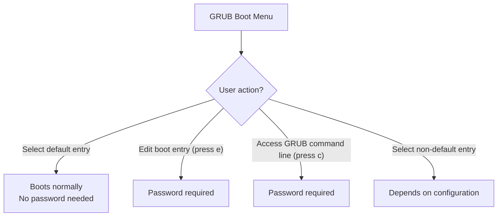

# How to Password-Protect the GRUB2 Boot Loader on RHEL

Author: [nawazdhandala](https://www.github.com/nawazdhandala)

Tags: RHEL, GRUB2, Passwords, Security, Linux

Description: Learn how to add password protection to the GRUB2 boot loader on RHEL to prevent unauthorized kernel parameter changes and single-user mode access.

---

## Why Protect GRUB2?

Anyone with physical access to a server (or console access via IPMI/iLO/iDRAC) can edit GRUB boot parameters, boot into single-user mode, and reset the root password. On systems where physical security is not guaranteed, password-protecting GRUB2 prevents unauthorized users from tampering with boot parameters.

This is a common requirement for PCI-DSS, HIPAA, and other compliance frameworks.

## What GRUB2 Password Protection Does



By default, password protection blocks editing boot entries and accessing the GRUB command line, while still allowing normal booting of the default entry.

## Setting a GRUB2 Password

### Generate the Password Hash

```bash
# Generate a PBKDF2 password hash
grub2-setpassword
```

You will be prompted to enter and confirm the password. This creates a file at `/boot/grub2/user.cfg` containing the hashed password.

```bash
# Verify the file was created
cat /boot/grub2/user.cfg
# Output: GRUB2_PASSWORD=grub.pbkdf2.sha512.10000.<hash>
```

### How grub2-setpassword Works

The `grub2-setpassword` command:

1. Prompts for a password
2. Hashes it with PBKDF2-SHA512
3. Stores the hash in `/boot/grub2/user.cfg`
4. The superuser is set to `root` by default

The GRUB2 configuration template at `/etc/grub.d/01_users` reads this file and includes the password protection in the generated config.

## Verifying Password Protection

```bash
# Check that the password file exists and has correct permissions
ls -la /boot/grub2/user.cfg

# Verify the GRUB config includes password references
grep -i password /boot/grub2/grub.cfg 2>/dev/null || echo "Check /boot/grub2/user.cfg instead"

# Test by rebooting and pressing 'e' at the GRUB menu
# You should be prompted for username 'root' and your password
```

## Changing the GRUB2 Password

```bash
# Simply run the command again with a new password
sudo grub2-setpassword
```

## Removing GRUB2 Password Protection

```bash
# Remove the password file
sudo rm /boot/grub2/user.cfg

# Regenerate GRUB config (if needed)
# For BIOS:
sudo grub2-mkconfig -o /boot/grub2/grub.cfg
# For UEFI:
sudo grub2-mkconfig -o /boot/efi/EFI/redhat/grub.cfg
```

## Advanced: Custom Users and Unrestricted Entries

If you want to allow some boot entries to be selected without a password while protecting others:

```bash
# Create a custom GRUB configuration snippet
sudo tee /etc/grub.d/40_custom <<'EOF'
#!/bin/sh
exec tail -n +3 $0

set superusers="admin"
password_pbkdf2 admin grub.pbkdf2.sha512.10000.<your-hash-here>
EOF

# Make it executable
sudo chmod +x /etc/grub.d/40_custom
```

To make specific menu entries accessible without a password, you would need to mark them as `--unrestricted` in the GRUB configuration. However, on RHEL with BLS, the simpler approach using `grub2-setpassword` is recommended.

## Security Considerations

| Consideration | Details |
|--------------|---------|
| Physical security | GRUB password does not protect against booting from USB/CD |
| Secure Boot | Combine with UEFI Secure Boot for stronger protection |
| Password strength | Use a strong password, it protects root access |
| Recovery | Keep the password documented in your password manager |
| Disk encryption | LUKS encryption provides stronger data protection |

Important: A GRUB password alone does not provide complete security. Someone with physical access could still boot from external media or remove the disk. Combine GRUB protection with:

- UEFI Secure Boot
- BIOS/UEFI password
- Full disk encryption (LUKS)
- Disabled boot from external media

## File Permissions

Make sure the password file has proper permissions:

```bash
# Set restrictive permissions on the password file
sudo chmod 600 /boot/grub2/user.cfg
sudo chown root:root /boot/grub2/user.cfg

# Verify
ls -la /boot/grub2/user.cfg
```

## Wrapping Up

Password-protecting GRUB2 on RHEL is a quick task thanks to the `grub2-setpassword` command. It takes under a minute to set up and it closes a real security gap on systems where someone could access the console. Just remember that it is one layer of defense, not the whole strategy. Combine it with UEFI Secure Boot and disk encryption for comprehensive boot security, and keep the password stored safely, because if you lose it, you will need to boot from installation media to recover.
