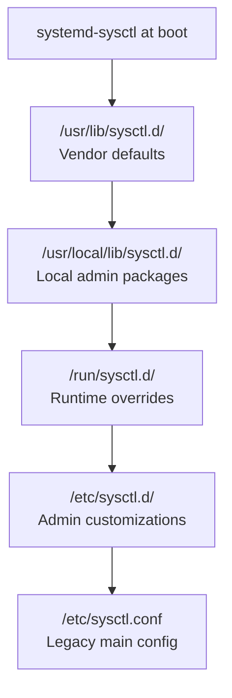

# How to Make Kernel Parameter Changes Persistent Across Reboots on RHEL

Author: [nawazdhandala](https://www.github.com/nawazdhandala)

Tags: RHEL, Sysctl, Persistent, Kernel, Linux

Description: Learn how to make kernel parameter changes survive reboots on RHEL using sysctl configuration files, drop-in directories, and systemd-sysctl integration.

---

## The Problem with Runtime Changes

When you run `sysctl -w vm.swappiness=10`, the change takes effect immediately. But the moment you reboot, it reverts to the default. This is by design. The kernel starts fresh each boot and reads its tunable values from configuration files during early userspace initialization.

If you are tuning a production server, you need those changes to stick. RHEL gives you several places to define persistent kernel parameters, and knowing which one to use matters.

## Where Persistent sysctl Configuration Lives

RHEL uses systemd-sysctl to apply kernel parameters during boot. It reads configuration from multiple directories in a specific order.



Files are processed in lexicographic order within each directory, and later entries override earlier ones. The `/etc/sysctl.d/` directory is where your custom settings belong.

## Creating Persistent Configuration Files

The recommended approach is to create drop-in files in `/etc/sysctl.d/` with descriptive names.

```bash
# Create a file for network tuning parameters
sudo tee /etc/sysctl.d/90-network-tuning.conf <<EOF
# Increase connection backlog for web servers
net.core.somaxconn = 65535

# Enable TCP window scaling
net.ipv4.tcp_window_scaling = 1

# Expand local port range
net.ipv4.ip_local_port_range = 1024 65535

# Enable SYN cookies for flood protection
net.ipv4.tcp_syncookies = 1
EOF
```

```bash
# Create a separate file for memory tuning
sudo tee /etc/sysctl.d/90-memory-tuning.conf <<EOF
# Reduce swappiness to keep more data in RAM
vm.swappiness = 10

# Set dirty page background flush threshold
vm.dirty_background_ratio = 5

# Set dirty page forced flush threshold
vm.dirty_ratio = 15
EOF
```

## Naming Conventions

The number prefix controls the load order. Here is a practical scheme.

| Prefix | Purpose |
|--------|---------|
| 10-* | Base system defaults (usually vendor-provided) |
| 50-* | Application-specific settings |
| 90-* | Site-specific overrides |
| 99-* | Final overrides that always win |

Use `.conf` as the file extension. Files without it will be ignored by systemd-sysctl.

## Applying Changes Without Rebooting

After creating or modifying a configuration file, apply the settings immediately.

```bash
# Apply settings from a specific file
sudo sysctl -p /etc/sysctl.d/90-network-tuning.conf

# Or reload all sysctl configuration files system-wide
sudo sysctl --system
```

The `--system` flag processes all configuration directories in the correct order. It also prints each file as it loads, which helps you spot conflicts.

## The Legacy /etc/sysctl.conf File

The `/etc/sysctl.conf` file still works on RHEL and is processed last after all drop-in files. Some admins prefer keeping everything in one place, and that is fine for simple setups.

```bash
# Append a setting to the legacy config file
echo "net.ipv4.ip_forward = 1" | sudo tee -a /etc/sysctl.conf

# Apply it
sudo sysctl -p
```

However, the drop-in approach scales better. When you have dozens of parameters across different categories, separate files are much easier to manage, review, and version-control.

## Verifying Persistence

After applying changes, verify they are set correctly.

```bash
# Check specific values
sysctl vm.swappiness net.core.somaxconn net.ipv4.ip_forward

# Simulate a full reload and check for errors
sudo sysctl --system 2>&1 | grep -i error
```

To confirm settings survive a reboot, you can check right after the system comes back up.

```bash
# After reboot, verify your settings
sysctl vm.swappiness
# Expected: vm.swappiness = 10
```

## Debugging Conflicting Settings

When a parameter does not have the value you expect, conflicting files are usually the cause.

```bash
# Search all sysctl config locations for a specific parameter
grep -rn "swappiness" /usr/lib/sysctl.d/ /usr/local/lib/sysctl.d/ /run/sysctl.d/ /etc/sysctl.d/ /etc/sysctl.conf 2>/dev/null
```

Remember, the last value wins. If `/usr/lib/sysctl.d/50-default.conf` sets `vm.swappiness = 60` and your `/etc/sysctl.d/90-memory-tuning.conf` sets it to `10`, your value wins because `/etc/sysctl.d/` is processed after `/usr/lib/sysctl.d/`.

## Using systemd-sysctl Directly

You can also check how systemd-sysctl will process your configuration.

```bash
# Show the effective configuration that systemd-sysctl will apply
systemd-sysctl --cat-config

# Check the status of the sysctl service
systemctl status systemd-sysctl
```

The `--cat-config` option shows all configuration files concatenated with comment headers indicating which file each block comes from.

## Automating with Ansible

For fleets of servers, use Ansible's `sysctl` module to manage persistent parameters.

```yaml
# Example Ansible task for persistent sysctl settings
- name: Set network tuning parameters
  ansible.posix.sysctl:
    name: "{{ item.name }}"
    value: "{{ item.value }}"
    sysctl_file: /etc/sysctl.d/90-network-tuning.conf
    reload: true
  loop:
    - { name: "net.core.somaxconn", value: "65535" }
    - { name: "net.ipv4.tcp_syncookies", value: "1" }
    - { name: "vm.swappiness", value: "10" }
```

## Wrapping Up

Persistent kernel parameters on RHEL are straightforward once you understand the directory hierarchy and processing order. Use `/etc/sysctl.d/` with numbered, descriptive filenames. Keep related settings together. And always verify after applying. The few minutes you spend organizing your sysctl configuration files will save you hours of head-scratching when something behaves differently after a reboot.
