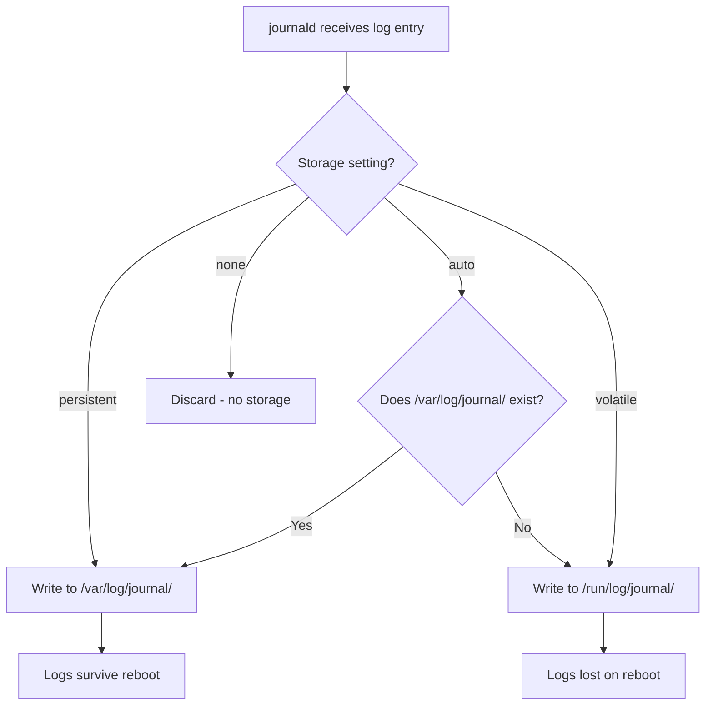

# How to Configure Persistent Logging with systemd-journald on RHEL 9

Author: [nawazdhandala](https://www.github.com/nawazdhandala)

Tags: RHEL, journald, Persistent Logging, systemd, Linux

Description: Learn how to configure systemd-journald on RHEL 9 to store logs persistently across reboots, manage journal size limits, and clean up old log data with vacuum commands.

---

## The Problem with Default Journal Storage

By default on RHEL 9, the systemd journal stores logs persistently if the directory `/var/log/journal/` exists, which it typically does on standard installations. However, this is not guaranteed on every setup, especially minimal installations or custom images. If the directory does not exist, journald falls back to storing logs in `/run/log/journal/`, which is a tmpfs filesystem. That means your logs disappear on every reboot.

If you have ever rebooted a server to fix an issue, only to realize the pre-reboot logs are gone because journald was not configured for persistent storage, you know how frustrating this can be. Let me walk you through making sure that does not happen again.

## Checking Your Current Configuration

First, find out how journald is currently storing logs.

```bash
# Check the current journal storage location and size
journalctl --disk-usage

# See which boots are recorded (if persistent, you will see multiple entries)
journalctl --list-boots
```

If `--list-boots` only shows the current boot (boot ID 0), your logs are probably not persisting.

Check the configuration file:

```bash
# View the current journald configuration
cat /etc/systemd/journald.conf
```

Most of the settings will be commented out, meaning journald uses its defaults. The key setting is `Storage=`.

## Understanding the Storage Options

The `Storage=` directive in `journald.conf` controls where logs are written:

- **`auto`** (default) - Stores logs in `/var/log/journal/` if the directory exists. If it does not exist, uses volatile storage in `/run/log/journal/`.
- **`persistent`** - Always stores logs in `/var/log/journal/` and creates the directory if it does not exist.
- **`volatile`** - Only stores logs in memory at `/run/log/journal/`. Logs are lost on reboot.
- **`none`** - Disables all log storage. Logs can still be forwarded to other targets.



## Enabling Persistent Storage

Edit the journald configuration file to set persistent storage explicitly.

```bash
# Edit the journald configuration
sudo vi /etc/systemd/journald.conf
```

Find the `[Journal]` section and uncomment or add the `Storage` line:

```ini
[Journal]
Storage=persistent
```

If you prefer a one-liner approach:

```bash
# Set persistent storage in the configuration
sudo sed -i 's/^#Storage=auto/Storage=persistent/' /etc/systemd/journald.conf
```

Now create the storage directory if it does not already exist and restart journald:

```bash
# Create the persistent journal directory (usually already exists on RHEL 9)
sudo mkdir -p /var/log/journal

# Restart journald to apply the new configuration
sudo systemctl restart systemd-journald

# Verify the change
journalctl --disk-usage
```

## Configuring Size Limits

Without size limits, the journal can grow until it fills up your `/var` partition. That is a bad day for everyone. journald has several settings to control this.

### Key Size Settings

Edit `/etc/systemd/journald.conf` and set the following under the `[Journal]` section:

```ini
[Journal]
Storage=persistent

# Maximum disk space the journal can use
SystemMaxUse=2G

# Leave at least this much free space on the partition
SystemKeepFree=4G

# Maximum size of individual journal files
SystemMaxFileSize=128M

# Maximum disk space for runtime (volatile) journal
RuntimeMaxUse=256M
```

Here is what each setting does:

- **`SystemMaxUse`** - Hard cap on total journal disk usage. Once reached, the oldest entries are deleted to make room.
- **`SystemKeepFree`** - Ensures journald does not eat into the last N bytes of free space on the partition. This protects other applications.
- **`SystemMaxFileSize`** - Controls how large individual journal files can grow before a new one is started.
- **`RuntimeMaxUse`** - Same as `SystemMaxUse` but for the volatile journal in `/run/log/journal/`.

After editing, restart journald:

```bash
# Apply the new size limits
sudo systemctl restart systemd-journald
```

### Defaults If You Do Not Set Anything

If you leave the size settings commented out, journald uses sensible defaults:
- `SystemMaxUse` defaults to 10% of the file system size (capped at 4GB)
- `SystemKeepFree` defaults to 15% of the file system size
- The lower of these two limits wins

For most servers, the defaults are fine. But I have seen cases where a verbose application floods the journal with debug messages and the 10% default was too generous for a small `/var` partition.

## Cleaning Up Old Journal Data

Over time, you may need to manually trim the journal. journald provides vacuum commands for this.

### Vacuum by Time

Remove journal entries older than a specified period:

```bash
# Delete journal entries older than 30 days
sudo journalctl --vacuum-time=30d

# Delete entries older than 1 week
sudo journalctl --vacuum-time=1w
```

### Vacuum by Size

Shrink the journal to a maximum size:

```bash
# Reduce journal to 500MB
sudo journalctl --vacuum-size=500M

# Reduce to 1GB
sudo journalctl --vacuum-size=1G
```

### Vacuum by Number of Files

Limit the number of journal files kept:

```bash
# Keep only the 5 most recent journal files
sudo journalctl --vacuum-files=5
```

### Check the Result

After vacuuming, verify the new usage:

```bash
# Show the current disk usage
journalctl --disk-usage
```

## Verifying Persistence Across Reboots

After configuring persistent logging, verify it is working by checking that you can see previous boots.

```bash
# List all recorded boots
journalctl --list-boots
```

You should see multiple entries if the system has been rebooted since enabling persistent storage:

```
-2 abc123... Wed 2026-03-02 08:00:00 UTC—Wed 2026-03-02 23:59:00 UTC
-1 def456... Thu 2026-03-03 08:00:00 UTC—Thu 2026-03-03 23:59:00 UTC
 0 ghi789... Fri 2026-03-04 08:00:00 UTC—Fri 2026-03-04 10:30:00 UTC
```

To view logs from a previous boot:

```bash
# View logs from the previous boot
journalctl -b -1

# View logs from two boots ago
journalctl -b -2
```

This is incredibly valuable for troubleshooting. If a server crashed and rebooted, you can look at the logs leading up to the crash.

## Forwarding to rsyslog

Persistent journald storage does not replace rsyslog. Both can run simultaneously. By default on RHEL 9, journald forwards messages to rsyslog, which writes them to traditional text files in `/var/log/`.

Check that forwarding is enabled:

```bash
# This should be set to yes (or commented out, as yes is the default)
grep ForwardToSyslog /etc/systemd/journald.conf
```

If the line is commented out, the default is `yes`, meaning rsyslog receives journal entries automatically.

## Automating Cleanup with a systemd Timer

If you want regular automated cleanup beyond what the size limits provide, you can create a systemd timer.

```bash
# Create a service to vacuum old journal entries
sudo tee /etc/systemd/system/journal-vacuum.service << 'EOF'
[Unit]
Description=Vacuum old journal entries

[Service]
Type=oneshot
ExecStart=/usr/bin/journalctl --vacuum-time=14d --vacuum-size=1G
EOF

# Create a timer to run it weekly
sudo tee /etc/systemd/system/journal-vacuum.timer << 'EOF'
[Unit]
Description=Weekly journal vacuum

[Timer]
OnCalendar=weekly
Persistent=true

[Install]
WantedBy=timers.target
EOF

# Enable the timer
sudo systemctl enable --now journal-vacuum.timer

# Verify the timer is scheduled
systemctl list-timers journal-vacuum.timer
```

## Monitoring Journal Health

Keep an eye on journal corruption or issues.

```bash
# Verify the integrity of journal files
journalctl --verify
```

If verification reports errors, the affected entries may be unreadable. Corrupted journal files can be removed manually from `/var/log/journal/<machine-id>/`.

```bash
# List journal files
ls -lh /var/log/journal/$(cat /etc/machine-id)/
```

## Practical Tips

- **Set `Storage=persistent` explicitly** on every server, even if RHEL 9 typically creates `/var/log/journal/` by default. Being explicit prevents surprises.
- **Size your journal limits based on the `/var` partition size.** On servers with a small `/var`, keep `SystemMaxUse` conservative (500MB-1GB). On servers with plenty of space, 2-4GB is reasonable.
- **Use `--vacuum-time` rather than `--vacuum-size` for routine cleanup.** Time-based cleanup is more predictable and ensures you always have at least N days of history.
- **Check `journalctl --disk-usage` periodically**, especially on servers running verbose applications.
- **After a crash, always check the previous boot logs** with `journalctl -b -1` before doing anything else. The answer is usually in there.

## Summary

Persistent logging with systemd-journald on RHEL 9 is essential for any production server. Set `Storage=persistent` in `/etc/systemd/journald.conf`, configure sensible size limits with `SystemMaxUse` and `SystemKeepFree`, and use vacuum commands to manage old data. With persistent logs, you can always look back at previous boots to understand what happened, which makes troubleshooting far more effective than trying to reproduce an issue from memory.
