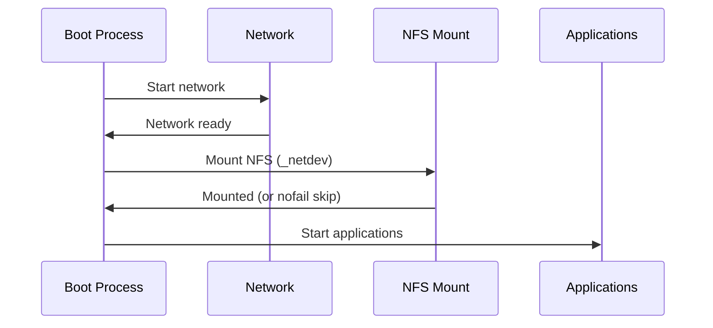

# How to Configure Persistent NFS Mounts in /etc/fstab on RHEL 9

Author: [nawazdhandala](https://www.github.com/nawazdhandala)

Tags: RHEL, NFS, fstab, Persistent, Linux

Description: Configure NFS shares to mount automatically at boot using /etc/fstab on RHEL 9, with proper options for reliability and performance.

---

## Why Persistent Mounts?

Manual mount commands do not survive reboots. For NFS shares that should always be available, you need an entry in /etc/fstab. This tells the system to mount the share during the boot process, so your applications find their data right where they expect it.

## Basic fstab Entry

The general format for an NFS fstab entry:

```
server:/export  /mount-point  nfs  options  0 0
```

### Example

```bash
# Add a persistent NFS mount to fstab
echo "192.168.1.10:/srv/nfs/shared  /mnt/nfs-shared  nfs  defaults  0 0" | sudo tee -a /etc/fstab
```

## Recommended Mount Options

The `defaults` option works, but production mounts benefit from explicit options:

```bash
# Production-grade fstab entry
192.168.1.10:/srv/nfs/shared  /mnt/nfs-shared  nfs  rw,hard,intr,rsize=65536,wsize=65536,noatime,_netdev  0 0
```

### Option Breakdown

| Option | Purpose |
|--------|---------|
| `rw` | Read-write access |
| `hard` | Keep retrying if server is unavailable |
| `intr` | Allow signal interrupts during hangs |
| `rsize=65536` | 64 KB read buffer for better throughput |
| `wsize=65536` | 64 KB write buffer for better throughput |
| `noatime` | Skip access time updates for performance |
| `_netdev` | Wait for network before mounting |

The `_netdev` option is critical. Without it, the system tries to mount NFS before the network is up, which causes boot delays or failures.

## Creating the Mount Point

```bash
# Create the mount point before adding the fstab entry
sudo mkdir -p /mnt/nfs-shared
```

## Testing the fstab Entry

Never reboot to test. Use `mount -a` instead:

```bash
# Mount everything in fstab
sudo mount -a

# Verify the mount
df -h /mnt/nfs-shared
findmnt /mnt/nfs-shared
```

If `mount -a` fails, fix the fstab entry before rebooting, or you risk a boot failure.

## Handling Boot Failures

If the NFS server is down during boot, a `hard` mount will cause the boot process to hang. To prevent this, use the `nofail` option:

```bash
# nofail prevents boot failure if the NFS server is unreachable
192.168.1.10:/srv/nfs/shared  /mnt/nfs-shared  nfs  rw,hard,_netdev,nofail  0 0
```

With `nofail`, the system continues booting even if the mount fails. The mount can be retried later.

## Alternative: systemd Mount Units

On RHEL 9, fstab entries are converted to systemd mount units automatically. You can also create mount units directly:

```bash
# /etc/systemd/system/mnt-nfs\x2dshared.mount
[Unit]
Description=NFS Share Mount
After=network-online.target
Wants=network-online.target

[Mount]
What=192.168.1.10:/srv/nfs/shared
Where=/mnt/nfs-shared
Type=nfs
Options=rw,hard,intr,_netdev

[Install]
WantedBy=multi-user.target
```

Enable it:

```bash
sudo systemctl daemon-reload
sudo systemctl enable --now mnt-nfs\\x2dshared.mount
```

## Multiple NFS Mounts

```bash
# Multiple shares from the same or different servers
192.168.1.10:/srv/nfs/shared    /mnt/shared    nfs  rw,hard,_netdev,nofail  0 0
192.168.1.10:/srv/nfs/backups   /mnt/backups   nfs  ro,hard,_netdev,nofail  0 0
192.168.1.20:/srv/nfs/projects  /mnt/projects  nfs  rw,hard,_netdev,nofail  0 0
```

## NFSv4-Specific Entries

To force NFSv4:

```bash
# Specify NFS version in the options
192.168.1.10:/srv/nfs/shared  /mnt/nfs-shared  nfs4  rw,hard,_netdev  0 0

# Or use the vers option
192.168.1.10:/srv/nfs/shared  /mnt/nfs-shared  nfs  rw,hard,vers=4,_netdev  0 0
```

## Boot Order



## Verifying After Reboot

After a reboot, confirm all mounts are active:

```bash
# Check all NFS mounts
mount -t nfs,nfs4

# Detailed view
findmnt -t nfs,nfs4

# Check for any mount errors in the journal
journalctl -b | grep -i nfs
```

## Common Pitfalls

1. **Missing _netdev**: The mount tries before the network is up and hangs
2. **Missing nofail**: A down NFS server blocks the entire boot
3. **Wrong permissions**: The mount succeeds but the files are not accessible
4. **Typos in server name or path**: Always test with `mount -a` before rebooting
5. **SELinux blocking**: Check `ausearch -m avc` for denials

## Wrap-Up

Persistent NFS mounts in /etc/fstab on RHEL 9 are essential for production systems. Use `_netdev` to ensure proper boot ordering, `nofail` to prevent boot hangs when the server is down, and `hard` for data safety. Always test with `mount -a` before rebooting, and include performance options like `rsize`, `wsize`, and `noatime` for better throughput.
