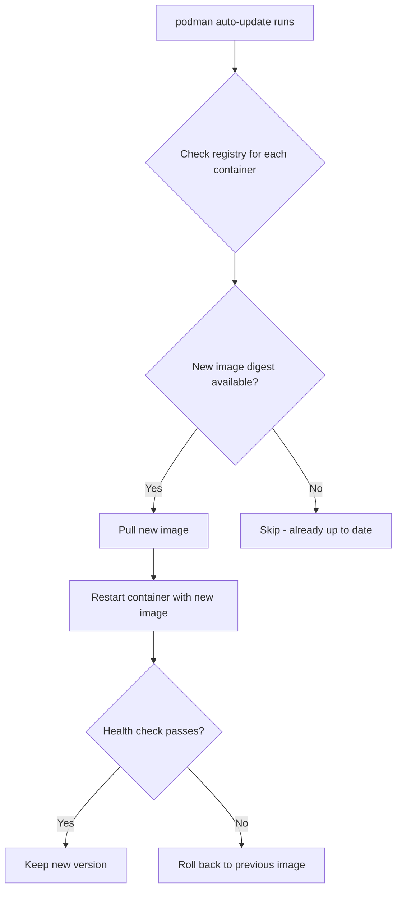
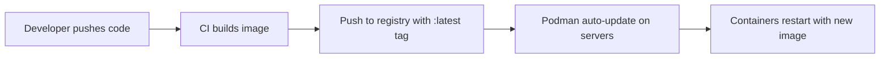

# How to Set Up Podman Auto-Updates for Containers on RHEL 9

Author: [nawazdhandala](https://www.github.com/nawazdhandala)

Tags: RHEL, Podman, Auto-Updates, Containers, Linux

Description: Learn how to configure Podman auto-updates on RHEL 9 to automatically check for new container images and restart services with the latest versions.

---

Keeping container images up to date is a constant chore. You build a new image, push it to the registry, then SSH into every server to pull and restart. Podman's auto-update feature automates this. It checks if a newer version of an image is available in the registry and, if so, pulls the new image and restarts the container.

## How Auto-Updates Work



## Setting Up a Container for Auto-Updates

The key is the `--label io.containers.autoupdate=registry` label:

# Run a container with auto-update enabled
```bash
podman run -d --name web \
  --label io.containers.autoupdate=registry \
  -p 8080:80 \
  docker.io/library/nginx:latest
```

The label tells `podman auto-update` to check the registry for a newer version of this image.

## Auto-Update with Quadlet

The recommended way is to use Quadlet with the AutoUpdate directive:

```bash
mkdir -p ~/.config/containers/systemd/

cat > ~/.config/containers/systemd/web.container << 'EOF'
[Unit]
Description=Auto-updating Web Server

[Container]
Image=docker.io/library/nginx:latest
PublishPort=8080:80
AutoUpdate=registry

[Service]
Restart=always

[Install]
WantedBy=default.target
EOF
```

```bash
systemctl --user daemon-reload
systemctl --user start web
```

The `AutoUpdate=registry` setting is equivalent to the label.

## Auto-Update Policies

There are two auto-update policies:

**registry** - Checks if a newer image is available in the registry by comparing digests:
```bash
podman run -d --label io.containers.autoupdate=registry my-image:latest
```

**local** - Uses a locally available image if it is newer than the one the container is running:
```bash
podman run -d --label io.containers.autoupdate=local my-image:latest
```

Use `registry` for pulling from remote registries. Use `local` when a CI/CD system pre-pulls images to the host.

## Running Auto-Update Manually

# Check for updates without applying them (dry run)
```bash
podman auto-update --dry-run
```

# Apply updates
```bash
podman auto-update
```

# Show more detail about what changed
```bash
podman auto-update --format "{{.Unit}} {{.Image}} {{.Updated}} {{.Policy}}"
```

## Scheduling Auto-Updates with systemd Timers

Podman ships with a systemd timer for auto-updates:

# For rootless, enable the user timer
```bash
systemctl --user enable --now podman-auto-update.timer
```

# For rootful, enable the system timer
```bash
sudo systemctl enable --now podman-auto-update.timer
```

# Check when the timer is scheduled to run
```bash
systemctl --user list-timers podman-auto-update.timer
```

By default, the timer runs daily. To change the schedule:

# Override the timer schedule
```bash
systemctl --user edit podman-auto-update.timer
```

Add:

```ini
[Timer]
OnCalendar=
OnCalendar=*-*-* 03:00:00
```

This runs auto-updates at 3 AM daily.

## Rollback on Failure

Podman can automatically roll back if the new image fails health checks. Set up health checks in your container:

```bash
cat > ~/.config/containers/systemd/web.container << 'EOF'
[Unit]
Description=Auto-updating Web Server with Rollback

[Container]
Image=docker.io/library/nginx:latest
PublishPort=8080:80
AutoUpdate=registry
HealthCmd=curl -f http://localhost/ || exit 1
HealthInterval=30s
HealthTimeout=5s
HealthRetries=3
HealthStartPeriod=10s

[Service]
Restart=always

[Install]
WantedBy=default.target
EOF
```

If the new image fails the health check, Podman rolls back to the previous working image.

## Auto-Update for Multiple Containers

Set up auto-updates across your entire container stack:

```bash
cat > ~/.config/containers/systemd/api.container << 'EOF'
[Unit]
Description=API Server
After=database.service

[Container]
Image=registry.example.com/myapp/api:latest
AutoUpdate=registry
Network=app-net.network

[Service]
Restart=always

[Install]
WantedBy=default.target
EOF
```

```bash
cat > ~/.config/containers/systemd/worker.container << 'EOF'
[Unit]
Description=Background Worker
After=database.service

[Container]
Image=registry.example.com/myapp/worker:latest
AutoUpdate=registry
Network=app-net.network

[Service]
Restart=always

[Install]
WantedBy=default.target
EOF
```

# Check all auto-updatable containers
```bash
podman auto-update --dry-run
```

## Monitoring Auto-Updates

# View auto-update logs
```bash
journalctl --user -u podman-auto-update.service
```

# Check when the last update ran
```bash
systemctl --user status podman-auto-update.service
```

## Using Specific Tags vs Latest

Auto-update works best with `latest` or mutable tags. If you use immutable tags like `v1.2.3`, the image will never update because the tag always points to the same digest.

For controlled updates, use a floating tag strategy:

```
registry.example.com/myapp:stable    # Updated when ready for production
registry.example.com/myapp:v1.2.3    # Never changes
registry.example.com/myapp:latest    # Updated on every build
```

Point your auto-updating containers at `stable` or `latest`.

## Auto-Update in CI/CD Workflow



## Disabling Auto-Update for a Container

Remove the label to stop a container from being auto-updated:

```bash
podman container stop web
podman container rm web
# Recreate without the auto-update label
podman run -d --name web -p 8080:80 docker.io/library/nginx:latest
```

Or update the Quadlet file to remove `AutoUpdate=registry`.

## Summary

Podman auto-updates on RHEL 9 automate the tedious process of keeping container images current. Enable it with a label or Quadlet directive, schedule the timer, and add health checks for automatic rollback. It is not a replacement for a proper deployment pipeline in large environments, but for smaller setups and edge deployments, it keeps things updated with minimal effort.
