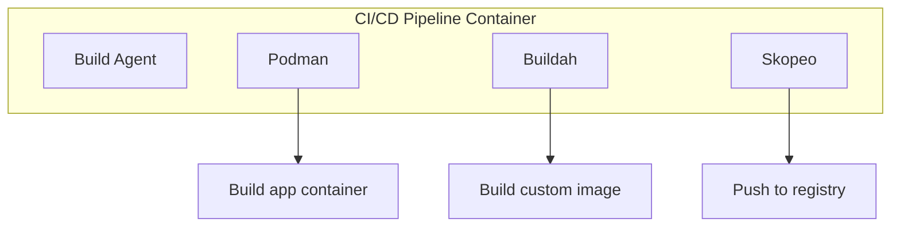

# How to Run Podman, Buildah, and Skopeo Inside a Container on RHEL 9

Author: [nawazdhandala](https://www.github.com/nawazdhandala)

Tags: RHEL, Podman, Buildah, Skopeo, Nested, Linux

Description: A guide to running container tools inside containers on RHEL 9, enabling CI/CD pipelines and nested container workflows with proper security configuration.

---

Running containers inside containers comes up a lot in CI/CD pipelines. Your build agent runs in a container, and it needs to build and push container images. With Docker, this meant Docker-in-Docker (DinD) with its security headaches. Podman handles this more cleanly because there is no daemon to share.

## Why Run Container Tools Inside Containers?

The most common scenarios:

- CI/CD pipelines where build agents are containerized
- Development environments that need to build images
- Testing infrastructure that spins up containers as part of test suites



## Running Podman Inside a Podman Container

The key is using the right privileges and volume mounts:

# Run a container with fuse-overlayfs support for nested containers
```bash
podman run --rm -it \
  --privileged \
  --device /dev/fuse \
  registry.access.redhat.com/ubi9/ubi \
  /bin/bash
```

Inside the container, install and use Podman:

```bash
dnf install -y podman
podman run --rm docker.io/library/alpine echo "Hello from nested container"
```

## Running Without Privileged Mode

Using `--privileged` is convenient but grants too many capabilities. Here is a more restrictive approach:

# Run with specific capabilities and security options
```bash
podman run --rm -it \
  --cap-add=SYS_ADMIN \
  --security-opt label=disable \
  --security-opt seccomp=unconfined \
  --device /dev/fuse \
  -v podman-storage:/var/lib/containers:Z \
  registry.access.redhat.com/ubi9/ubi \
  /bin/bash
```

The important flags:
- `--cap-add=SYS_ADMIN` allows mount operations needed by overlay storage
- `--security-opt label=disable` disables SELinux labeling inside the container
- `--device /dev/fuse` provides the FUSE device for fuse-overlayfs
- Volume mount for persistent container storage

## Using the Podman Remote Client

A safer alternative to nested containers is using the Podman remote client that talks to the host's Podman:

# On the host, enable the Podman socket
```bash
systemctl --user enable --now podman.socket
```

# Run a container with access to the Podman socket
```bash
podman run --rm -it \
  -v $XDG_RUNTIME_DIR/podman/podman.sock:/var/run/podman/podman.sock:Z \
  -e CONTAINER_HOST=unix:///var/run/podman/podman.sock \
  registry.access.redhat.com/ubi9/ubi \
  /bin/bash
```

Inside the container, install the Podman remote client and connect to the host's Podman:

```bash
dnf install -y podman-remote
podman-remote --url unix:///var/run/podman/podman.sock ps
```

## Building Images with Buildah Inside a Container

Buildah inside a container works similarly to Podman:

# Run a container for image building
```bash
podman run --rm -it \
  --device /dev/fuse \
  --cap-add=SYS_ADMIN \
  --security-opt label=disable \
  registry.access.redhat.com/ubi9/ubi \
  /bin/bash
```

Inside:

```bash
dnf install -y buildah

# Build an image using Buildah
container=$(buildah from registry.access.redhat.com/ubi9/ubi-minimal)
buildah run $container -- microdnf install -y httpd
buildah config --entrypoint '["/usr/sbin/httpd", "-D", "FOREGROUND"]' $container
buildah commit $container my-httpd:latest
buildah images
```

## Using Skopeo Inside a Container

Skopeo is the easiest of the three to run inside a container because it does not need special privileges for most operations:

# Run a container with Skopeo (no special privileges needed for inspect/copy)
```bash
podman run --rm -it \
  registry.access.redhat.com/ubi9/ubi \
  /bin/bash
```

Inside:

```bash
dnf install -y skopeo

# Inspect a remote image (no privileges needed)
skopeo inspect docker://docker.io/library/nginx:latest

# Copy between registries
skopeo copy docker://docker.io/library/nginx:latest dir:/tmp/nginx
```

## Creating a CI/CD Build Image

Build a dedicated image with all container tools pre-installed:

```bash
cat > Containerfile.ci << 'EOF'
FROM registry.access.redhat.com/ubi9/ubi

# Install container tools
RUN dnf install -y podman buildah skopeo fuse-overlayfs && \
    dnf clean all

# Configure Podman for nested container use
RUN echo '[storage]' > /etc/containers/storage.conf && \
    echo 'driver = "overlay"' >> /etc/containers/storage.conf && \
    echo '[storage.options.overlay]' >> /etc/containers/storage.conf && \
    echo 'mount_program = "/usr/bin/fuse-overlayfs"' >> /etc/containers/storage.conf

# Configure registries
RUN echo 'unqualified-search-registries = ["registry.redhat.io", "docker.io"]' > /etc/containers/registries.conf

VOLUME /var/lib/containers

CMD ["/bin/bash"]
EOF
```

# Build the CI image
```bash
podman build -f Containerfile.ci -t ci-builder:latest .
```

# Use the CI image
```bash
podman run --rm -it \
  --device /dev/fuse \
  --cap-add=SYS_ADMIN \
  --security-opt label=disable \
  ci-builder:latest
```

## Storage Considerations

Nested container storage adds up fast. Use volumes to persist the inner container storage across runs:

# Create a persistent storage volume for the inner Podman
```bash
podman volume create ci-storage
```

# Mount it when running the CI container
```bash
podman run --rm -it \
  --device /dev/fuse \
  --cap-add=SYS_ADMIN \
  --security-opt label=disable \
  -v ci-storage:/var/lib/containers:Z \
  ci-builder:latest
```

This way, pulled images and cached layers persist between CI runs, speeding up builds significantly.

## Rootless Nested Containers

Running Podman rootless inside a rootless container is possible but requires more setup:

# The outer container needs proper user namespace configuration
```bash
podman run --rm -it \
  --user podman \
  --device /dev/fuse \
  --security-opt label=disable \
  quay.io/podman/stable \
  podman run --rm docker.io/library/alpine echo "Nested rootless"
```

The `quay.io/podman/stable` image comes pre-configured for rootless nested use.

## Security Recommendations

When running container tools inside containers:

1. **Prefer Podman remote over nested Podman** when possible. It is simpler and more secure.
2. **Avoid `--privileged`** in production. Use specific capabilities instead.
3. **Use dedicated storage volumes** to separate inner container data from the host.
4. **Limit the scope** - if you only need to push images, Skopeo alone might be enough.
5. **Run rootless** whenever possible, even inside containers.

## Summary

Running Podman, Buildah, and Skopeo inside containers is a common requirement for CI/CD pipelines on RHEL 9. The approach is cleaner than Docker-in-Docker because there is no daemon to manage. Use `--device /dev/fuse` and `--cap-add=SYS_ADMIN` for the minimum privileges needed, or use the Podman remote client through a socket for better security. For simple image inspection and copying, Skopeo works without any special privileges at all.
