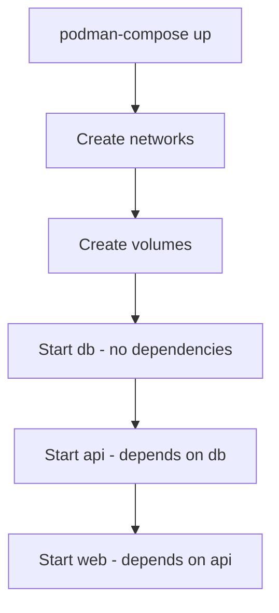

# How to Use Podman Compose as a Docker Compose Alternative on RHEL

Author: [nawazdhandala](https://www.github.com/nawazdhandala)

Tags: RHEL, Podman Compose, Docker Compose, Linux

Description: A practical guide to using podman-compose on RHEL as a drop-in replacement for Docker Compose, reusing your existing compose files with Podman's daemonless container engine.

---

If you have a stack of `docker-compose.yml` files and you are migrating to RHEL, you do not have to rewrite everything. Podman Compose reads the same YAML format and translates it into Podman commands. It is not a perfect 1:1 replacement, but for most common use cases it works well enough to save you a rewrite.

## Installing Podman Compose

Podman Compose is available as a Python package:

## Install podman-compose using pip
```bash
sudo dnf install -y python3-pip
pip3 install --user podman-compose
```

## Verify installation
```bash
podman-compose --version
```

Make sure `~/.local/bin` is in your PATH:

```bash
export PATH="$HOME/.local/bin:$PATH"
```

Add that to your `~/.bashrc` to make it permanent.

## Writing a Compose File

Podman Compose uses the same `docker-compose.yml` format. Here is a basic example:

```bash
mkdir -p ~/myapp && cd ~/myapp
```

```bash
cat > docker-compose.yml << 'EOF'
version: "3.8"

services:
  web:
    image: docker.io/library/nginx:latest
    ports:
      - "8080:80"
    volumes:
      - web-content:/usr/share/nginx/html:Z
    depends_on:
      - api

  api:
    image: registry.access.redhat.com/ubi9/ubi-minimal
    command: sleep infinity
    environment:
      - DB_HOST=db
      - DB_PORT=3306
    depends_on:
      - db

  db:
    image: docker.io/library/mariadb:latest
    environment:
      MYSQL_ROOT_PASSWORD: secret
      MYSQL_DATABASE: myapp
    volumes:
      - db-data:/var/lib/mysql:Z

volumes:
  web-content:
  db-data:
EOF
```

## Starting the Stack

This section covers starting the stack.

## Start all services in the background
```bash
podman-compose up -d
```

## Start with build (if using build context)
```bash
podman-compose up -d --build
```

## View running containers
```bash
podman-compose ps
```



## Managing the Stack

This section covers managing the stack.

## View logs for all services
```bash
podman-compose logs
```

## Follow logs for a specific service
```bash
podman-compose logs -f web
```

## Stop all services
```bash
podman-compose down
```

## Stop and remove volumes
```bash
podman-compose down -v
```

## Restart a specific service
```bash
podman-compose restart api
```

## Scale a service (run multiple instances)
```bash
podman-compose up -d --scale api=3
```

## Building Images with Compose

You can build images from Containerfiles:

```bash
cat > docker-compose.yml << 'EOF'
version: "3.8"

services:
  app:
    build:
      context: .
      dockerfile: Containerfile
    ports:
      - "8000:8000"
    environment:
      - DEBUG=false
EOF
```

```bash
cat > Containerfile << 'EOF'
FROM registry.access.redhat.com/ubi9/ubi-minimal
RUN microdnf install -y python3 && microdnf clean all
WORKDIR /app
COPY app.py .
CMD ["python3", "app.py"]
EOF
```

## Build and start
```bash
podman-compose up -d --build
```

## Environment Files

Use `.env` files for configuration:

```bash
cat > .env << 'EOF'
DB_PASSWORD=mysecret
APP_PORT=8000
EOF
```

Reference variables in your compose file:

```yaml
services:
  db:
    image: docker.io/library/mariadb:latest
    environment:
      MYSQL_ROOT_PASSWORD: ${DB_PASSWORD}
    ports:
      - "${APP_PORT}:3306"
```

## Health Checks in Compose

```yaml
services:
  db:
    image: docker.io/library/mariadb:latest
    environment:
      MYSQL_ROOT_PASSWORD: secret
    healthcheck:
      test: ["CMD", "healthcheck.sh", "--connect", "--innodb_initialized"]
      interval: 30s
      timeout: 10s
      retries: 5
```

## Networking

Podman Compose creates a default network for each project. Containers can reach each other by service name:

```bash
# From the web container, reach the db service by name
podman-compose exec web curl http://api:8000
```

You can also define custom networks:

```yaml
services:
  web:
    networks:
      - frontend
  api:
    networks:
      - frontend
      - backend
  db:
    networks:
      - backend

networks:
  frontend:
  backend:
```

## Differences from Docker Compose

There are some differences to be aware of:

| Feature | Docker Compose | Podman Compose |
|---------|---------------|----------------|
| Daemon required | Yes (Docker daemon) | No |
| rootless support | Limited | Full |
| `deploy` section | Supported | Not supported |
| Swarm features | Supported | Not supported |
| Network driver options | Full | Limited |
| Build caching | Advanced | Basic |

## Executing Commands in Running Containers

```bash
# Open a shell in a service container
podman-compose exec db /bin/bash

# Run a one-off command
podman-compose exec db mysql -u root -psecret myapp
```

## Viewing Container Details

```bash
# List containers with their details
podman-compose ps

# View the podman containers directly
podman ps --filter label=com.docker.compose.project=myapp
```

## Pulling Updated Images

```bash
# Pull latest images for all services
podman-compose pull

# Pull for a specific service
podman-compose pull web

# Recreate containers with new images
podman-compose up -d --force-recreate
```

## Alternative: Using docker-compose with Podman

You can also use the original `docker-compose` binary with Podman's Docker-compatible socket:

## Enable the Podman socket
```bash
systemctl --user enable --now podman.socket
```

## Point docker-compose to the Podman socket
```bash
export DOCKER_HOST=unix://$XDG_RUNTIME_DIR/podman/podman.sock
```

## Now docker-compose talks to Podman
```bash
docker-compose up -d
```

This approach has better compatibility than podman-compose for advanced compose features.

## Summary

Podman Compose gets you running with existing `docker-compose.yml` files on RHEL without major rewrites. It handles the common cases well - services, networks, volumes, environment variables, and build contexts. For new projects on RHEL, consider whether Quadlet might be a better fit, but for migrating existing Docker Compose stacks, podman-compose does the job.
