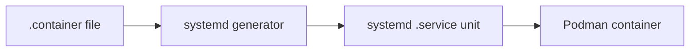

# How to Run Podman Containers as systemd Services Using Quadlet on RHEL

Author: [nawazdhandala](https://www.github.com/nawazdhandala)

Tags: RHEL, Podman, Quadlet, systemd, Linux

Description: Learn how to use Quadlet on RHEL to run Podman containers as native systemd services with automatic startup, restart policies, and full service management.

---

Quadlet is the modern way to run Podman containers as systemd services on RHEL. Instead of the older `podman generate systemd` approach, Quadlet lets you write simple declarative unit files that systemd's generator turns into full service units. It is cleaner, easier to maintain, and the recommended approach going forward.

## What is Quadlet?

Quadlet is a systemd generator that reads `.container`, `.volume`, `.network`, and `.kube` files and converts them into proper systemd service units at boot time or when you reload the daemon.



## Where to Place Quadlet Files

For system-wide services (rootful):
- `/etc/containers/systemd/`
- `/usr/share/containers/systemd/`

For user-level services (rootless):
- `~/.config/containers/systemd/`

## Basic Container Quadlet

Let us create a simple web server that starts on boot:

# Create the Quadlet directory for rootless containers
```bash
mkdir -p ~/.config/containers/systemd/
```

# Create a Quadlet container file
```bash
cat > ~/.config/containers/systemd/nginx.container << 'EOF'
[Unit]
Description=Nginx Web Server Container

[Container]
Image=docker.io/library/nginx:latest
PublishPort=8080:80
Volume=web-data.volume:/usr/share/nginx/html:Z

[Service]
Restart=always
TimeoutStartSec=900

[Install]
WantedBy=default.target
EOF
```

# Reload systemd to pick up the new unit
```bash
systemctl --user daemon-reload
```

# Start the container service
```bash
systemctl --user start nginx
```

# Check the status
```bash
systemctl --user status nginx
```

# Enable it to start on boot
```bash
systemctl --user enable nginx
```

Note that the service name matches the filename without the `.container` extension.

## Quadlet Volume Files

Define volumes alongside your containers:

```bash
cat > ~/.config/containers/systemd/web-data.volume << 'EOF'
[Volume]
Label=app=nginx
EOF
```

Reload systemd after adding the volume file:

```bash
systemctl --user daemon-reload
```

The volume is automatically created when the container that references it starts.

## Quadlet Network Files

Create custom networks for your containers:

```bash
cat > ~/.config/containers/systemd/app-net.network << 'EOF'
[Network]
Subnet=10.89.1.0/24
Gateway=10.89.1.1
Label=app=myapp
EOF
```

Reference the network in your container file:

```bash
cat > ~/.config/containers/systemd/myapp.container << 'EOF'
[Unit]
Description=My Application

[Container]
Image=registry.access.redhat.com/ubi9/ubi-minimal
Exec=sleep infinity
Network=app-net.network

[Service]
Restart=always

[Install]
WantedBy=default.target
EOF
```

## Environment Variables

Pass environment variables to your containers:

```bash
cat > ~/.config/containers/systemd/database.container << 'EOF'
[Unit]
Description=MariaDB Database

[Container]
Image=docker.io/library/mariadb:latest
Environment=MYSQL_ROOT_PASSWORD=secret
Environment=MYSQL_DATABASE=myapp
Volume=db-data.volume:/var/lib/mysql:Z
PublishPort=3306:3306

[Service]
Restart=always
TimeoutStartSec=900

[Install]
WantedBy=default.target
EOF
```

For sensitive data, use an environment file:

```bash
cat > ~/.config/containers/systemd/db.env << 'EOF'
MYSQL_ROOT_PASSWORD=secret
MYSQL_DATABASE=production
EOF
```

Reference it with `EnvironmentFile=` in the `[Service]` section or `EnvironmentFile=` in the `[Container]` section.

## Health Checks

Add health checking to your Quadlet containers:

```bash
cat > ~/.config/containers/systemd/webapp.container << 'EOF'
[Unit]
Description=Web Application

[Container]
Image=docker.io/library/nginx:latest
PublishPort=8080:80
HealthCmd=curl -f http://localhost/ || exit 1
HealthInterval=30s
HealthTimeout=5s
HealthRetries=3

[Service]
Restart=always

[Install]
WantedBy=default.target
EOF
```

## Rootful Quadlet Services

For system-level services that need root privileges:

# Create the system-wide Quadlet directory
```bash
sudo mkdir -p /etc/containers/systemd/
```

```bash
sudo cat > /etc/containers/systemd/monitoring.container << 'EOF'
[Unit]
Description=Monitoring Agent
After=network-online.target

[Container]
Image=docker.io/library/nginx:latest
PublishPort=9090:80
Volume=/var/log:/host-logs:ro,Z

[Service]
Restart=always

[Install]
WantedBy=multi-user.target
EOF
```

```bash
sudo systemctl daemon-reload
sudo systemctl start monitoring
sudo systemctl enable monitoring
```

## Managing Quadlet Services

Quadlet services behave like any systemd service:

# View service logs
```bash
journalctl --user -u nginx -f
```

# Stop the service
```bash
systemctl --user stop nginx
```

# Restart the service
```bash
systemctl --user restart nginx
```

# Check if the container is running
```bash
podman ps
```

## Dependencies Between Services

If one container depends on another:

```bash
cat > ~/.config/containers/systemd/api.container << 'EOF'
[Unit]
Description=API Server
Requires=database.service
After=database.service

[Container]
Image=registry.access.redhat.com/ubi9/ubi-minimal
Exec=sleep infinity
Network=app-net.network

[Service]
Restart=always

[Install]
WantedBy=default.target
EOF
```

The `Requires=` and `After=` directives ensure the database starts before the API server.

## Debugging Quadlet Issues

If your Quadlet file is not generating a service:

# Check for generator errors
```bash
/usr/libexec/podman/quadlet --dryrun --user 2>&1
```

# Verify the generated unit file
```bash
systemctl --user cat nginx.service
```

# Check journal for startup errors
```bash
journalctl --user -u nginx --no-pager -n 50
```

Common issues:
- Typos in the `.container` file prevent the generator from producing output
- Missing images will cause the service to fail on start
- Wrong file permissions on rootless Quadlet files

## Auto-Update Support

Quadlet supports automatic image updates:

```bash
cat > ~/.config/containers/systemd/web.container << 'EOF'
[Unit]
Description=Auto-updating Web Server

[Container]
Image=docker.io/library/nginx:latest
PublishPort=8080:80
AutoUpdate=registry

[Service]
Restart=always

[Install]
WantedBy=default.target
EOF
```

The `AutoUpdate=registry` option works with `podman auto-update` to check for and apply image updates.

## Summary

Quadlet is the right way to run Podman containers as services on RHEL. Write a `.container` file, reload systemd, and you have a managed service with restart policies, logging, and dependency management. No scripts, no manual `podman generate systemd` steps. It just works with the systemd tools you already know.
