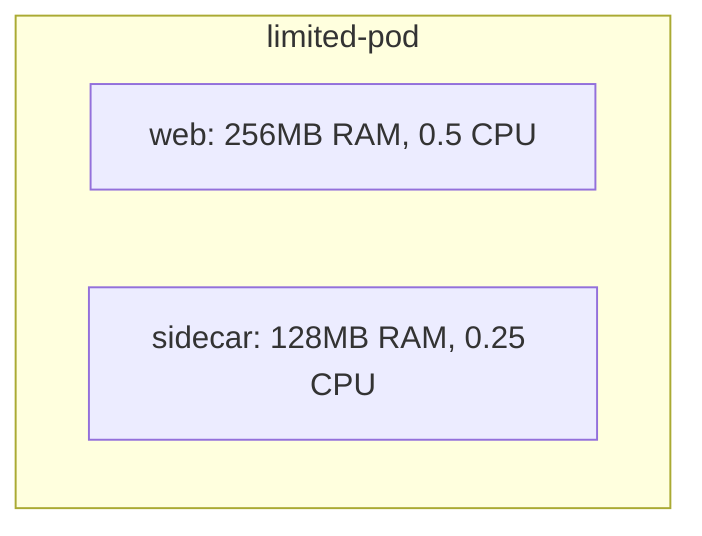

# How to Configure Podman Pod Security and Resource Limits on RHEL

Author: [nawazdhandala](https://www.github.com/nawazdhandala)

Tags: RHEL, Podman, Security, Resource Limits, Linux

Description: Learn how to configure security contexts, capabilities, resource limits, and isolation settings for Podman pods and containers on RHEL.

---

Running containers without resource limits is a recipe for trouble. One runaway process and it consumes all your CPU and memory, taking down everything else on the system. On RHEL, Podman with cgroups v2 gives you solid resource controls for both individual containers and pods.

## Setting Memory Limits

# Run a container with a hard memory limit
```bash
podman run -d --name limited-app \
  --memory 512m \
  --memory-swap 1g \
  registry.access.redhat.com/ubi9/ubi-minimal \
  sleep infinity
```

- `--memory 512m` sets the hard memory limit to 512 MB
- `--memory-swap 1g` sets total memory + swap to 1 GB (so 512 MB swap)

# Verify the limits are applied
```bash
podman inspect limited-app --format '{{.HostConfig.Memory}}'
```

When a container hits its memory limit, the OOM killer terminates it.

## Setting CPU Limits

# Limit a container to 1.5 CPU cores
```bash
podman run -d --name cpu-limited \
  --cpus 1.5 \
  registry.access.redhat.com/ubi9/ubi-minimal \
  sleep infinity
```

# Limit using CPU shares (relative weight)
```bash
podman run -d --name low-priority \
  --cpu-shares 256 \
  registry.access.redhat.com/ubi9/ubi-minimal \
  sleep infinity

podman run -d --name high-priority \
  --cpu-shares 1024 \
  registry.access.redhat.com/ubi9/ubi-minimal \
  sleep infinity
```

CPU shares only matter when there is contention. The high-priority container gets 4x the CPU time of the low-priority one when both are competing.

## Setting I/O Limits

# Limit block I/O (reads and writes)
```bash
podman run -d --name io-limited \
  --device-read-bps /dev/sda:10mb \
  --device-write-bps /dev/sda:5mb \
  registry.access.redhat.com/ubi9/ubi-minimal \
  sleep infinity
```

## PID Limits

Prevent fork bombs inside containers:

# Limit the number of processes a container can create
```bash
podman run -d --name pid-limited \
  --pids-limit 100 \
  registry.access.redhat.com/ubi9/ubi-minimal \
  sleep infinity
```

## Resource Limits on Pods

When using pods, you can set limits at the pod level:

# Create a pod with resource limits on individual containers
```bash
podman pod create --name limited-pod -p 8080:80

podman run -d --pod limited-pod --name web \
  --memory 256m --cpus 0.5 \
  docker.io/library/nginx:latest

podman run -d --pod limited-pod --name sidecar \
  --memory 128m --cpus 0.25 \
  registry.access.redhat.com/ubi9/ubi-minimal \
  sleep infinity
```



## Dropping Container Capabilities

By default, containers get a set of Linux capabilities. Drop the ones you do not need:

# Run with minimal capabilities
```bash
podman run -d --name secure-app \
  --cap-drop ALL \
  --cap-add NET_BIND_SERVICE \
  docker.io/library/nginx:latest
```

# Check what capabilities a container has
```bash
podman inspect secure-app --format '{{.HostConfig.CapAdd}} {{.HostConfig.CapDrop}}'
```

Common capabilities to keep:
- `NET_BIND_SERVICE` - bind to ports below 1024
- `CHOWN` - change file ownership
- `SETUID`/`SETGID` - change process user/group

Everything else should be dropped for most workloads.

## Read-Only Root Filesystem

Prevent containers from writing to their root filesystem:

# Run with a read-only filesystem
```bash
podman run -d --name readonly-app \
  --read-only \
  --tmpfs /tmp \
  --tmpfs /run \
  docker.io/library/nginx:latest
```

The `--tmpfs` flags provide writable temporary directories in memory. The actual container filesystem is read-only, preventing tampering.

## Security Options

# Disable privilege escalation inside the container
```bash
podman run -d --name no-escalation \
  --security-opt no-new-privileges \
  registry.access.redhat.com/ubi9/ubi-minimal \
  sleep infinity
```

# Run with a specific seccomp profile
```bash
podman run -d --name seccomp-app \
  --security-opt seccomp=/path/to/custom-seccomp.json \
  registry.access.redhat.com/ubi9/ubi-minimal \
  sleep infinity
```

# Run with SELinux labels
```bash
podman run -d --name selinux-app \
  --security-opt label=type:container_t \
  registry.access.redhat.com/ubi9/ubi-minimal \
  sleep infinity
```

## Running as Non-Root User

Force the container process to run as a non-root user:

```bash
podman run -d --name nonroot-app \
  --user 1001:1001 \
  docker.io/library/nginx:latest
```

Or set it in the Containerfile:

```dockerfile
FROM registry.access.redhat.com/ubi9/ubi-minimal
RUN useradd -r -u 1001 appuser
USER 1001
CMD ["sleep", "infinity"]
```

## Monitoring Resource Usage

# Watch real-time resource consumption
```bash
podman stats
```

# One-shot stats for a specific container
```bash
podman stats --no-stream limited-app
```

# Check cgroup limits applied to a container
```bash
podman inspect limited-app --format '{{.HostConfig.Memory}} {{.HostConfig.NanoCpus}}'
```

## Setting Default Limits

Configure default resource limits in `/etc/containers/containers.conf`:

```toml
[containers]
pids_limit = 2048
log_size_max = 1048576
default_ulimits = [
  "nofile=1024:1024"
]
```

These apply to all containers unless overridden at runtime.

## Ulimits

Set process limits inside containers:

```bash
# Set file descriptor limit
podman run -d --name ulimit-app \
  --ulimit nofile=4096:8192 \
  --ulimit nproc=256:512 \
  registry.access.redhat.com/ubi9/ubi-minimal \
  sleep infinity
```

## Summary

Resource limits and security hardening are essential for production containers on RHEL. At minimum, set memory limits (to prevent OOM), CPU limits (to prevent resource starvation), drop unnecessary capabilities, and run as a non-root user. These controls, combined with SELinux and seccomp profiles, create multiple layers of defense for your container workloads.
