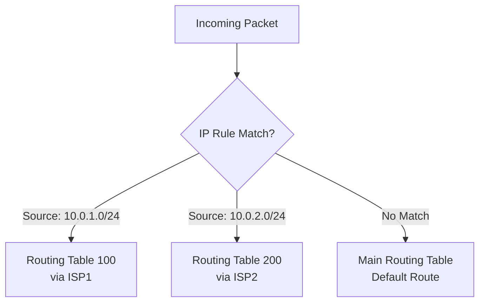

# How to Set Up Policy-Based Routing with Multiple Routing Tables on RHEL

Author: [nawazdhandala](https://www.github.com/nawazdhandala)

Tags: RHEL, Policy-Based Routing, Networking, Routing Tables, Linux

Description: Learn how to configure policy-based routing with multiple routing tables on RHEL to route traffic based on source address, protocol, or other criteria.

---

Policy-based routing (PBR) lets you make routing decisions based on criteria beyond the destination address, such as source IP, incoming interface, or packet mark. This is essential for multi-homed servers, VPN split tunneling, and traffic engineering.

## Architecture



## Prerequisites

- RHEL with multiple network interfaces or gateways
- Root or sudo access

## Step 1: Create Custom Routing Tables

```bash
# Define named routing tables in /etc/iproute2/rt_tables
# Add two custom tables: isp1 (ID 100) and isp2 (ID 200)
echo "100 isp1" | sudo tee -a /etc/iproute2/rt_tables
echo "200 isp2" | sudo tee -a /etc/iproute2/rt_tables

# Verify the tables were added
cat /etc/iproute2/rt_tables
```

## Step 2: Add Routes to Custom Tables

```bash
# Add a default route for table isp1 through gateway 203.0.113.1
sudo ip route add default via 203.0.113.1 dev ens3 table isp1

# Add a default route for table isp2 through gateway 198.51.100.1
sudo ip route add default via 198.51.100.1 dev ens4 table isp2

# Add local network routes to each table so local traffic works
sudo ip route add 10.0.1.0/24 dev ens3 table isp1
sudo ip route add 10.0.2.0/24 dev ens4 table isp2

# Verify routes in each table
ip route show table isp1
ip route show table isp2
```

## Step 3: Create IP Rules

```bash
# Route traffic from the 10.0.1.0/24 subnet through ISP1
sudo ip rule add from 10.0.1.0/24 table isp1 priority 100

# Route traffic from the 10.0.2.0/24 subnet through ISP2
sudo ip rule add from 10.0.2.0/24 table isp2 priority 200

# View all routing rules
ip rule show
```

## Step 4: Route by Source Port or Protocol

```bash
# Route all HTTP traffic (destination port 80) through ISP1
# First, mark packets with iptables
sudo nft add table inet mangle
sudo nft add chain inet mangle prerouting '{ type filter hook prerouting priority -150; }'
sudo nft add rule inet mangle prerouting tcp dport 80 meta mark set 0x1

# Then create a rule that matches the mark
sudo ip rule add fwmark 0x1 table isp1 priority 50
```

## Step 5: Make Rules Persistent with nmcli

```bash
# Add routing rules through NetworkManager for ens3
sudo nmcli connection modify ens3 +ipv4.routing-rules "priority 100 from 10.0.1.0/24 table 100"

# Add a route to the custom table through NetworkManager
sudo nmcli connection modify ens3 +ipv4.routes "0.0.0.0/0 203.0.113.1 table=100"

# Reapply the connection
sudo nmcli connection up ens3

# Verify the rules persist after reboot
ip rule show
ip route show table 100
```

## Step 6: Test Policy-Based Routing

```bash
# Test which route a packet from a specific source would take
ip route get 8.8.8.8 from 10.0.1.5

# Expected output should show the packet going through table isp1 via 203.0.113.1

# Test from the other subnet
ip route get 8.8.8.8 from 10.0.2.5
# Should show the packet going through table isp2 via 198.51.100.1

# Use traceroute to verify the path
traceroute -s 10.0.1.5 8.8.8.8
traceroute -s 10.0.2.5 8.8.8.8
```

## Troubleshooting

```bash
# List all rules with their priorities
ip rule show

# Flush a specific routing table
sudo ip route flush table isp1

# Remove a specific rule
sudo ip rule del from 10.0.1.0/24 table isp1

# Debug routing decisions
ip route get 8.8.8.8 from 10.0.1.5 iif ens3
```

## Summary

You have configured policy-based routing on RHEL with multiple routing tables. Traffic from different subnets now routes through different gateways, and you can also route based on packet marks for protocol-specific routing. This setup is commonly used for multi-homed servers, ISP failover, and VPN split tunneling scenarios.
