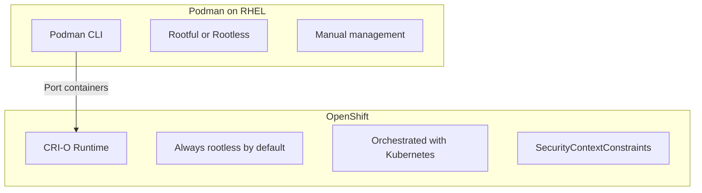

# How to Port Podman Containers to OpenShift from RHEL

Author: [nawazdhandala](https://www.github.com/nawazdhandala)

Tags: RHEL, Podman, OpenShift, Migration, Linux

Description: A practical guide to porting Podman containers and pods from RHEL to OpenShift, covering image requirements, security constraints, and deployment strategies.

---

Moving containers from a standalone RHEL server to OpenShift is a natural progression. You have been running containers with Podman, they work well, and now you need the orchestration, scaling, and management that OpenShift provides. The good news is that Podman and OpenShift share the same container runtime foundations. The challenge is meeting OpenShift's security requirements.

## Understanding the Differences



Key differences to prepare for:
- OpenShift runs containers as random, non-root UIDs by default
- SecurityContextConstraints (SCCs) restrict what containers can do
- No direct host path mounts without special permissions
- Images must handle running as an arbitrary user

## Step 1: Make Your Image OpenShift-Ready

The biggest issue is running as non-root. OpenShift assigns a random UID at runtime.

Update your Containerfile:

```bash
cat > Containerfile << 'EOF'
FROM registry.access.redhat.com/ubi9/ubi-minimal

# Install your application
RUN microdnf install -y httpd && microdnf clean all

# Adjust permissions so arbitrary UIDs can work
RUN chgrp -R 0 /var/www/html /var/log/httpd /run/httpd && \
    chmod -R g=u /var/www/html /var/log/httpd /run/httpd

# Use a non-privileged port (OpenShift restricts ports below 1024)
RUN sed -i 's/Listen 80/Listen 8080/' /etc/httpd/conf/httpd.conf

EXPOSE 8080

# Do NOT set USER to a specific UID - OpenShift will assign one
USER 1001

CMD ["/usr/sbin/httpd", "-D", "FOREGROUND"]
EOF
```

Key changes:
- Group ownership set to `0` (root group) with group-write permissions
- Listen on ports above 1024
- Set USER to a non-root value

## Build and test locally
```bash
podman build -t my-app:openshift .
```

## Test with a random UID (simulating OpenShift)
```bash
podman run --rm -u 1000650000:0 -p 8080:8080 my-app:openshift
```

## Step 2: Push to an OpenShift-Accessible Registry

OpenShift needs to pull your image from a registry it can reach:

## Log in to the OpenShift internal registry
```bash
podman login -u $(oc whoami) -p $(oc whoami -t) default-route-openshift-image-registry.apps.cluster.example.com
```

## Tag and push your image
```bash
podman tag my-app:openshift default-route-openshift-image-registry.apps.cluster.example.com/myproject/my-app:latest
podman push default-route-openshift-image-registry.apps.cluster.example.com/myproject/my-app:latest
```

Alternatively, push to an external registry like Quay.io:

```bash
podman tag my-app:openshift quay.io/myorg/my-app:latest
podman push quay.io/myorg/my-app:latest
```

## Step 3: Generate Kubernetes YAML from Podman

Export your running Podman pod to YAML:

```bash
podman kube generate my-app > my-app-k8s.yaml
```

Edit the YAML for OpenShift:

```yaml
apiVersion: apps/v1
kind: Deployment
metadata:
  name: my-app
  labels:
    app: my-app
spec:
  replicas: 2
  selector:
    matchLabels:
      app: my-app
  template:
    metadata:
      labels:
        app: my-app
    spec:
      containers:
      - name: my-app
        image: quay.io/myorg/my-app:latest
        ports:
        - containerPort: 8080
        resources:
          limits:
            memory: "256Mi"
            cpu: "500m"
          requests:
            memory: "128Mi"
            cpu: "250m"
        livenessProbe:
          httpGet:
            path: /
            port: 8080
          initialDelaySeconds: 10
        readinessProbe:
          httpGet:
            path: /
            port: 8080
          initialDelaySeconds: 5
---
apiVersion: v1
kind: Service
metadata:
  name: my-app
spec:
  selector:
    app: my-app
  ports:
  - port: 8080
    targetPort: 8080
---
apiVersion: route.openshift.io/v1
kind: Route
metadata:
  name: my-app
spec:
  to:
    kind: Service
    name: my-app
  port:
    targetPort: 8080
```

## Step 4: Deploy to OpenShift

This section covers step 4: deploy to openshift.

## Log in to OpenShift
```bash
oc login https://api.cluster.example.com:6443
```

## Create or switch to your project
```bash
oc new-project my-app-project
```

## Apply the deployment
```bash
oc apply -f my-app-k8s.yaml
```

## Check the deployment status
```bash
oc get pods
oc get svc
oc get routes
```

## Step 5: Handle Storage

Replace host path volumes with PersistentVolumeClaims:

```yaml
apiVersion: v1
kind: PersistentVolumeClaim
metadata:
  name: app-data
spec:
  accessModes:
  - ReadWriteOnce
  resources:
    requests:
      storage: 5Gi
```

Reference in your deployment:

```yaml
volumeMounts:
- name: data
  mountPath: /data
volumes:
- name: data
  persistentVolumeClaim:
    claimName: app-data
```

## Step 6: Handle Secrets

Move environment variables to OpenShift Secrets:

## Create a secret
```bash
oc create secret generic db-credentials \
  --from-literal=username=admin \
  --from-literal=password=secret
```

Reference in the deployment:

```yaml
env:
- name: DB_USER
  valueFrom:
    secretKeyRef:
      name: db-credentials
      key: username
```

## Common Issues When Porting

**Permission denied errors:** Your container is running as a random UID. Make sure directories have group-write permissions for group 0.

**Port binding failures:** OpenShift restricts ports below 1024 for non-privileged containers. Use ports 8080, 8443, etc.

**Volume mount permission issues:** PVC data directories may need group-writable permissions. Use an init container to fix permissions.

**Image pull failures:** Make sure OpenShift can reach your registry and has the right pull secrets configured.

## Using oc new-app for Quick Deployment

For simpler cases, OpenShift can create deployments directly:

## Create an app from an image
```bash
oc new-app quay.io/myorg/my-app:latest --name=my-app
```

## Expose the service
```bash
oc expose svc/my-app
```

## Testing Checklist

Before deploying to production OpenShift:

```bash
# Test with random UID locally
podman run --rm -u $((RANDOM + 1000000)):0 -p 8080:8080 my-app:openshift

# Test with read-only filesystem
podman run --rm --read-only --tmpfs /tmp -u 1001:0 my-app:openshift

# Test without capabilities
podman run --rm --cap-drop ALL -u 1001:0 my-app:openshift

# Verify no root processes
podman run --rm -u 1001:0 my-app:openshift id
```

## Summary

Porting Podman containers to OpenShift from RHEL requires adapting your images for OpenShift's security model - specifically running as a non-root arbitrary UID, using non-privileged ports, and setting proper group permissions. Generate your Kubernetes YAML from Podman, add OpenShift-specific resources like Routes and PVCs, and deploy. Test locally with random UIDs before deploying to catch permission issues early.
