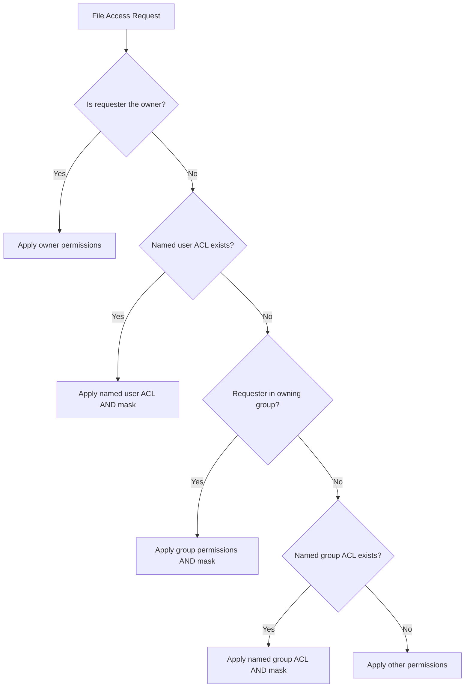

# How to Configure POSIX Access Control Lists with setfacl on RHEL

Author: [nawazdhandala](https://www.github.com/nawazdhandala)

Tags: RHEL, ACLs, setfacl, Permissions, Linux

Description: Learn how to use setfacl and getfacl on RHEL to configure POSIX Access Control Lists for fine-grained file permission management beyond traditional Unix permissions.

---

Standard Unix file permissions (owner, group, others) are too coarse for many real-world scenarios. What if you need to give a specific user read access to a file without changing its group? Or grant write access to two different groups on the same directory? POSIX ACLs solve this by adding fine-grained access control entries to files and directories.

## Checking ACL Support

RHEL filesystems (XFS and ext4) support ACLs by default:

```bash
# Verify ACL support on a filesystem
mount | grep acl

# For XFS (default on RHEL), ACLs are always supported
# For ext4, check mount options
tune2fs -l /dev/sda3 | grep "Default mount options"
```

## Viewing ACLs with getfacl

```bash
# View ACLs on a file
getfacl /etc/passwd

# View ACLs on a directory
getfacl /opt/shared
```

A file with no ACLs shows only the standard permissions:

```bash
# file: etc/passwd
# owner: root
# group: root
user::rw-
group::r--
other::r--
```

## Setting ACLs with setfacl

### Grant a Specific User Access

```bash
# Give user "devuser" read and write access to a file
setfacl -m u:devuser:rw /opt/shared/config.yml

# Verify the ACL
getfacl /opt/shared/config.yml
```

### Grant a Specific Group Access

```bash
# Give the "webteam" group read access to a directory
setfacl -m g:webteam:rx /opt/webapp

# Apply recursively to all files in the directory
setfacl -R -m g:webteam:rx /opt/webapp
```

### Remove a Specific ACL Entry

```bash
# Remove the ACL for user "devuser"
setfacl -x u:devuser /opt/shared/config.yml

# Remove the ACL for group "webteam"
setfacl -x g:webteam /opt/webapp
```

### Remove All ACLs

```bash
# Strip all ACLs from a file
setfacl -b /opt/shared/config.yml

# Strip all ACLs recursively
setfacl -R -b /opt/webapp
```

## Common ACL Operations

Here is a practical example setting up shared access:

```bash
# Create a shared directory
sudo mkdir -p /opt/project

# Set base ownership
sudo chown root:root /opt/project
sudo chmod 770 /opt/project

# Grant read-write access to user "alice"
sudo setfacl -m u:alice:rwx /opt/project

# Grant read-only access to user "bob"
sudo setfacl -m u:bob:rx /opt/project

# Grant read-write access to the "developers" group
sudo setfacl -m g:developers:rwx /opt/project

# Verify all ACLs
getfacl /opt/project
```

The output shows the full ACL:

```bash
# file: opt/project
# owner: root
# group: root
user::rwx
user:alice:rwx
user:bob:r-x
group::rwx
group:developers:rwx
mask::rwx
other::---
```

## Understanding the ACL Mask

The mask entry limits the maximum permissions for named users and groups. It acts as an upper bound:

```bash
# Set the mask to read-only
setfacl -m m::r /opt/project

# Now even though alice has rwx, her effective permissions are r--
getfacl /opt/project
```

The output shows effective permissions:

```bash
user:alice:rwx    #effective:r--
```

## ACL Permission Flow



## Backing Up and Restoring ACLs

```bash
# Back up ACLs for a directory tree
getfacl -R /opt/project > /root/project-acls-backup.txt

# Restore ACLs from backup
setfacl --restore=/root/project-acls-backup.txt
```

## Using ACLs with cp and mv

By default, `cp` does not preserve ACLs:

```bash
# Copy with ACL preservation
cp -a source dest
# or
cp --preserve=all source dest

# rsync with ACL support
rsync -avA source/ dest/
```

## Practical Example: Web Development Team

```bash
# Create web root with ACLs for different teams
sudo mkdir -p /var/www/project

# Backend team gets full access
sudo setfacl -R -m g:backend:rwx /var/www/project

# Frontend team gets read access to everything, write to specific dirs
sudo setfacl -R -m g:frontend:rx /var/www/project
sudo setfacl -R -m g:frontend:rwx /var/www/project/static

# QA team gets read-only access
sudo setfacl -R -m g:qa:rx /var/www/project

# Verify
getfacl /var/www/project
```

## Identifying Files with ACLs

Files with ACLs show a `+` sign in `ls -l` output:

```bash
# The + indicates ACLs are set
ls -l /opt/project
# drwxrwx---+ 2 root root 4096 Mar  4 10:00 project
```

Find all files with ACLs in a directory:

```bash
# Find files with ACLs set
find /opt -exec getfacl --tabular {} + 2>/dev/null | grep -B1 "user:"
```

ACLs give you the granularity that traditional Unix permissions lack. They are essential for shared environments where multiple users and groups need different levels of access to the same files.
