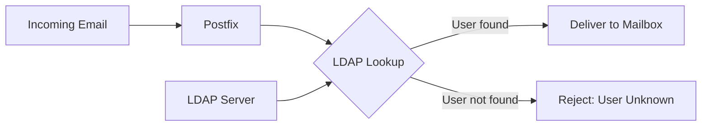

# How to Set Up Postfix with LDAP Directory Lookups on RHEL

Author: [nawazdhandala](https://www.github.com/nawazdhandala)

Tags: RHEL, Postfix, LDAP, Mail, Linux

Description: Configure Postfix to query an LDAP directory for email routing, alias resolution, and recipient validation on RHEL.

---

## Why LDAP with Postfix?

If your organization uses LDAP (or Active Directory) for user management, duplicating all that user data into Postfix alias files and local accounts is a maintenance headache. Instead, you can configure Postfix to query your LDAP directory directly. When a message arrives, Postfix asks LDAP whether the recipient exists, what their mailbox is, and where to deliver the message. One source of truth, no sync scripts.

## Prerequisites

- RHEL with Postfix installed
- An LDAP server (OpenLDAP, 389 Directory Server, or Active Directory)
- A service account with read access to the LDAP directory
- The `postfix-ldap` package

## Installing LDAP Support

```bash
# Install Postfix LDAP integration
sudo dnf install -y postfix-ldap
```

Verify the LDAP support is available:

```bash
# Check that Postfix was built with LDAP support
postconf -m | grep ldap
```

You should see `ldap` in the output.

## LDAP Directory Structure

For this guide, assume your LDAP directory has user entries like:

```
dn: uid=jdoe,ou=People,dc=example,dc=com
objectClass: inetOrgPerson
objectClass: posixAccount
uid: jdoe
cn: John Doe
mail: jdoe@example.com
mailAlternateAddress: john.doe@example.com
```

## Architecture



## Configuring LDAP Alias Lookups

Create an LDAP configuration file for virtual alias lookups. This maps email addresses to mailbox locations.

Create `/etc/postfix/ldap-aliases.cf`:

```
# LDAP server connection settings
server_host = ldap://ldap.example.com
server_port = 389

# Bind credentials (service account)
bind = yes
bind_dn = cn=postfix,ou=Services,dc=example,dc=com
bind_pw = your_service_password

# Search base and scope
search_base = ou=People,dc=example,dc=com
scope = sub

# Search filter - find entries matching the recipient address
query_filter = (|(mail=%s)(mailAlternateAddress=%s))

# Return the primary mail attribute
result_attribute = mail

# Connection timeout
timeout = 10
```

## Configuring Virtual Mailbox Lookups

If you are using virtual mailboxes, create `/etc/postfix/ldap-vmailbox.cf`:

```
# LDAP server connection
server_host = ldap://ldap.example.com
server_port = 389

# Bind credentials
bind = yes
bind_dn = cn=postfix,ou=Services,dc=example,dc=com
bind_pw = your_service_password

# Search settings
search_base = ou=People,dc=example,dc=com
scope = sub

# Find the user by mail attribute
query_filter = (mail=%s)

# Return the mailbox path
result_attribute = mailMessageStore
result_format = %s/
```

## Configuring LDAP for Recipient Validation

To reject mail for addresses that do not exist in LDAP, create `/etc/postfix/ldap-recipients.cf`:

```
# LDAP server connection
server_host = ldap://ldap.example.com
server_port = 389

# Bind credentials
bind = yes
bind_dn = cn=postfix,ou=Services,dc=example,dc=com
bind_pw = your_service_password

# Search settings
search_base = ou=People,dc=example,dc=com
scope = sub

# Check if the recipient exists
query_filter = (|(mail=%s)(mailAlternateAddress=%s))

# Just return something if found
result_attribute = mail
```

## Integrating LDAP Maps into Postfix

Edit `/etc/postfix/main.cf` to use the LDAP lookup tables:

```
# Virtual alias maps for address rewriting
virtual_alias_maps = ldap:/etc/postfix/ldap-aliases.cf

# Virtual mailbox maps (if using virtual delivery)
virtual_mailbox_maps = ldap:/etc/postfix/ldap-vmailbox.cf

# Reject recipients not found in LDAP
smtpd_recipient_restrictions =
    permit_mynetworks,
    permit_sasl_authenticated,
    reject_unauth_destination,
    reject_unlisted_recipient

# Local recipient maps using LDAP
local_recipient_maps = ldap:/etc/postfix/ldap-recipients.cf
```

## Using LDAP over TLS

For secure LDAP connections, use LDAPS or STARTTLS:

### LDAPS (port 636)

```
server_host = ldaps://ldap.example.com
server_port = 636
```

### STARTTLS (port 389 with encryption)

```
server_host = ldap://ldap.example.com
server_port = 389
start_tls = yes
tls_ca_cert_file = /etc/pki/tls/certs/ca-bundle.crt
tls_require_cert = yes
```

## Connecting to Active Directory

If your LDAP server is Active Directory, the configuration is slightly different. Create `/etc/postfix/ldap-ad-aliases.cf`:

```
# Active Directory server
server_host = ldap://dc01.corp.example.com

# Bind with AD service account
bind = yes
bind_dn = CN=Postfix Service,OU=Service Accounts,DC=corp,DC=example,DC=com
bind_pw = your_ad_password

# Search base
search_base = OU=Users,DC=corp,DC=example,DC=com
scope = sub

# AD uses proxyAddresses and mail attributes
query_filter = (|(mail=%s)(proxyAddresses=smtp:%s))

# Return the primary email address
result_attribute = mail
```

## Testing LDAP Lookups

Use `postmap` to test your LDAP queries:

```bash
# Test a virtual alias lookup
postmap -q "jdoe@example.com" ldap:/etc/postfix/ldap-aliases.cf

# Test recipient validation
postmap -q "jdoe@example.com" ldap:/etc/postfix/ldap-recipients.cf

# Test virtual mailbox lookup
postmap -q "jdoe@example.com" ldap:/etc/postfix/ldap-vmailbox.cf
```

If the lookup returns a result, the LDAP integration is working. If it returns nothing, check your filter syntax and bind credentials.

## Securing the LDAP Configuration Files

The LDAP config files contain bind passwords, so lock them down:

```bash
# Restrict permissions on LDAP config files
sudo chown root:postfix /etc/postfix/ldap-*.cf
sudo chmod 640 /etc/postfix/ldap-*.cf
```

## Applying the Configuration

Reload Postfix to pick up the changes:

```bash
# Reload postfix
sudo postfix reload
```

## Troubleshooting

**LDAP connection errors:**

Check connectivity to the LDAP server:

```bash
# Test LDAP connectivity
ldapsearch -x -H ldap://ldap.example.com -D "cn=postfix,ou=Services,dc=example,dc=com" -w your_password -b "ou=People,dc=example,dc=com" "(mail=jdoe@example.com)"
```

**Empty results from postmap:**

Double-check the `query_filter` syntax. LDAP filters use prefix notation and parentheses. A typo in the filter is the most common cause.

**Slow mail delivery:**

If LDAP lookups are slow, enable connection caching and increase the number of Postfix processes. Also make sure your LDAP server has proper indexes on the `mail` and `mailAlternateAddress` attributes.

**SELinux blocking LDAP connections:**

```bash
# Check for SELinux denials
sudo ausearch -m avc -ts recent | grep postfix

# Allow Postfix to connect to LDAP if needed
sudo setsebool -P nis_enabled 1
```

## Wrapping Up

LDAP integration with Postfix eliminates the need to maintain separate user databases for email. Once set up, adding or removing users in your directory automatically updates mail routing. Just make sure to secure your LDAP configuration files, use TLS for the LDAP connection, and test your lookup queries thoroughly before deploying to production.
