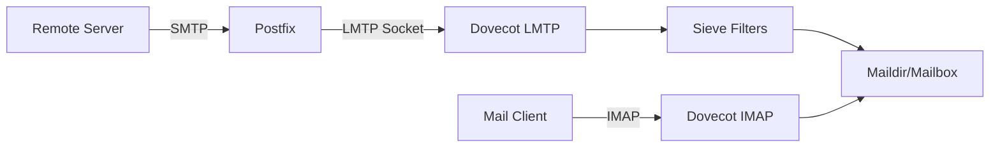

# How to Configure Postfix with LMTP Delivery to Dovecot on RHEL

Author: [nawazdhandala](https://www.github.com/nawazdhandala)

Tags: RHEL, Postfix, LMTP, Dovecot, Linux

Description: Use LMTP to deliver mail from Postfix directly to Dovecot on RHEL, enabling server-side filtering, quotas, and better mailbox management.

---

## Why LMTP Instead of Direct Delivery?

By default, Postfix delivers mail to Maildir or mbox files directly. This works, but Dovecot never knows about new messages until the user checks their mailbox. With LMTP (Local Mail Transfer Protocol), Postfix hands messages to Dovecot for final delivery. This gives you several advantages:

- Dovecot manages the mailbox format and indexing directly
- Sieve server-side filtering works automatically
- Quota enforcement happens at delivery time
- Push notifications (IMAP IDLE) work immediately
- Dovecot handles mailbox creation and structure

LMTP is the recommended way to connect Postfix and Dovecot in any serious deployment.

## Architecture



## Prerequisites

- RHEL with Postfix and Dovecot installed
- Virtual mailbox setup (or local user delivery)

## Installing Required Packages

```bash
# Install Dovecot with LMTP support
sudo dnf install -y dovecot dovecot-pigeonhole
```

The `dovecot-pigeonhole` package includes Sieve filtering and the LMTP service.

## Configuring Dovecot LMTP

### Enable LMTP Protocol

Edit `/etc/dovecot/dovecot.conf`:

```
# Add lmtp to the protocols list
protocols = imap lmtp
```

### Configure the LMTP Socket

Edit `/etc/dovecot/conf.d/10-master.conf`:

```
service lmtp {
  unix_listener /var/spool/postfix/private/dovecot-lmtp {
    mode = 0600
    user = postfix
    group = postfix
  }
}
```

This creates a Unix socket inside Postfix's chroot directory so Postfix can communicate with Dovecot's LMTP service.

### LMTP Settings

Edit `/etc/dovecot/conf.d/20-lmtp.conf`:

```
protocol lmtp {
  # Enable Sieve filtering on delivery
  mail_plugins = $mail_plugins sieve

  # Postmaster address for delivery failures
  postmaster_address = postmaster@example.com
}
```

## Configuring Postfix

### For Virtual Mailboxes

Edit `/etc/postfix/main.cf`:

```
# Deliver to Dovecot via LMTP instead of direct virtual delivery
virtual_transport = lmtp:unix:private/dovecot-lmtp
```

Remove or comment out the `virtual_mailbox_base` setting since Dovecot handles the mailbox layout now:

```
# Comment these out - Dovecot manages delivery now
# virtual_mailbox_base = /var/mail/vhosts
# virtual_uid_maps = static:5000
# virtual_gid_maps = static:5000
```

Keep these settings:

```
virtual_mailbox_domains = hash:/etc/postfix/virtual_domains
virtual_mailbox_maps = hash:/etc/postfix/vmailbox
virtual_alias_maps = hash:/etc/postfix/virtual_aliases
```

### For Local System Users

If you are delivering to system users instead of virtual mailboxes:

```
# Use LMTP for local delivery
mailbox_transport = lmtp:unix:private/dovecot-lmtp
```

## Configuring Dovecot Mail Location

Make sure Dovecot knows where to store mail. Edit `/etc/dovecot/conf.d/10-mail.conf`:

```
# For virtual mailboxes
mail_location = maildir:/var/mail/vhosts/%d/%n
mail_home = /var/mail/vhosts/%d/%n

# Or for system users
# mail_location = maildir:~/Maildir
```

## Setting Up Sieve Filtering

Sieve lets users define server-side mail filtering rules. Configure it in `/etc/dovecot/conf.d/90-sieve.conf`:

```
plugin {
  # Location of user-specific Sieve scripts
  sieve = file:~/sieve;active=~/.dovecot.sieve

  # Default Sieve script applied before user scripts
  sieve_before = /etc/dovecot/sieve/before.d

  # Default Sieve script applied after user scripts
  sieve_after = /etc/dovecot/sieve/after.d
}
```

Create a global spam filtering rule:

```bash
# Create sieve directories
sudo mkdir -p /etc/dovecot/sieve/before.d
```

Create `/etc/dovecot/sieve/before.d/spam-to-junk.sieve`:

```
require ["fileinto", "mailbox"];

# Move spam-flagged messages to Junk
if header :contains "X-Spam-Status" "Yes" {
    fileinto :create "Junk";
    stop;
}
```

Compile the Sieve script:

```bash
sudo sievec /etc/dovecot/sieve/before.d/spam-to-junk.sieve
```

## Adding Quota Support

With LMTP delivery, quota enforcement happens at delivery time. Edit `/etc/dovecot/conf.d/90-quota.conf`:

```
plugin {
  # Set default quota to 1 GB
  quota = maildir:User quota
  quota_rule = *:storage=1G
  quota_rule2 = Trash:storage=+100M

  # Quota warning messages
  quota_warning = storage=95%% quota-warning 95 %u
  quota_warning2 = storage=80%% quota-warning 80 %u
}

# Enable quota in LMTP
protocol lmtp {
  mail_plugins = $mail_plugins sieve quota
}

# Enable quota in IMAP
protocol imap {
  mail_plugins = $mail_plugins quota imap_quota
}
```

Set up a quota warning script. Edit `/etc/dovecot/conf.d/10-master.conf`:

```
service quota-warning {
  executable = script /usr/local/bin/quota-warning.sh
  user = dovecot

  unix_listener quota-warning {
    user = vmail
  }
}
```

Create `/usr/local/bin/quota-warning.sh`:

```bash
#!/bin/bash
PERCENT=$1
USER=$2
cat << EOF | /usr/sbin/sendmail -f postmaster@example.com "$USER"
From: postmaster@example.com
Subject: Mailbox quota warning

Your mailbox is ${PERCENT}% full. Please delete some messages or archive old mail.
EOF
```

```bash
sudo chmod +x /usr/local/bin/quota-warning.sh
```

## Starting and Testing

```bash
# Restart both services
sudo systemctl restart dovecot
sudo postfix reload

# Verify the LMTP socket exists
sudo ls -la /var/spool/postfix/private/dovecot-lmtp
```

### Test LMTP Delivery

```bash
# Send a test email
echo "LMTP delivery test" | mail -s "LMTP Test" john@example.com

# Check the logs for LMTP delivery
sudo grep "lmtp" /var/log/maillog | tail -5
```

You should see log entries like:

```
postfix/lmtp[12345]: ABC123: to=<john@example.com>, relay=relay.example.com, delay=0.2, status=sent (250 2.0.0 OK)
```

### Test Sieve Filtering

Send a message with a spam header to verify the Sieve rule:

```bash
# Create a test message with spam header
cat << 'EOF' | sendmail john@example.com
From: test@example.com
To: john@example.com
Subject: Sieve Test
X-Spam-Status: Yes

This should go to Junk.
EOF
```

Check that it landed in the Junk folder:

```bash
sudo ls /var/mail/vhosts/example.com/john/Junk/new/
```

## Troubleshooting

**"LMTP connection refused":**

Check that the socket exists and has correct permissions:

```bash
sudo ls -la /var/spool/postfix/private/dovecot-lmtp
```

**Delivery errors in logs:**

```bash
sudo grep "lmtp" /var/log/maillog | grep -i "error\|fail" | tail -10
```

**Sieve script not working:**

Make sure it is compiled:

```bash
sudo sievec /etc/dovecot/sieve/before.d/spam-to-junk.sieve
```

Check for Sieve errors:

```bash
sudo grep "sieve" /var/log/maillog | tail -10
```

## Wrapping Up

LMTP is the proper way to connect Postfix and Dovecot. It unlocks server-side Sieve filtering, real-time quota enforcement, and better mailbox management. The Unix socket approach is simple and efficient. Once you have LMTP in place, adding features like automatic spam filing, vacation responders, and quota warnings becomes straightforward through Sieve scripts.
