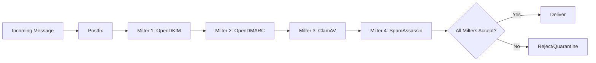

# How to Configure Postfix Milters for Email Security on RHEL

Author: [nawazdhandala](https://www.github.com/nawazdhandala)

Tags: RHEL, Postfix, Milters, Email Security, Linux

Description: Learn how to use Postfix milters (mail filters) on RHEL to add DKIM signing, spam filtering, virus scanning, and other email security features.

---

## What Are Milters?

Milters (mail filters) are external programs that plug into Postfix's mail processing pipeline. When a message arrives, Postfix passes it through each configured milter, which can inspect, modify, or reject the message. The milter protocol was originally developed for Sendmail but Postfix has supported it since version 2.3.

Common milters include OpenDKIM for DKIM signing, OpenDMARC for DMARC verification, ClamAV-milter for virus scanning, and SpamAssassin's milter interface for spam filtering.

## How Milters Work



Messages pass through milters in the order they are listed. Each milter can:
- **Accept** the message (pass it to the next milter)
- **Reject** the message (send a rejection to the sender)
- **Tempfail** the message (tell the sender to try again later)
- **Modify** the message (add headers, change body)
- **Quarantine** the message

## Prerequisites

- RHEL with Postfix installed
- Milter packages installed for each filter you want to use

## Postfix Milter Configuration

### Basic Milter Setup

Add to `/etc/postfix/main.cf`:

```
# Default action if a milter is unavailable
milter_default_action = accept

# Milter protocol version
milter_protocol = 6

# Milters for SMTP-received mail
smtpd_milters =
    inet:localhost:8891,
    inet:localhost:8893,
    unix:/run/clamav-milter/clamav-milter.sock,
    unix:/run/spamass-milter/postfix/sock

# Milters for locally-generated mail
non_smtpd_milters =
    inet:localhost:8891
```

### Understanding the Two Milter Lists

- `smtpd_milters` - Applied to mail received via SMTP (from other servers or authenticated users)
- `non_smtpd_milters` - Applied to mail generated locally (cron jobs, system notifications)

Usually you want DKIM signing on both, but spam/virus scanning only on incoming SMTP mail.

### Milter Connection Types

Milters connect to Postfix via Unix sockets or TCP:

```
# Unix socket (faster, requires both on same host)
unix:/run/clamav-milter/clamav-milter.sock

# TCP socket (can run on different hosts)
inet:localhost:8891

# TCP on a remote host
inet:milter-server.example.com:8891
```

## Setting Up Common Milters

### OpenDKIM (DKIM Signing and Verification)

```bash
# Install OpenDKIM
sudo dnf install -y opendkim opendkim-tools
```

Configure `/etc/opendkim.conf`:

```
Mode            sv
Syslog          yes
Socket          inet:8891@localhost
Domain          example.com
Selector        default
KeyFile         /etc/opendkim/keys/example.com/default.private
Canonicalization relaxed/simple
```

```bash
# Start OpenDKIM
sudo systemctl enable --now opendkim
```

### OpenDMARC (DMARC Verification)

```bash
# Install OpenDMARC
sudo dnf install -y opendmarc
```

Configure `/etc/opendmarc.conf`:

```
AuthservID      mail.example.com
Socket          inet:8893@localhost
SPFSelfValidate true
```

```bash
# Start OpenDMARC
sudo systemctl enable --now opendmarc
```

### ClamAV Milter (Virus Scanning)

```bash
# Install ClamAV milter
sudo dnf install -y epel-release
sudo dnf install -y clamav-milter clamd clamav-update
```

Configure `/etc/mail/clamav-milter.conf`:

```
MilterSocket    /run/clamav-milter/clamav-milter.sock
MilterSocketMode 660
MilterSocketGroup postfix
ClamdSocket     unix:/run/clamd.scan/clamd.sock
OnInfected      Reject
OnFail          Accept
AddHeader       Replace
```

```bash
# Start ClamAV services
sudo systemctl enable --now clamd@scan
sudo systemctl enable --now clamav-milter
```

### SpamAssassin Milter

```bash
# Install SpamAssassin milter
sudo dnf install -y spamass-milter spamassassin
```

```bash
# Start services
sudo systemctl enable --now spamassassin
sudo systemctl enable --now spamass-milter
```

## Milter Processing Order

The order matters. Here is a recommended sequence:

```
smtpd_milters =
    inet:localhost:8891,
    inet:localhost:8893,
    unix:/run/clamav-milter/clamav-milter.sock,
    unix:/run/spamass-milter/postfix/sock
```

1. **OpenDKIM** - Verify incoming DKIM signatures first (before any modifications)
2. **OpenDMARC** - Check DMARC policy (uses DKIM and SPF results)
3. **ClamAV** - Scan for viruses (reject infected mail early)
4. **SpamAssassin** - Score for spam (most resource-intensive, do last)

## Milter Timeouts

If a milter is slow, you do not want it to hold up mail delivery:

```
# Timeout for milter connections (default: 10s)
milter_connect_timeout = 30s

# Timeout for milter commands (default: 300s)
milter_command_timeout = 300s

# Timeout for milter content (default: 300s)
milter_content_timeout = 300s
```

## Per-Milter Settings

You can apply milters selectively based on context. For example, skip milters for authenticated users sending outbound mail:

In `/etc/postfix/master.cf`:

```
# Submission port with different milter settings
submission inet n       -       n       -       -       smtpd
  -o smtpd_milters=inet:localhost:8891
  -o non_smtpd_milters=inet:localhost:8891
```

This only applies DKIM signing on the submission port, skipping virus and spam scanning for outbound mail from authenticated users.

## Macros for Milters

Postfix passes macros to milters that they can use for decision-making:

```
# Define macros available to milters
milter_connect_macros = j {daemon_name} v {if_name} _
milter_helo_macros = {tls_version} {cipher} {cipher_bits} {cert_subject} {cert_issuer}
milter_mail_macros = i {auth_type} {auth_authen} {auth_author} {mail_addr} {mail_host} {mail_mailer}
milter_rcpt_macros = {rcpt_addr} {rcpt_host} {rcpt_mailer}
```

## Monitoring Milters

Check that milters are running and responsive:

```bash
# Check milter sockets
sudo ss -tlnp | grep -E '889[0-9]'

# Check Unix socket milters
sudo ls -la /run/clamav-milter/clamav-milter.sock
sudo ls -la /run/spamass-milter/postfix/sock

# Check milter-related log entries
sudo grep -E "milter|opendkim|opendmarc|clamav-milter|spamass" /var/log/maillog | tail -20
```

## Handling Milter Failures

The `milter_default_action` setting controls what happens when a milter is unreachable:

```
# Accept mail if milter is down (recommended for availability)
milter_default_action = accept

# Temp-fail mail if milter is down (safer but may delay mail)
# milter_default_action = tempfail
```

Use `accept` in production to prevent milter downtime from blocking all mail delivery. Use `tempfail` if security is more important than availability.

## Testing the Milter Pipeline

Send a test email and trace it through the milters:

```bash
# Send a test
echo "Milter pipeline test" | mail -s "Test" user@example.com

# Check the headers on the received message for milter results
# You should see headers like:
# Authentication-Results: dkim=pass
# X-Virus-Scanned: ClamAV
# X-Spam-Status: No, score=-1.0
```

## Wrapping Up

Milters give you a modular, flexible way to add security layers to your Postfix mail server. Each milter handles one specific task, and you can add or remove them independently. Start with DKIM and DMARC for authentication, add ClamAV for virus protection, and layer on SpamAssassin for spam filtering. The milter architecture makes it straightforward to build a comprehensive email security stack.
