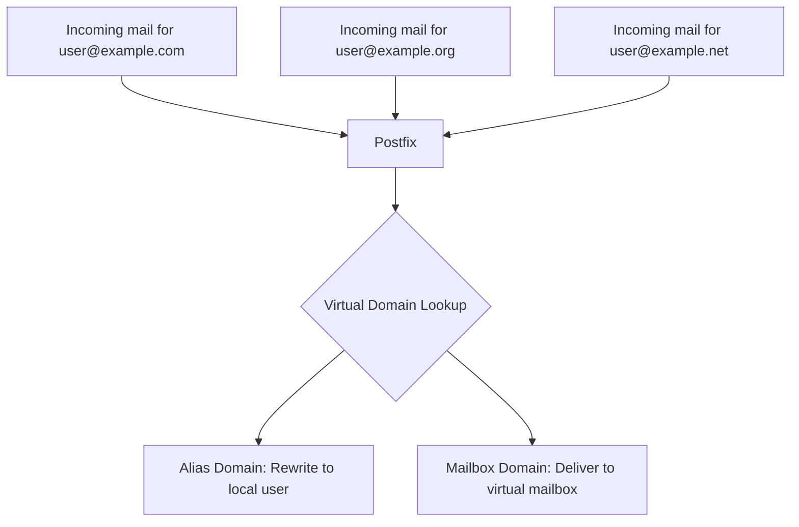

# How to Configure Postfix for Multiple Domains on RHEL

Author: [nawazdhandala](https://www.github.com/nawazdhandala)

Tags: RHEL, Postfix, Multiple Domains, Mail, Linux

Description: Set up a single Postfix server on RHEL to handle email for multiple domains using virtual alias domains and virtual mailbox domains.

---

## The Problem

You have one RHEL server and need it to handle mail for several domains, say example.com, example.org, and example.net. Each domain has its own set of users, and some users might have addresses in multiple domains. Postfix handles this through virtual domains, and there are two approaches depending on your needs.

## Two Approaches to Multi-Domain Mail

**Virtual Alias Domains** - The simpler approach. All mail is rewritten and delivered to local system users. Good when you have a small number of users with shell accounts.

**Virtual Mailbox Domains** - The more flexible approach. Mail is delivered to directories on disk without needing local system accounts. Better for hosting many domains with many users.

You can mix both approaches, but most setups pick one.

## DNS Prerequisites

Each domain needs an MX record pointing to your mail server:

| Domain | MX Record | Points To |
|---|---|---|
| example.com | MX 10 | mail.example.com |
| example.org | MX 10 | mail.example.com |
| example.net | MX 10 | mail.example.com |

All domains resolve to the same server IP.

## Architecture



## Method 1: Virtual Alias Domains

This is the easiest setup. Mail for virtual alias domains gets rewritten to local user addresses.

### Configure main.cf

Add to `/etc/postfix/main.cf`:

```bash
# Your primary domain stays in mydestination
mydestination = mail.example.com, localhost

# List the virtual alias domains
virtual_alias_domains = example.com, example.org, example.net

# Point to the alias map file
virtual_alias_maps = hash:/etc/postfix/virtual
```

### Create the Virtual Alias Map

Edit `/etc/postfix/virtual`:

```bash
# example.com addresses
admin@example.com       localadmin
sales@example.com       john
info@example.com        john, jane
postmaster@example.com  localadmin

# example.org addresses
admin@example.org       localadmin
webmaster@example.org   jane
contact@example.org     john

# example.net addresses
support@example.net     jane
billing@example.net     john

# Catch-all for a domain (use carefully)
@example.net            john
```

Build the hash database:

```bash
# Generate the virtual alias database
sudo postmap /etc/postfix/virtual
```

### Restart and Test

```bash
# Reload postfix
sudo postfix reload

# Test the lookup
postmap -q "admin@example.com" hash:/etc/postfix/virtual
```

## Method 2: Virtual Mailbox Domains

This method stores mail in directories without requiring system accounts. It is better for hosting many users.

### Create a Virtual Mail User

Create a dedicated system user to own all virtual mailboxes:

```bash
# Create the virtual mail user and group
sudo groupadd -g 5000 vmail
sudo useradd -u 5000 -g vmail -s /sbin/nologin -d /var/mail/vhosts -m vmail
```

### Create Domain Directories

```bash
# Create directories for each domain
sudo mkdir -p /var/mail/vhosts/example.com
sudo mkdir -p /var/mail/vhosts/example.org
sudo mkdir -p /var/mail/vhosts/example.net
sudo chown -R vmail:vmail /var/mail/vhosts
```

### Configure main.cf

Add to `/etc/postfix/main.cf`:

```bash
# Do not include virtual domains in mydestination
mydestination = mail.example.com, localhost

# Virtual mailbox domain configuration
virtual_mailbox_domains = example.com, example.org, example.net
virtual_mailbox_base = /var/mail/vhosts
virtual_mailbox_maps = hash:/etc/postfix/vmailbox
virtual_minimum_uid = 100
virtual_uid_maps = static:5000
virtual_gid_maps = static:5000

# Optional: virtual aliases for address rewriting
virtual_alias_maps = hash:/etc/postfix/virtual
```

### Create the Mailbox Map

Edit `/etc/postfix/vmailbox`:

```bash
# Format: email_address    mailbox_path (relative to virtual_mailbox_base)
john@example.com        example.com/john/
jane@example.com        example.com/jane/
admin@example.com       example.com/admin/

john@example.org        example.org/john/
support@example.org     example.org/support/

billing@example.net     example.net/billing/
info@example.net        example.net/info/
```

The trailing slash tells Postfix to use Maildir format (one file per message).

Build the database:

```bash
# Generate the virtual mailbox database
sudo postmap /etc/postfix/vmailbox
```

### Create Virtual Aliases

Edit `/etc/postfix/virtual` for aliases across domains:

```bash
# Redirect postmaster to admin
postmaster@example.com  admin@example.com
postmaster@example.org  john@example.org

# Forward from one domain to another
sales@example.org       john@example.com
```

```bash
# Generate the virtual alias database
sudo postmap /etc/postfix/virtual
```

### Apply and Test

```bash
# Check the configuration
sudo postfix check

# Reload postfix
sudo postfix reload

# Test virtual mailbox lookup
postmap -q "john@example.com" hash:/etc/postfix/vmailbox

# Send a test email
echo "Multi-domain test" | mail -s "Test" john@example.com
```

Check that the mail was delivered:

```bash
# Check for the delivered message
ls -la /var/mail/vhosts/example.com/john/new/
```

## Managing Domains with a Database

For larger setups with many domains, use a file listing domains instead of hardcoding them:

Create `/etc/postfix/virtual_domains`:

```bash
example.com     OK
example.org     OK
example.net     OK
```

```bash
# Hash the domains file
sudo postmap /etc/postfix/virtual_domains
```

Update `main.cf`:

```bash
virtual_mailbox_domains = hash:/etc/postfix/virtual_domains
```

Now adding a new domain is just adding a line to the file and running `postmap`.

## Adding a New Domain Checklist

When you need to add a new domain, here is the process:

1. Add the MX record in DNS pointing to your server
2. Add the domain to `virtual_mailbox_domains` or `virtual_alias_domains`
3. Create the mailbox directory (for virtual mailbox domains)
4. Add user entries to `vmailbox` or `virtual`
5. Run `postmap` on changed files
6. Reload Postfix

```bash
# Quick add example for newdomain.com
sudo mkdir -p /var/mail/vhosts/newdomain.com
sudo chown vmail:vmail /var/mail/vhosts/newdomain.com

# Add to domain list and rebuild
echo "newdomain.com    OK" | sudo tee -a /etc/postfix/virtual_domains
sudo postmap /etc/postfix/virtual_domains

# Add users and rebuild
echo "user@newdomain.com    newdomain.com/user/" | sudo tee -a /etc/postfix/vmailbox
sudo postmap /etc/postfix/vmailbox

# Reload
sudo postfix reload
```

## Troubleshooting

**"User unknown in virtual mailbox table":**

The recipient is not listed in `/etc/postfix/vmailbox`. Add them and run `postmap`.

**Mail delivered but not visible:**

Check directory permissions:

```bash
sudo ls -la /var/mail/vhosts/example.com/john/
```

Everything should be owned by `vmail:vmail`.

**Domain listed in both mydestination and virtual_mailbox_domains:**

This will cause errors. A domain can only appear in one of these settings, never both.

## Wrapping Up

Running multiple domains on a single Postfix server is a common setup and Postfix handles it well. Virtual alias domains work great for small setups with system users. Virtual mailbox domains scale better and are the right choice when you are hosting mail for clients or managing many domains. Pair this with Dovecot for IMAP access and you have a complete multi-domain mail server.
