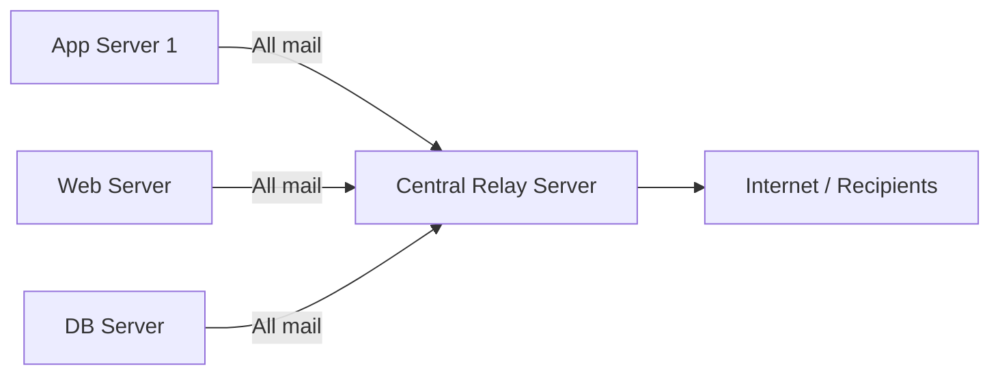

# How to Set Up Postfix as a Null-Client Mail Relay on RHEL

Author: [nawazdhandala](https://www.github.com/nawazdhandala)

Tags: RHEL, Postfix, Null Client, Mail Relay, Linux

Description: Configure Postfix as a null client on RHEL so your server sends all outgoing mail through a central relay without accepting any incoming mail.

---

## What Is a Null Client?

A null client is a mail configuration where the local machine forwards all outgoing email to a central mail relay server and does not accept any incoming mail itself. This is the most common Postfix configuration for application servers, web servers, and database servers that just need to send system alerts, cron job output, or application notifications.

Instead of each server trying to deliver mail directly (and dealing with DNS, TLS, SPF, DKIM, and deliverability issues), you point everything at one relay that handles all of that.

## When to Use This Setup

- Application servers that send transactional emails
- Servers that send cron job notifications
- Database servers sending alert emails
- Any machine that needs to send but never receive mail

## Prerequisites

- RHEL with root or sudo access
- A relay server (your organization's mail server, or a service like an internal Postfix relay)
- Network access to the relay server on port 25 or 587

## Architecture



## Installing Postfix

```bash
# Install postfix if not already present
sudo dnf install -y postfix
```

## Configuring the Null Client

Edit `/etc/postfix/main.cf`. For a null client, you want a minimal configuration. Replace the contents with:

```bash
# Backup the original config
sudo cp /etc/postfix/main.cf /etc/postfix/main.cf.bak
```

Set these values in `/etc/postfix/main.cf`:

```
# Hostname of this machine
myhostname = appserver01.example.com

# Domain for outgoing mail
mydomain = example.com

# Rewrite sender addresses to use the main domain
myorigin = $mydomain

# Only listen on localhost - do not accept external connections
inet_interfaces = loopback-only

# Do not accept mail for local delivery
mydestination =

# Forward all mail to the central relay
relayhost = [relay.example.com]

# Only trust the local machine
mynetworks = 127.0.0.0/8 [::1]/128

# Use IPv4 only
inet_protocols = ipv4

# Disable local mail delivery entirely
local_transport = error:5.1.1 Mailbox not available
```

The key settings that make this a null client are:

- `inet_interfaces = loopback-only` - only accepts mail from local processes
- `mydestination =` - empty, so no mail is delivered locally
- `relayhost = [relay.example.com]` - sends everything to the relay

The square brackets around the relay hostname tell Postfix to connect directly to that host without doing an MX lookup.

## Relay with Authentication

If your relay server requires authentication (common with cloud email services), configure SASL:

```bash
# Install SASL support
sudo dnf install -y cyrus-sasl cyrus-sasl-plain
```

Add these lines to `/etc/postfix/main.cf`:

```
# Enable SASL authentication for the relay
smtp_sasl_auth_enable = yes
smtp_sasl_password_maps = hash:/etc/postfix/sasl_passwd
smtp_sasl_security_options = noanonymous
smtp_sasl_tls_security_options = noanonymous
```

Create the password file:

```bash
# Create the SASL password file
sudo vi /etc/postfix/sasl_passwd
```

Add the relay credentials:

```
[relay.example.com] username:password
```

Secure and hash the password file:

```bash
# Set restrictive permissions
sudo chmod 600 /etc/postfix/sasl_passwd

# Generate the hash database
sudo postmap /etc/postfix/sasl_passwd
```

## Relay with TLS Encryption

If the relay requires TLS (and it should), add these settings:

```
# Enable TLS for outgoing connections
smtp_tls_security_level = encrypt
smtp_tls_CAfile = /etc/pki/tls/certs/ca-bundle.crt

# Use port 587 for submission with STARTTLS
relayhost = [relay.example.com]:587
```

## Rewriting Sender Addresses

You may want all outgoing mail to appear from a consistent address. Use sender canonical mapping:

```
# Rewrite all sender addresses
sender_canonical_maps = regexp:/etc/postfix/sender_canonical
```

Create `/etc/postfix/sender_canonical`:

```
# Rewrite all local senders to a single address
/.+/ noreply@example.com
```

If you only want to rewrite the domain but keep the username:

```
# Rewrite only the domain part
sender_canonical_classes = envelope_sender
sender_canonical_maps = regexp:/etc/postfix/sender_canonical
```

And in `/etc/postfix/sender_canonical`:

```
/@.*$/ @example.com
```

## Starting the Service

```bash
# Enable and start postfix
sudo systemctl enable --now postfix

# Check the status
sudo systemctl status postfix
```

## Testing

Send a test email:

```bash
# Send a test message
echo "Test from null client" | mail -s "Null Client Test" admin@example.com
```

Check the logs to confirm the relay is working:

```bash
# Watch the mail log
sudo tail -f /var/log/maillog
```

You should see a line like:

```
relay=relay.example.com[10.0.0.5]:25, delay=0.5, status=sent
```

Check the queue for any stuck messages:

```bash
# View the mail queue
sudo postqueue -p
```

## Verifying the Configuration

Make sure the null client settings are correct:

```bash
# Show non-default settings
sudo postconf -n

# Verify these specific values
sudo postconf inet_interfaces mydestination relayhost
```

Expected output:

```
inet_interfaces = loopback-only
mydestination =
relayhost = [relay.example.com]
```

## Preventing Local Mail Delivery Failures

Since `mydestination` is empty, mail sent to local users (like root) will try to relay. To handle root's mail, set up an alias:

```bash
# Edit /etc/aliases
sudo vi /etc/aliases
```

Add:

```
root: admin@example.com
```

Rebuild the alias database:

```bash
# Rebuild aliases
sudo newaliases
```

## Troubleshooting

**Mail stuck in the queue with "connection refused":**

Check that the relay server is reachable:

```bash
# Test connectivity to the relay
telnet relay.example.com 25
```

**Authentication failures:**

Check the SASL password map is hashed correctly:

```bash
# Rehash the password file
sudo postmap /etc/postfix/sasl_passwd
```

**Mail log shows "relay access denied":**

Your relay server is not configured to accept mail from this host. Add the server IP to the relay's `mynetworks` or configure SASL authentication.

## Wrapping Up

A null-client Postfix configuration is the simplest and most secure way to handle outgoing mail from servers that do not need to receive email. It takes five minutes to set up, keeps your mail delivery centralized, and means you only have to manage DNS records, TLS certificates, and spam reputation on one relay server instead of every machine in your fleet.
