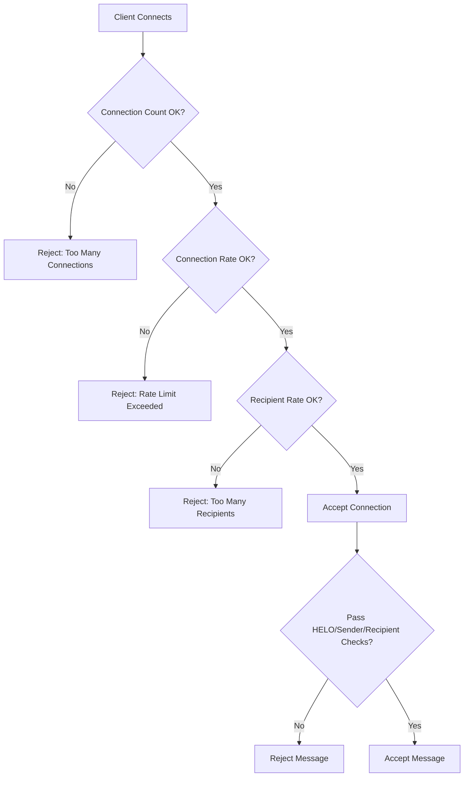

# How to Configure Postfix Rate Limiting and Anti-Spam on RHEL

Author: [nawazdhandala](https://www.github.com/nawazdhandala)

Tags: RHEL, Postfix, Rate Limiting, Anti-Spam, Linux

Description: Protect your Postfix mail server on RHEL from spam and abuse by configuring rate limiting, client restrictions, and anti-spam measures.

---

## Why Rate Limiting Matters

An unprotected mail server will get hammered by spammers within hours of going live. They will try to relay through it, flood it with junk, and use it to send spam on your behalf. Even if you have relay restrictions in place, you still need to limit how fast clients can send mail and block obvious spam patterns. Postfix has built-in mechanisms for this.

## Built-in Postfix Anti-Spam Restrictions

### HELO/EHLO Restrictions

Many spam bots do not send proper HELO greetings. Require valid ones:

Add to `/etc/postfix/main.cf`:

```bash
# Require clients to send HELO/EHLO
smtpd_helo_required = yes

# Reject invalid HELO hostnames
smtpd_helo_restrictions =
    permit_mynetworks,
    reject_invalid_helo_hostname,
    reject_non_fqdn_helo_hostname,
    reject_unknown_helo_hostname
```

### Sender Restrictions

Block mail from senders with invalid or non-existent domains:

```bash
smtpd_sender_restrictions =
    permit_mynetworks,
    reject_non_fqdn_sender,
    reject_unknown_sender_domain
```

### Recipient Restrictions

This is the most important restriction chain:

```bash
smtpd_recipient_restrictions =
    permit_mynetworks,
    permit_sasl_authenticated,
    reject_unauth_destination,
    reject_non_fqdn_recipient,
    reject_unknown_recipient_domain,
    reject_rbl_client zen.spamhaus.org,
    reject_rbl_client bl.spamcop.net,
    reject_rhsbl_helo dbl.spamhaus.org,
    reject_rhsbl_sender dbl.spamhaus.org
```

### Client Restrictions

Block clients based on their connecting behavior:

```bash
smtpd_client_restrictions =
    permit_mynetworks,
    reject_unknown_client_hostname
```

## Rate Limiting with Anvil

Postfix includes the `anvil` service that tracks client connection rates. Configure it in `/etc/postfix/main.cf`:

```bash
# Maximum number of connections per time unit from one client
smtpd_client_connection_rate_limit = 30

# Maximum number of SMTP sessions at the same time from one client
smtpd_client_connection_count_limit = 10

# Maximum number of recipients per message from one client
smtpd_client_recipient_rate_limit = 60

# Maximum number of new TLS sessions per time unit from one client
smtpd_client_new_tls_session_rate_limit = 30

# Time unit for rate calculations (default: 60s)
anvil_rate_time_unit = 60s

# Status window for rate statistics
anvil_status_update_time = 600s
```

These limits apply per client IP address. Internal networks listed in `mynetworks` are exempt by default.

## Rate Limiting Flow



## Using Real-Time Blocklists (RBLs)

RBLs maintain lists of known spam-sending IP addresses. Postfix can check these during the SMTP conversation:

```bash
smtpd_recipient_restrictions =
    permit_mynetworks,
    permit_sasl_authenticated,
    reject_unauth_destination,
    reject_rbl_client zen.spamhaus.org,
    reject_rbl_client bl.spamcop.net
```

Be careful with RBLs. Only use reputable ones. Some aggressive blocklists have high false-positive rates.

### Test if an IP is Listed

```bash
# Check if IP 1.2.3.4 is in the Spamhaus blocklist
# Reverse the IP octets for the query
dig +short 4.3.2.1.zen.spamhaus.org
```

A non-empty response means the IP is listed.

## Greylisting with Postgrey

Greylisting temporarily rejects mail from unknown senders, forcing them to retry. Legitimate servers retry; most spam bots do not.

```bash
# Install postgrey
sudo dnf install -y postgrey
```

Start the service:

```bash
# Enable and start postgrey
sudo systemctl enable --now postgrey
```

Add to `/etc/postfix/main.cf`:

```bash
smtpd_recipient_restrictions =
    permit_mynetworks,
    permit_sasl_authenticated,
    reject_unauth_destination,
    check_policy_service inet:127.0.0.1:10023
```

Postgrey delays the first delivery from an unknown sender by about 5 minutes. Subsequent messages from the same sender are accepted immediately.

## Limiting Message Size

Prevent large messages from clogging your server:

```bash
# Maximum message size (25 MB)
message_size_limit = 26214400

# Maximum number of recipients per message
smtpd_recipient_limit = 100
```

## Access Control Tables

Create custom access rules using access maps.

### Block Specific Senders

Create `/etc/postfix/sender_access`:

```bash
# Block known spam domains
spammer.com         REJECT
bad-sender.net      REJECT

# Block specific addresses
junk@example.org    REJECT
```

```bash
# Hash the access table
sudo postmap /etc/postfix/sender_access
```

Add to `main.cf`:

```bash
smtpd_sender_restrictions =
    check_sender_access hash:/etc/postfix/sender_access,
    reject_non_fqdn_sender,
    reject_unknown_sender_domain
```

### Block Specific Client IPs

Create `/etc/postfix/client_access`:

```bash
# Block abusive IPs
1.2.3.4         REJECT Too many spam attempts
5.6.7.0/24      REJECT Known spam network
```

```bash
sudo postmap /etc/postfix/client_access
```

Add to `main.cf`:

```bash
smtpd_client_restrictions =
    check_client_access hash:/etc/postfix/client_access,
    permit_mynetworks,
    reject_unknown_client_hostname
```

## Header and Body Checks

Filter messages based on content patterns:

```bash
# Enable header and body checks
header_checks = regexp:/etc/postfix/header_checks
body_checks = regexp:/etc/postfix/body_checks
```

Create `/etc/postfix/header_checks`:

```bash
# Reject messages with suspicious subjects
/^Subject:.*viagra/i           REJECT Spam content detected
/^Subject:.*lottery winner/i   REJECT Spam content detected

# Reject forged headers
/^Received:.*localhost.*by.*localhost/  REJECT Forged header
```

Create `/etc/postfix/body_checks`:

```bash
# Block messages with suspicious content
/click here to claim your prize/i    REJECT Spam body content
```

## Monitoring Rate Limit Effectiveness

Check the anvil statistics:

```bash
# View anvil rate limit statistics
sudo postfix status
sudo grep "anvil" /var/log/maillog | tail -20
```

Check how many connections are being rejected:

```bash
# Count rejections in the last hour
sudo grep "NOQUEUE: reject" /var/log/maillog | wc -l

# See rejection reasons
sudo grep "NOQUEUE: reject" /var/log/maillog | tail -10
```

## Applying Changes

After modifying `main.cf`:

```bash
# Check configuration for errors
sudo postfix check

# Reload Postfix
sudo postfix reload
```

## Wrapping Up

A layered approach works best for anti-spam. Start with the built-in HELO, sender, and recipient restrictions. Add RBL checking for known bad IPs. Use rate limiting to slow down abusers. Consider greylisting if spam volume is high. Each layer catches a different type of spam, and together they block the vast majority of junk before it ever hits your users' inboxes.
